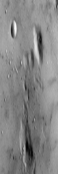
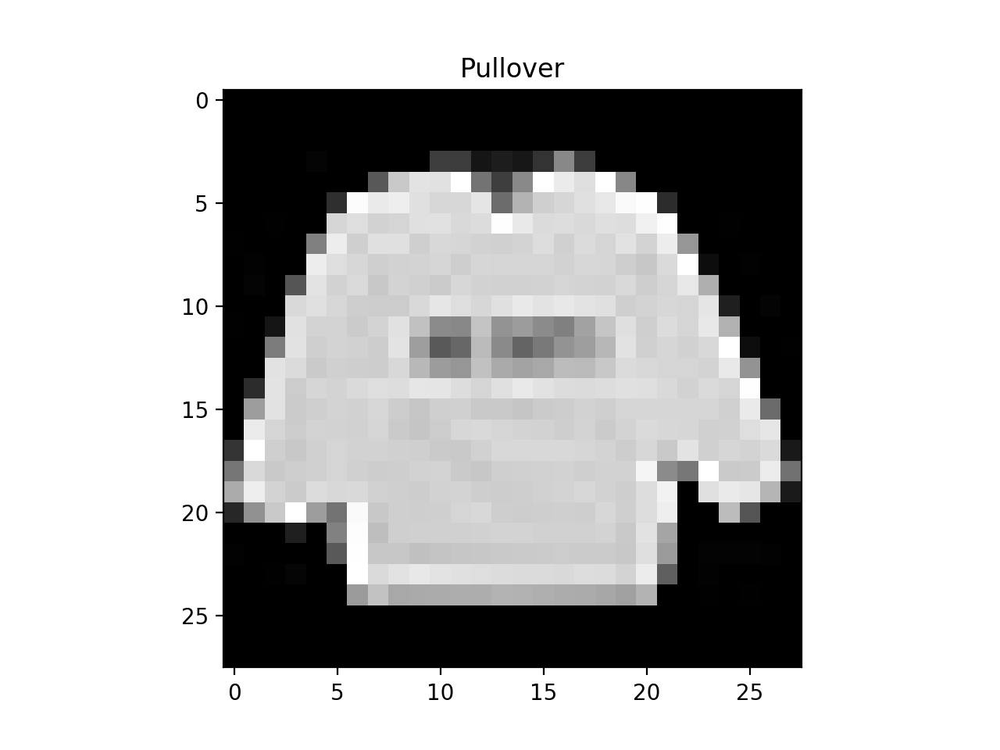

<!-- Check whether the assignment is up to date -->
{{'now' | date: '%Y'}}
{{page.due_date | date: '%Y'}}
 
<div class="alert alert-danger">
Warning: this assignment is out of date.  It may still need to be updated for this year's class.  Check with your instructor before you start working on this assignment.
</div>

<!-- End of check whether the assignment is up to date -->


<div class="alert alert-info">
This assignment is due on {{ page.due_date | date: "%A, %B %-d, %Y" }} before {{ page.due_date | date: "%I:%M%p" }}. 
</div>


<div class="alert alert-info">
You can download the materials for this assignment here:
<ul>

<li><a href="{{item.url}}">{{ item.name }}</a></li>

</ul>
</div>



Homework 10: Extra Credit [100 points]
=============================================================

## <a name="instructions"></a> Instructions


The [first part](#part_1) of this assignment involves implementing functions commonly used in Neural Networks from scratch without use of external libraries/packages other than [NumPy](http://www.numpy.org).

The [second part](#part_2)of the assignment involves building a Neural Network using one of the Machine Learning frameworks called [PyTorch](https://pytorch.org) for a [Fashion MNIST dataset](https://github.com/zalandoresearch/fashion-mnist).

A skeleton file [homework10.py](homework10.py) containing empty definitions for each question has been provided. Since portions of this assignment will be graded automatically, none of the names or function signatures in this file should be modified. However, you are free to introduce additional variables or functions if needed.

A file containing a sub-set of the Fashion MNIST dataset dataset [dataset.csv](dataset.csv) is provided. 

You will find that in addition to a problem specification, most programming questions also include a pair of examples from the Python interpreter. These are meant to illustrate typical use cases, and should not be taken as comprehensive test suites.

You are strongly encouraged to follow the Python style guidelines set forth in [PEP 8](http://www.python.org/dev/peps/pep-0008/), which was written in part by the creator of Python. However, your code will not be graded for style.

Once you have completed the assignment, you should submit your file on [Gradescope]({{page.submission_link}}).

You may submit as many times as you would like before the deadline, but only the last submission will be saved. 


## <a name="part_1"></a> Part 1 [45 points]

The goal of this part of the assignment is to get an intuition of the underlying implementation used in Convolutional Neural Networks, specifically performing convolution and pooling, and applying an activation function.  

The functions in this assignment test are simplified, are not explicitly related to each other (unless stated otherwise) and will not be used in [Part 2](#part_2).

As mentioned in the [instructions](#instructions), you are restricted from using any external packages other than [NumPy](http://www.numpy.org). Numpy has a [Quickstart tutorial](https://docs.scipy.org/doc/numpy/user/quickstart.html), which we recommend looking at if you are not familiar or would like to refresh memory. 


####  <a name="part_1_1"></a> Part 1.1 [15 points] 

Write a function `convolve_greyscale(image, filter)` that accepts a numpy array `image` of shape `(image_height, image_width)` (greyscale image) of integers  and a numpy array `kernel` of shape `(kernel_height, kernel_width)` of floats. 

The function performs a convolution,  which consists of adding each element of the image to its local neighbors, weighted by the kernel. 

The result of this function is a new numpy array of integers that has the same shape as the input `image`. 

Apply zero-padding to the input image to calculate image edges. Note that the height and width of both `image` and `kernel` might not be equal to each other. 

There exist a few visualisations hands-on experience of applying a convolution online, for instance a post by [Victor Powell](http://setosa.io/ev/image-kernels/).

For more information 

You can also use real images as an input.  We recommend selecting a few images of type `gray` from the Miscellaneous Volume  of the  [USC-SIPI Image Database](http://sipi.usc.edu/database/database.php?volume=misc). (Image from [Example 3](#example_1_3) is taken from this dataset labelled under [5.1.09](http://sipi.usc.edu/database/download.php?vol=misc&img=5.1.09))

###### Example 1

        
```python
>>> import numpy as np
>>> image = np.array([
        [0,  1,  2,  3,  4],
        [ 5,  6,  7,  8,  9], 
        [10, 11, 12, 13, 14], 
        [15, 16, 17, 18, 19], 
        [20, 21, 22, 23, 24]])
>>> kernel = np.array([
        [0, -1, 0],
        [-1, 5, -1],
        [0, -1, 0]])
>>> print(convolve_greyscale(image, kernel))
[[-6 -3 -1  1  8]
 [ 9  6  7  8 19]
 [19 11 12 13 29]
 [29 16 17 18 39]
 [64 47 49 51 78]]
```

###### Example 2

```python
>>> import numpy as np
>>> image = np.array([
        [0,  1,  2,  3,  4],
        [ 5,  6,  7,  8,  9], 
        [10, 11, 12, 13, 14], 
        [15, 16, 17, 18, 19], 
        [20, 21, 22, 23, 24]])
>>> kernel = np.array([
        [1, 2, 3],
        [0, 0, 0],
        [-1, -2, -3]])
>>> print(convolve_greyscale(image, kernel))
[[  16   34   40   46   42]
 [  30   60   60   60   50]
 [  30   60   60   60   50]
 [  30   60   60   60   50]
 [ -46  -94 -100 -106  -92]]
```


######  <a name="example_1_3"></a> Example 3
```python
>>> import numpy as np
>>> from PIL import Image
>>> import matplotlib.pyplot as plt
>>> image = np.array(Image.open('5.1.09.tiff'))
>>> plt.imshow(image, cmap='gray')
>>> plt.show()
>>> kernel = np.array([
    [0, -1, 0],
    [-1, 5, -1],
    [0, -1, 0]])
>>> output = convolve_greyscale(image, kernel)
>>> plt.imshow(output, cmap='gray')
>>> plt.show()
```

<p align="center">
Line 6 of Example 3 (Before function invocation)

</p>

<p align="center">
Line 10 of Example 3 (After function invocation)

</p>


#### Part 1.2 [5 points]

Write a function `convolve_rgb(image, filter)` that accepts a numpy array `image` of shape `(image_height, image_width, image_depth)` of integers  and a numpy array `kernel` of shape `(kernel_height, kernel_width)` of floats. 

The function performs a convolution,  which consists of adding each element of the image to its local neighbors, weighted by the kernel. 

The result of this function is a new numpy array of integers that has the same shape as the input `image`. 

You can use `convolve_greyscale(image, filter)` implemented in the previous [part](#part_1_1). 

As before, apply zero-padding to the input image to calculate image edges. Note that the height and width of both `image` and `kernel` might not be equal to each other. 

We recommend selecting a few images of type `color` from the Miscellaneous Volume of the  [USC-SIPI Image Database](http://sipi.usc.edu/database/database.php?volume=misc). (Image from [Example 1](#example_2_1) and [Example 2](#example_2_2) is taken from this dataset labelled under [4.1.07](http://sipi.usc.edu/database/download.php?vol=misc&img=4.1.07))


######  <a name="example_2_1"></a> Example 1
```python
>>> import numpy as np
>>> from PIL import Image
>>> import matplotlib.pyplot as plt
>>> image = np.array(Image.open('4.1.07.tiff'))
>>> plt.imshow(image)
>>> plt.show()
>>> kernel = np.array([
[0.11111111, 0.11111111, 0.11111111],
 [0.11111111, 0.11111111, 0.11111111],
 [0.11111111, 0.11111111, 0.11111111]])
>>> output = convolve_rgb(image, kernel)
>>> plt.imshow(output)
>>> plt.show()
```

<p align="center">
Line 6 of Example 1 (Before function invocation)

</p>

<p align="center">
Line 10 of Example 1 (After function invocation)

</p>

######  <a name="example_2_2"></a> Example 2
```python
>>> import numpy as np
>>> from PIL import Image
>>> import matplotlib.pyplot as plt
>>> image = np.array(Image.open('4.1.07.tiff'))
>>> plt.imshow(image)
>>> plt.show()
>>> kernel = np.ones((10, 10))
>>> kernel /= np.sum(kernel)
>>> output = convolve_rgb(image, kernel)
>>> plt.imshow(output)
>>> plt.show()
```

<p align="center">
Line 6 of Example 1 (Before function invocation)

</p>

<p align="center">
Line 11 of Example 1 (After function invocation)

</p>


#### Part 1.3 [15 points]

Write a function `max_pooling(image, kernel_size, stride)` that accepts a numpy array `image` of integers of shape `(image_height, image_width)` (greyscale image) of integers, a tuple `kernel_size` corresponding to `(kernel_height, kernel_width)`, and a tuple `stride` of `(stride_height, stride_width)` corresponding to the stride of pooling window. 

The goal of this function is to reduce the spatial size of the representation and in this case reduce dimensionality of an image with max down-sampling. 

It is not common to pad the input using zero-padding for the pooling layer in Convolutional Neural Network and as such, so we do not ask to pad. 

Notice that this function must support overlapping pooling if `stride` is not equal to `kernel_size`.

As before, we recommend selecting a few images of type `gray` from the Miscellaneous Volume  of the  [USC-SIPI Image Database](http://sipi.usc.edu/database/database.php?volume=misc). (Image from [Example 3](#example_3_3) is taken from this dataset labelled under [5.1.09](http://sipi.usc.edu/database/download.php?vol=misc&img=5.1.09))


###### Example 1
```python
>>> image = np.array([
        [1, 1, 2, 4],
        [5, 6, 7, 8],
        [3, 2, 1, 0],
        [1, 2, 3, 4]])
>>> kernel_size = (2, 2)
>>> stride = (2, 2)
>>> print(max_pooling(image, kernel_size, stride))
[[6 8]
[3 4]]
```

###### Example 2
```python
>>> image = np.array([
        [1, 1, 2, 4],
        [5, 6, 7, 8],
        [3, 2, 1, 0],
        [1, 2, 3, 4]])
>>> kernel_size = (2, 2)
>>> stride = (1, 1)
>>> print(max_pooling(image, kernel_size, stride))
[[6 7 8]
 [6 7 8]
 [3 3 4]]
```

###### Example 3
```python
>>> import numpy as np
>>> from PIL import Image
>>> import matplotlib.pyplot as plt
>>> image = np.array(Image.open('5.1.09.tiff'))
>>> plt.imshow(image, cmap='gray')
>>> plt.show()
>>> kernel_size = (2, 2)
>>> stride = (2, 2)
>>> output = max_pooling(image, kernel_size, stride)
>>> plt.imshow(output, cmap='gray')
>>> plt.show()
```
<p align="center">
Line 6 of Example 3 (Before function invocation with image shape (256, 256))

</p>

<p align="center">
Line 11 of Example 3 (After function invocation with image shape (128, 128))

</p>


###### Example 4
```python
>>> import numpy as np
>>> from PIL import Image
>>> import matplotlib.pyplot as plt
>>> image = np.array(Image.open('5.1.09.tiff'))
>>> plt.imshow(image, cmap='gray')
>>> plt.show()
>>> kernel_size = (4, 4)
>>> stride = (1, 1)
>>> output = max_pooling(image, kernel_size, stride)
>>> plt.imshow(output, cmap='gray')
>>> plt.show()
```
<p align="center">
Line 6 of Example 4 (Before function invocation with image shape (256, 256))

</p>

<p align="center">
Line 11 of Example 4 (After function invocation with image shape (253, 253))

</p>


###### Example 5
```python
>>> import numpy as np
>>> from PIL import Image
>>> import matplotlib.pyplot as plt
>>> image = np.array(Image.open('5.1.09.tiff'))
>>> plt.imshow(image, cmap='gray')
>>> plt.show()
>>> kernel_size = (3, 3)
>>> stride = (1, 3)
>>> output = max_pooling(image, kernel_size, stride)
>>> plt.imshow(output, cmap='gray')
>>> plt.show()
```
<p align="center">
Line 6 of Example 5 (Before function invocation with image shape (256, 256))

</p>

<p align="center">
Line 11 of Example 5 (After function invocation with image shape (254, 85))

</p>


#### Part 1.4 [5 points]


Similarly to the previous part, write a function `average_pooling(image, kernel_size, stride)` that accepts a numpy array `image` of integers of shape `(image_height, image_width)` (greyscale image) of integers, a tuple `kernel_size` corresponding to `(kernel_height, kernel_width)`, and a tuple `stride` of `(stride_height, stride_width)` corresponding to the stride of pooling window. 

The goal of this function is to reduce the spatial size of the representation and in this case reduce dimensionality of an image with average down-sampling. 

As before, we recommend selecting a few images of type `gray` from the Miscellaneous Volume  of the  [USC-SIPI Image Database](http://sipi.usc.edu/database/database.php?volume=misc). (Image from [Example 3](#example_3_3) is taken from this dataset labelled under [5.1.09](http://sipi.usc.edu/database/download.php?vol=misc&img=5.1.09))


###### Example 1
```python
>>> image = np.array([
        [1, 1, 2, 4],
        [5, 6, 7, 8],
        [3, 2, 1, 0],
        [1, 2, 3, 4]])
>>> kernel_size = (2, 2)
>>> stride = (2, 2)
>>> print(average_pooling(image, kernel_size, stride))
[[3.25 5.25]
 [2.   2.  ]]
```

###### Example 2
```python
>>> image = np.array([
        [1, 1, 2, 4],
        [5, 6, 7, 8],
        [3, 2, 1, 0],
        [1, 2, 3, 4]])
>>> kernel_size = (2, 2)
>>> stride = (1, 1)
>>> print(average_pooling(image, kernel_size, stride))
[[3.25 4.   5.25]
 [4.   4.   4.  ]
 [2.   2.   2.  ]]
```

###### Example 3
```python
>>> import numpy as np
>>> from PIL import Image
>>> import matplotlib.pyplot as plt
>>> image = np.array(Image.open('5.1.09.tiff'))
>>> plt.imshow(image, cmap='gray')
>>> plt.show()
>>> kernel_size = (2, 2)
>>> stride = (2, 2)
>>> output = average_pooling(image, kernel_size, stride)
>>> plt.imshow(output, cmap='gray')
>>> plt.show()
```
<p align="center">
Line 6 of Example 3 (Before function invocation with image shape (256, 256))

</p>

<p align="center">
Line 11 of Example 3 (After function invocation with image shape (128, 128))

</p>


###### Example 4
```python
>>> import numpy as np
>>> from PIL import Image
>>> import matplotlib.pyplot as plt
>>> image = np.array(Image.open('5.1.09.tiff'))
>>> plt.imshow(image, cmap='gray')
>>> plt.show()
>>> kernel_size = (4, 4)
>>> stride = (1, 1)
>>> output = average_pooling(image, kernel_size, stride)
>>> plt.imshow(output, cmap='gray')
>>> plt.show()
```
<p align="center">
Line 6 of Example 4 (Before function invocation with image shape (256, 256))

</p>

<p align="center">
Line 11 of Example 4 (After function invocation with image shape (253, 253))

</p>


###### Example 5
```python
>>> import numpy as np
>>> from PIL import Image
>>> import matplotlib.pyplot as plt
>>> image = np.array(Image.open('5.1.09.tiff'))
>>> plt.imshow(image, cmap='gray')
>>> plt.show()
>>> kernel_size = (3, 3)
>>> stride = (1, 3)
>>> output = average_pooling(image, kernel_size, stride)
>>> plt.imshow(output, cmap='gray')
>>> plt.show()
```
<p align="center">
Line 6 of Example 5 (Before function invocation with image shape (256, 256))

</p>

<p align="center">
Line 11 of Example 5 (After function invocation with image shape (254, 85))

</p>


#### Part 1.5 [5 points]

Write a function `sigmoid(x)` that accepts an a one-dimensional numpy array `x` and applies a sigmoid activation function on the input. 

###### Example 1
 ```python
>>> x = np.array([0.5, 3, 1.5, -4.7, -100])
>>> print(sigmoid(x))
[6.22459331e-01 9.52574127e-01 8.17574476e-01 9.01329865e-03 3.72007598e-44]
```


## <a name="part_2"></a> Part 2 [55 points]

The goal of this part of the assignment is to get familiar with one of the Machine Learning frameworks called [PyTorch](https://pytorch.org). 

The installation instructions can be found [here](https://pytorch.org/get-started/locally/). If you are having difficulty installing it here is an alternative way to  [setup PyTorch using miniconda](#setup).


### <a name="setup"></a>  (Setup PyTorch using miniconda)
Miniconda is a package, dependency and environment management for python (amongst other languages). It lets you install different versions of python, different versions of various packages in different environments which makes working on multiple projects (with different dependencies) easy.

There are two ways to use miniconda,

1. **Use an existing installation from another user (highly recommended)**: On ```biglab```, add the following line at the end of your ```~/.bashrc``` file.
```
export PATH="/home1/m/mayhew/miniconda3/bin:$PATH"
```
Then run the following command
```
source ~/.bashrc
```
If you run the command ```$ which conda```, the output should be ```/home1/m/mayhew/miniconda3/bin/conda```.

2. **Installing Miniconda from scratch**: On ```biglab```, run the following commands. Press Enter/Agree to all prompts during installation.
```
$ wget https://repo.continuum.io/miniconda/Miniconda3-latest-Linux-x86_64.sh
$ chmod +x Miniconda3-latest-Linux-x86_64.sh
$ bash Miniconda3-latest-Linux-x86_64.sh
```
After successful installation, running the command ```$ which conda``` should output ```/home1/m/$USERNAME/miniconda3/bin/conda```.


### Fashion MNIST Dataset


The [dataset.csv](dataset.csv) we will use is a sub-set of the Fashion MNIST dataset . 


<p align="center">

</p>

<p align="center">

</p>

The dataset contains 28x28 greyscale images, where each image has a label from one of 10 classes:

| Label | Description |
| --- | --- |
| 0 | T-shirt/top |
| 1 | Trouser |
| 2 | Pullover |
| 3 | Dress |
| 4 | Coat |
| 5 | Sandal |
| 6 | Shirt |
| 7 | Sneaker |
| 8 | Bag |
| 9 | Ankle boot |


#### Part 2.1 [5 points]

Parse the data in `__init__(self, file_path)` of `MyDataset` class as `self.X` and `self.Y` variables. 
The shape of `self.X` is supposed to be (?, 1, 28, 28) and `self.Y` is supposed to be (?,). Each line in the file corresponds 
to a label and an image, where label is in first column and the remaining columns (pixel 1...pixel 784) are image pixels.  
You should expect something as follows when dataset is loaded:

```python
>>> import matplotlib.pyplot as plt
>>> classes = ['T-Shirt', 'Trouser', 'Pullover', 'Dress', 'Coat', 'Sandal', 'Shirt', 'Sneaker', 'Bag', 'Ankle Boot']
>>> dataset = MyDataset('dataset.csv')
>>> print(dataset.X.shape)
(?, 1, 28, 28)
>>> print(dataset.Y.shape)
(?, )
>>> index = 0
>>> print(classes[dataset.Y[index]])
Pullover
>>> image = dataset.X[index]
>>> print(image.shape)
(1, 28, 28)
>>> plt.imshow(image.reshape(28, 28), cmap='gray')
>>> plt.title(classes[dataset.Y[index])
>>> plt.show()
```
<p align="center">

</p>


    
#### Part 2.2 [50 points]

Fill in  `__init__(self)` and  `forward(self, x)` of `MyModel` class to implement architecture of your choice. 

We suggest starting from a Fully-Connected Network with a single hidden layer and developing your implementation to a Convolutional Neural Network. You can see performance of different architectures for this dataset [here](https://github.com/zalandoresearch/fashion-mnist/blob/master/README.md#Benchmark)
 
There are many tutorials online for you to use, for instance here [blog post](http://adventuresinmachinelearning.com/pytorch-tutorial-deep-learning/) that builds a Fully-Connected Network with 2 hidden layers. 

We provide code used for training, so your output should be something like:
```text
Epoch : 1/5, Iteration : 100/?,  Loss: 0.4771
Epoch : 1/5, Iteration : 200/?,  Loss: 0.3591
...
Epoch : 5/5, Iteration : ?/?,  Loss: 0.3591
```

You will be evaluated on the reserved test dataset in terms of Accuracy and F1-score. 


## 3. Feedback [0 points]

1. **[0 points]** Approximately how long did you spend on this assignment?
2. **[0 points]** Which aspects of this assignment did you find most challenging? Were there any significant stumbling blocks?
3. **[0 points]**  Which aspects of this assignment did you like? Is there anything you would have changed?