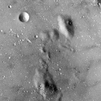
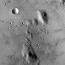

<!-- Check whether the assignment is up to date -->
{{'now' | date: '%Y'}}
{{page.due_date | date: '%Y'}}
 
<div class="alert alert-danger">
Warning: this assignment is out of date.  It may still need to be updated for this year's class.  Check with your instructor before you start working on this assignment.
</div>

<!-- End of check whether the assignment is up to date -->


<div class="alert alert-info">
This assignment is due on {{ page.due_date | date: "%A, %B %-d, %Y" }} before {{ page.due_date | date: "%I:%M%p" }}. 
</div>


<div class="alert alert-info">
You can download the materials for this assignment here:
<ul>

<li><a href="{{item.url}}">{{ item.name }}</a></li>

</ul>
</div>



Homework 10: Extra Credit - Part 1 [45 points]
=============================================================

## Instructions

This first part of the Extra Credit assignment involves implementing functions commonly used in Neural Networks from scratch without use of external libraries/packages other than [NumPy](http://www.numpy.org).

A skeleton file [homework10_part1.py](homework10_part1.py) containing empty definitions for each question has been provided. Since portions of this assignment will be graded automatically, none of the names or function signatures in this file should be modified. However, you are free to introduce additional variables or functions if needed.

You will find that in addition to a problem specification, most programming questions also include a pair of examples from the Python interpreter. These are meant to illustrate typical use cases, and should not be taken as comprehensive test suites.

You are strongly encouraged to follow the Python style guidelines set forth in [PEP 8](http://www.python.org/dev/peps/pep-0008/), which was written in part by the creator of Python. However, your code will not be graded for style.

Once you have completed the assignment, you should submit your file on [Gradescope]({{page.submission_link}}).

You may submit as many times as you would like before the deadline, but only the last submission will be saved. 

## 1. Individual Functions [45 points]

The goal of this part of the assignment is to get an intuition of the underlying implementation used in Convolutional Neural Networks, specifically performing convolution and pooling, and applying an activation function.  

As mentioned in the instructions, you are restricted from using any external packages other than [NumPy](http://www.numpy.org). Numpy has a [Quickstart tutorial](https://docs.scipy.org/doc/numpy/user/quickstart.html), which we recommend looking at if you are not familiar or would like to refresh memory. 


1. **[15 points]** Write a function `convolve_greyscale(image, kernel)` that accepts a numpy array `image` of shape `(image_height, image_width)` (greyscale image) of integers and a numpy array `kernel` of shape `(kernel_height, kernel_width)` of floats. The function performs a convolution,  which consists of adding each element of the image to its local neighbors, weighted by the kernel (flipped both vertically and horizontally). 

    The result of this function is a new numpy array of floats that has the same shape as the input `image`. Apply zero-padding to the input image to calculate image edges. Note that the height and width of both `image` and `kernel` might not be equal to each other. You can assume `kernel_width` and `kernel_height` are odd numbers. 

    There exist a few visualisations hands-on experience of applying a convolution online, for instance a post by [Victor Powell](http://setosa.io/ev/image-kernels/). For more information, you can also use real images as an input.  We recommend selecting a few images of type `gray` from the Miscellaneous Volume  of the  [USC-SIPI Image Database](http://sipi.usc.edu/database/database.php?volume=misc). (Image in the third example below is taken from this dataset labelled under [5.1.09](http://sipi.usc.edu/database/download.php?vol=misc&img=5.1.09).)
            
    ```python
    >>> import numpy as np
    >>> image = np.array([
            [0,  1,  2,  3,  4],
            [ 5,  6,  7,  8,  9], 
            [10, 11, 12, 13, 14], 
            [15, 16, 17, 18, 19], 
            [20, 21, 22, 23, 24]])
    >>> kernel = np.array([
            [0, -1, 0],
            [-1, 5, -1],
            [0, -1, 0]])
    >>> print(convolve_greyscale(image, kernel))
    [[-6. -3. -1.  1.  8.]
     [ 9.  6.  7.  8. 19.]
     [19. 11. 12. 13. 29.]
     [29. 16. 17. 18. 39.]
     [64. 47. 49. 51. 78.]]
    ```

    ```python
    >>> import numpy as np
    >>> image = np.array([
            [0,  1,  2,  3,  4],
            [ 5,  6,  7,  8,  9], 
            [10, 11, 12, 13, 14], 
            [15, 16, 17, 18, 19], 
            [20, 21, 22, 23, 24]])
    >>> kernel = np.array([
            [1, 2, 3],
            [0, 0, 0],
            [-1, -2, -3]])
    >>> print(convolve_greyscale(image, kernel))
    [[  16.   34.   40.   46.   42.]
     [  30.   60.   60.   60.   50.]
     [  30.   60.   60.   60.   50.]
     [  30.   60.   60.   60.   50.]
     [ -46.  -94. -100. -106.  -92.]]
    ```

    ```python
    >>> import numpy as np
    >>> from PIL import Image
    >>> import matplotlib.pyplot as plt
    >>> image = np.array(Image.open('5.1.09.tiff'))
    >>> plt.imshow(image, cmap='gray')
    >>> plt.show()
    >>> kernel = np.array([
            [0, -1, 0],
            [-1, 5, -1],
            [0, -1, 0]])
    >>> output = convolve_greyscale(image, kernel)
    >>> plt.imshow(output, cmap='gray')
    >>> plt.show()
    >>> print(output)
    [[416. 352. 270. ... 152. 135. 233.]
     [274. 201. 126. ...  85.  69. 155.]
     [255. 151. 131. ...  56.  45. 164.]
     ...
     [274. 124. 159. ...  91. 176. 241.]
     [166. 139. 118. ... 122. 156. 280.]
     [423. 262. 280. ... 262. 312. 454.]]
    ```
    <table align="center">
        <tr>
            <td> </td>
            <td>&nbsp;&nbsp;&nbsp;&nbsp;&nbsp;&nbsp;</td>
            <td> </td>
        </tr>
    </table>
    <p align="center">
    Left: line 6 (before function invocation)
    <br>
    Right: line 10 (after function invocation) 
    </p>


2. **[5 points]** Write a function `convolve_rgb(image, kernel)` that accepts a numpy array `image` of shape `(image_height, image_width, image_depth)` of integers  and a numpy array `kernel` of shape `(kernel_height, kernel_width)` of floats. The function performs a convolution on each depth of an image, which consists of adding each element of the image to its local neighbors, weighted by the kernel (flipped both vertically and horizontally). 

    The result of this function is a new numpy array of floats that has the same shape as the input `image`. You can use `convolve_greyscale(image, filter)` implemented in the previous part to go through each depth of an image. As before, apply zero-padding to the input image to calculate image edges. Note that the height and width of both `image` and `kernel` might not be equal to each other. You can assume `kernel_width` and `kernel_height` are odd numbers.

    We recommend selecting a few images of type `color` from the Miscellaneous Volume of the  [USC-SIPI Image Database](http://sipi.usc.edu/database/database.php?volume=misc). (Images in the examples below are taken from this dataset labelled under [4.1.07](http://sipi.usc.edu/database/download.php?vol=misc&img=4.1.07))


    ```python
    >>> import numpy as np
    >>> from PIL import Image
    >>> import matplotlib.pyplot as plt
    >>> image = np.array(Image.open('4.1.07.tiff'))
    >>> plt.imshow(image)
    >>> plt.show()
    >>> kernel = np.array([
            [0.11111111, 0.11111111, 0.11111111],
            [0.11111111, 0.11111111, 0.11111111],
            [0.11111111, 0.11111111, 0.11111111]])
    >>> output = convolve_rgb(image, kernel)
    >>> plt.imshow(output.astype('uint8'))
    >>> plt.show()
    >>> print(np.round(output[0:3, 0:3, 0:3], 2))
    [[[ 63.67  63.44  47.22]
      [ 95.56  94.89  70.89]
      [ 95.56  94.78  70.89]]
    
     [[ 95.67  95.22  70.67]
      [143.33 142.56 105.89]
      [143.22 142.33 106.  ]]
    
     [[ 96.33  96.11  70.22]
      [144.11 144.   105.11]
      [143.78 143.44 105.22]]]
     
    ```

    <table align="center">
        <tr>
            <td> </td>
            <td>&nbsp;&nbsp;&nbsp;&nbsp;&nbsp;&nbsp;</td>
            <td> </td>
        </tr>
    </table>
    <p align="center">
    Left: line 6 (before function invocation)
    <br>
    Right: line 10 (after function invocation) 
    </p>


    ```python
    >>> import numpy as np
    >>> from PIL import Image
    >>> import matplotlib.pyplot as plt
    >>> image = np.array(Image.open('4.1.07.tiff'))
    >>> plt.imshow(image)
    >>> plt.show()
    >>> kernel = np.ones((11, 11))
    >>> kernel /= np.sum(kernel)
    >>> output = convolve_rgb(image, kernel)
    >>> plt.imshow(output.astype('uint8'))
    >>> plt.show()
    >>> print(np.round(output[0:3, 0:3, 0:3], 2))
    [[[43.26 43.31 31.32]
      [50.54 50.67 36.6 ]
      [57.83 58.   41.88]]
    
     [[50.64 50.86 36.51]
      [59.17 59.5  42.65]
      [67.73 68.1  48.81]]
    
     [[58.01 58.49 41.7 ]
      [67.79 68.41 48.72]
      [77.6  78.29 55.75]]]
    ```
    <table align="center">
        <tr>
            <td> </td>
            <td>&nbsp;&nbsp;&nbsp;&nbsp;&nbsp;&nbsp;</td>
            <td> </td>
        </tr>
    </table>
    <p align="center">
    Left: line 6 (before function invocation)
    <br>
    Right: line 11 (after function invocation) 
    </p>

3. **[15 points]** Write a function `max_pooling(image, kernel_size, stride)` that accepts a numpy array `image` of integers of shape `(image_height, image_width)` (greyscale image) of integers, a tuple `kernel_size` corresponding to `(kernel_height, kernel_width)`, and a tuple `stride` of `(stride_height, stride_width)` corresponding to the stride of pooling window. 

    The goal of this function is to reduce the spatial size of the representation and in this case reduce dimensionality of an image with max down-sampling. It is not common to pad the input using zero-padding for the pooling layer in Convolutional Neural Network and as such, so we do not ask to pad. Notice that this function must support overlapping pooling if `stride` is not equal to `kernel_size`. 

    As before, we recommend selecting a few images of type `gray` from the Miscellaneous Volume  of the  [USC-SIPI Image Database](http://sipi.usc.edu/database/database.php?volume=misc). (Image in three examples below are taken from this dataset labelled under [5.1.09](http://sipi.usc.edu/database/download.php?vol=misc&img=5.1.09).)

    ```python
    >>> image = np.array([
            [1, 1, 2, 4],
            [5, 6, 7, 8],
            [3, 2, 1, 0],
            [1, 2, 3, 4]])
    >>> kernel_size = (2, 2)
    >>> stride = (2, 2)
    >>> print(max_pooling(image, kernel_size, stride))
    [[6 8]
    [3 4]]
    ```

    ```python
    >>> image = np.array([
            [1, 1, 2, 4],
            [5, 6, 7, 8],
            [3, 2, 1, 0],
            [1, 2, 3, 4]])
    >>> kernel_size = (2, 2)
    >>> stride = (1, 1)
    >>> print(max_pooling(image, kernel_size, stride))
    [[6 7 8]
     [6 7 8]
     [3 3 4]]
    ```

    ```python
    >>> import numpy as np
    >>> from PIL import Image
    >>> import matplotlib.pyplot as plt
    >>> image = np.array(Image.open('5.1.09.tiff'))
    >>> plt.imshow(image, cmap='gray')
    >>> plt.show()
    >>> kernel_size = (2, 2)
    >>> stride = (2, 2)
    >>> output = max_pooling(image, kernel_size, stride)
    >>> plt.imshow(output, cmap='gray')
    >>> plt.show()
    >>> print(output)
    [[160 146 155 ...  73  73  76]
     [160 148 153 ...  75  73  84]
     [168 155 155 ...  80  66  80]
     ...
     [137 133 131 ... 148 149 146]
     [133 133 129 ... 146 144 146]
     [133 133 133 ... 151 148 149]]
    >>> print(output.shape)
    (128, 128)
    ```
    <table align="center">
        <tr>
            <td> </td>
            <td>&nbsp;&nbsp;&nbsp;&nbsp;&nbsp;&nbsp;</td>
            <td> </td>
        </tr>
    </table>
    <p align="center">
    Left: line 6 (before function invocation with image shape (256, 256))
    <br>
    Right: line 11 (after function invocation with image shape (128, 128)) 
    </p>


    ```python
    >>> import numpy as np
    >>> from PIL import Image
    >>> import matplotlib.pyplot as plt
    >>> image = np.array(Image.open('5.1.09.tiff'))
    >>> plt.imshow(image, cmap='gray')
    >>> plt.show()
    >>> kernel_size = (4, 4)
    >>> stride = (1, 1)
    >>> output = max_pooling(image, kernel_size, stride)
    >>> plt.imshow(output, cmap='gray')
    >>> plt.show()
    >>> print(output)
    [[160 160 155 ...  75  73  84]
     [162 160 155 ...  80  76  84]
     [168 168 155 ...  80  76  84]
     ...
     [137 133 133 ... 149 149 149]
     [133 133 133 ... 149 149 149]
     [133 133 133 ... 151 149 149]]
    >>> print(output.shape)
    (253, 253)
    ```

    <table align="center">
        <tr>
            <td> </td>
            <td>&nbsp;&nbsp;&nbsp;&nbsp;&nbsp;&nbsp;</td>
            <td> </td>
        </tr>
    </table>
    <p align="center">
    Left: line 6 (before function invocation with image shape (256, 256))
    <br>
    Right: line 11 (after function invocation with image shape (253, 253)) 
    </p>


    ```python
    >>> import numpy as np
    >>> from PIL import Image
    >>> import matplotlib.pyplot as plt
    >>> image = np.array(Image.open('5.1.09.tiff'))
    >>> plt.imshow(image, cmap='gray')
    >>> plt.show()
    >>> kernel_size = (3, 3)
    >>> stride = (1, 3)
    >>> output = max_pooling(image, kernel_size, stride)
    >>> plt.imshow(output, cmap='gray')
    >>> plt.show()
    >>> print(output)
    [[160 155 153 ... 100  76  73]
     [160 155 153 ... 113  82  73]
     [162 155 157 ... 118  82  76]
     ...
     [133 133 126 ... 155 148 149]
     [133 133 131 ... 149 148 148]
     [133 133 131 ... 146 151 149]]
    >>> print(output.shape)
    (254, 85)

    ```
    <table align="center">
        <tr>
            <td> </td>
            <td>&nbsp;&nbsp;&nbsp;&nbsp;&nbsp;&nbsp;</td>
            <td> </td>
        </tr>
    </table>
    <p align="center">
    Left: line 6 (before function invocation with image shape (256, 256))
    <br>
    Right: line 11 (after function invocation with image shape (254, 85)) 
    </p>

4. **[5 points]** Similarly to the previous part, write a function `average_pooling(image, kernel_size, stride)` that accepts a numpy array `image` of integers of shape `(image_height, image_width)` (greyscale image) of integers, a tuple `kernel_size` corresponding to `(kernel_height, kernel_width)`, and a tuple `stride` of `(stride_height, stride_width)` corresponding to the stride of pooling window. 

    The goal of this function is to reduce the spatial size of the representation and in this case reduce dimensionality of an image with average down-sampling. 

    As before, we recommend selecting a few images of type `gray` from the Miscellaneous Volume  of the  [USC-SIPI Image Database](http://sipi.usc.edu/database/database.php?volume=misc). (Image in the third example is taken from this dataset labelled under [5.1.09](http://sipi.usc.edu/database/download.php?vol=misc&img=5.1.09).)

    ```python
    >>> image = np.array([
            [1, 1, 2, 4],
            [5, 6, 7, 8],
            [3, 2, 1, 0],
            [1, 2, 3, 4]])
    >>> kernel_size = (2, 2)
    >>> stride = (2, 2)
    >>> print(average_pooling(image, kernel_size, stride))
    [[3.25 5.25]
     [2.   2.  ]]
    ```

    ```python
    >>> image = np.array([
            [1, 1, 2, 4],
            [5, 6, 7, 8],
            [3, 2, 1, 0],
            [1, 2, 3, 4]])
    >>> kernel_size = (2, 2)
    >>> stride = (1, 1)
    >>> print(average_pooling(image, kernel_size, stride))
    [[3.25 4.   5.25]
     [4.   4.   4.  ]
     [2.   2.   2.  ]]
    ```

    ```python
    >>> import numpy as np
    >>> from PIL import Image
    >>> import matplotlib.pyplot as plt
    >>> image = np.array(Image.open('5.1.09.tiff'))
    >>> plt.imshow(image, cmap='gray')
    >>> plt.show()
    >>> kernel_size = (2, 2)
    >>> stride = (2, 2)
    >>> output = average_pooling(image, kernel_size, stride)
    >>> plt.imshow(output, cmap='gray')
    >>> plt.show()    
    >>> print(output)
    [[152.   145.   154.   ...  65.5   71.    73.5 ]
     [152.75 145.5  143.25 ...  70.5   68.25  74.25]
     [160.5  149.5  146.25 ...  71.    62.25  75.  ]
     ...
     [129.   128.75 125.25 ... 144.   138.25 141.75]
     [127.75 128.   125.   ... 142.   135.75 142.25]
     [125.5  127.75 130.   ... 143.75 141.25 146.5 ]]
    >>> print(output.shape)
    (128, 128)
    ```

    <table align="center">
        <tr>
            <td> </td>
            <td>&nbsp;&nbsp;&nbsp;&nbsp;&nbsp;&nbsp;</td>
            <td> </td>
        </tr>
    </table>
    <p align="center">
    Left: line 6 (before function invocation with image shape (256, 256))
    <br>
    Right: line 11 (after function invocation with image shape (128, 128)) 
    </p>

    ```python
    >>> import numpy as np
    >>> from PIL import Image
    >>> import matplotlib.pyplot as plt
    >>> image = np.array(Image.open('5.1.09.tiff'))
    >>> plt.imshow(image, cmap='gray')
    >>> plt.show()
    >>> kernel_size = (4, 4)
    >>> stride = (1, 1)
    >>> output = average_pooling(image, kernel_size, stride)
    >>> plt.imshow(output, cmap='gray')
    >>> plt.show() 
    >>> print(output)
    [[148.8125 149.375  146.9375 ...  68.8125  69.875   71.75  ]
     [149.5    148.     145.625  ...  69.4375  69.4375  71.    ]
     [152.0625 149.     146.125  ...  68.      67.4375  69.9375]
     ...
     [128.375  127.     126.75   ... 140.     139.6875 139.5   ]
     [126.625  127.     127.1875 ... 140.75   140.9375 140.5   ]
     [127.25   127.8125 127.6875 ... 140.6875 141.0625 141.4375]]
    >>> print(output.shape)
    (253, 253)
    ```
    
    <table align="center">
        <tr>
            <td> </td>
            <td>&nbsp;&nbsp;&nbsp;&nbsp;&nbsp;&nbsp;</td>
            <td> </td>
        </tr>
    </table>
    <p align="center">
    Left: line 6 (before function invocation with image shape (256, 256))
    <br>
    Right: line 11 (after function invocation with image shape (253, 253)) 
    </p>

    ```python
    >>> import numpy as np
    >>> from PIL import Image
    >>> import matplotlib.pyplot as plt
    >>> image = np.array(Image.open('5.1.09.tiff'))
    >>> plt.imshow(image, cmap='gray')
    >>> plt.show()
    >>> kernel_size = (3, 3)
    >>> stride = (1, 3)
    >>> output = average_pooling(image, kernel_size, stride)
    >>> plt.imshow(output, cmap='gray')
    >>> plt.show() 
    >>> print(np.round(output, 5))
    [[148.11111 150.88889 149.33333 ...  79.33333  66.66667  69.55556]
     [150.11111 146.33333 147.55556 ...  85.       70.33333  69.     ]
     [150.33333 144.44444 146.55556 ...  93.44444  73.55556  68.22222]
     ...
     [127.88889 125.55556 118.66667 ... 146.      142.22222 138.66667]
     [126.11111 126.55556 123.77778 ... 143.66667 142.44444 140.22222]
     [127.88889 128.11111 125.88889 ... 142.88889 143.55556 141.55556]]
    >>> print(output.shape)
    (254, 85)
    ```
    
    <table align="center">
        <tr>
            <td> </td>
            <td>&nbsp;&nbsp;&nbsp;&nbsp;&nbsp;&nbsp;</td>
            <td> </td>
        </tr>
    </table>
    <p align="center">
    Left: line 6 (before function invocation with image shape (256, 256))
    <br>
    Right: line 11 (after function invocation with image shape (254, 85)) 
    </p>


5. **[5 points]** Write a function `sigmoid(x)` that accepts an a numpy array `x` and applies a sigmoid activation function on the input. 

     ```python
    >>> x = np.array([0.5, 3, 1.5, -4.7, -100])
    >>> print(sigmoid(x))
    [6.22459331e-01 9.52574127e-01 8.17574476e-01 9.01329865e-03 3.72007598e-44]
    ```


## 2. Feedback [0 points]

1. **[0 points]** Approximately how long did you spend on this assignment?
2. **[0 points]** Which aspects of this assignment did you find most challenging? Were there any significant stumbling blocks?
3. **[0 points]**  Which aspects of this assignment did you like? Is there anything you would have changed?