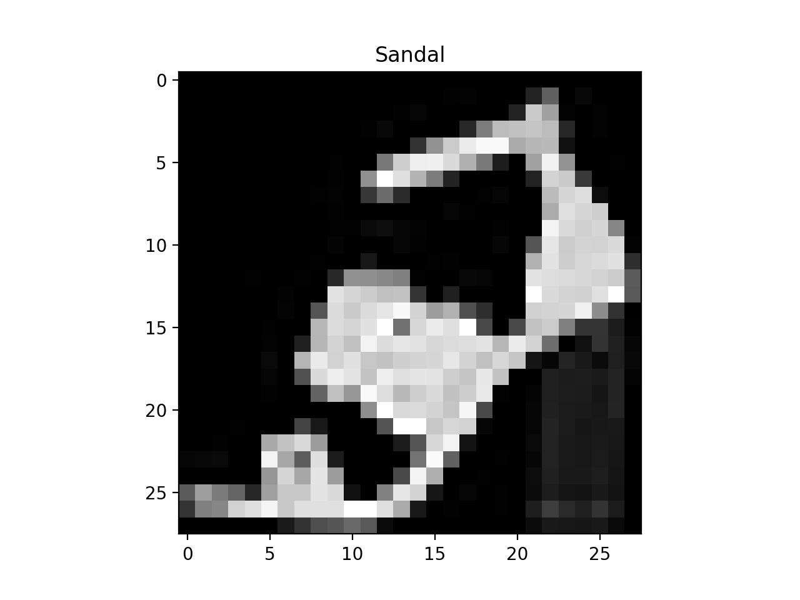
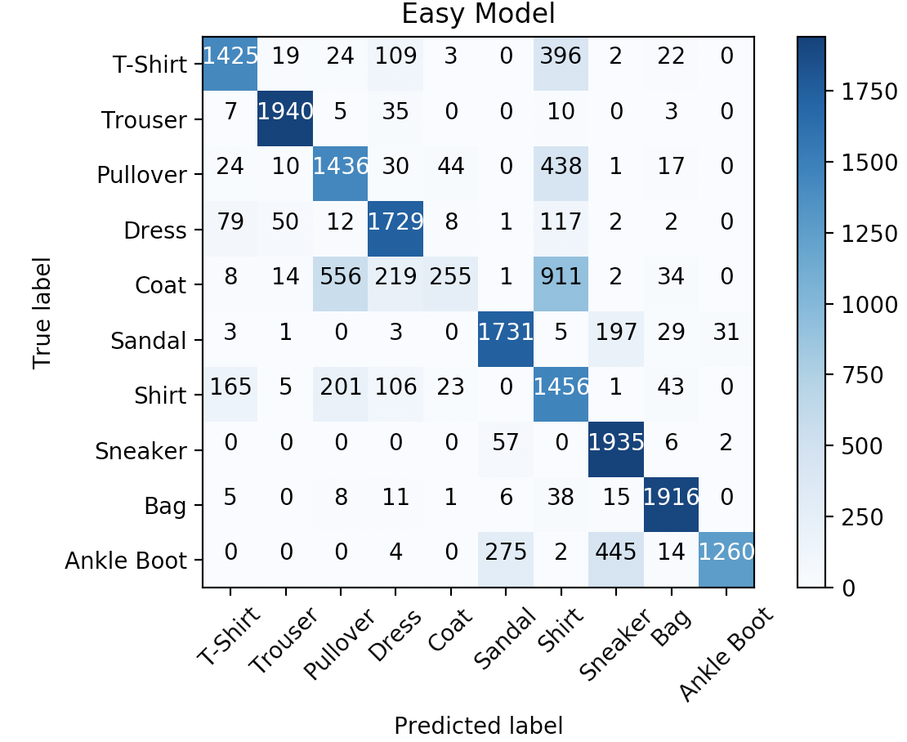
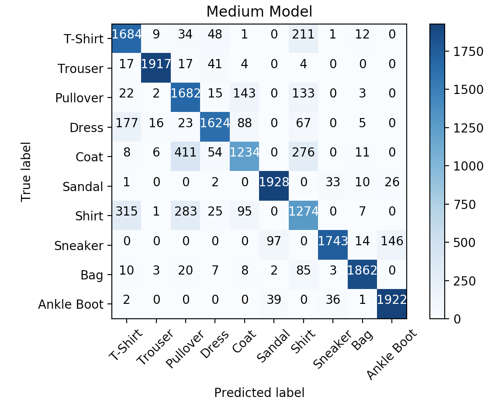
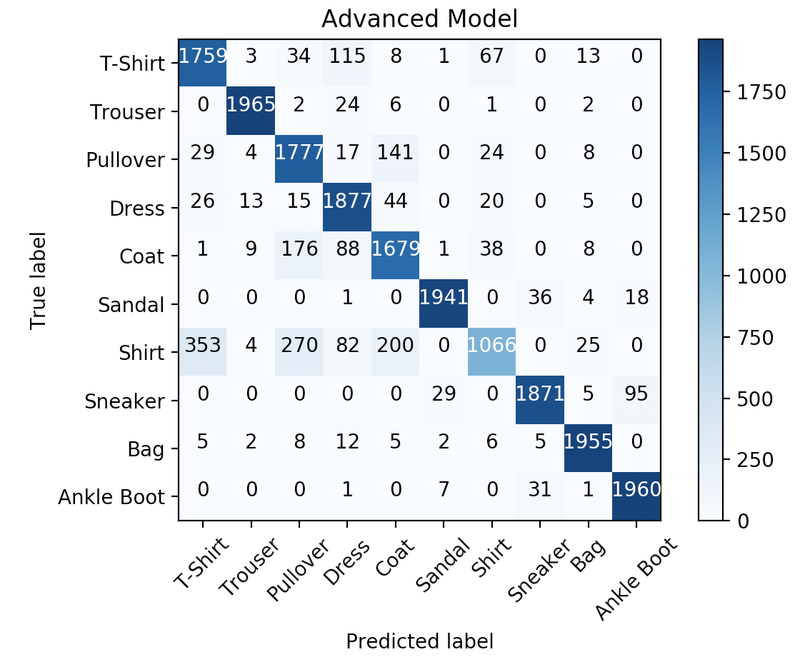

<!-- Check whether the assignment is up to date -->
{{'now' | date: '%Y'}}
{{page.due_date | date: '%Y'}}
 
<div class="alert alert-danger">
Warning: this assignment is out of date.  It may still need to be updated for this year's class.  Check with your instructor before you start working on this assignment.
</div>

<!-- End of check whether the assignment is up to date -->


<div class="alert alert-info">
This assignment is due on {{ page.due_date | date: "%A, %B %-d, %Y" }} before {{ page.due_date | date: "%I:%M%p" }}. 
</div>


<div class="alert alert-info">
You can download the materials for this assignment here:
<ul>

<li><a href="{{item.url}}">{{ item.name }}</a></li>

</ul>
</div>



Homework 10: Extra Credit - Part 2 [55 points]
=============================================================

## <a name="instructions"></a> Instructions


This part of the assignment involves building a Neural Network using one of the Machine Learning frameworks called [PyTorch](https://pytorch.org) for a [Fashion MNIST dataset](https://github.com/zalandoresearch/fashion-mnist).

A skeleton file [homework10_part2.py](homework10_part2.py) containing empty definitions for each question has been provided. Since portions of this assignment will be graded automatically, none of the names or function signatures in this file should be modified. However, you are free to introduce additional variables or functions if needed.

A file containing a sub-set of the Fashion MNIST dataset [dataset.csv](dataset.csv) is provided. 

You will find that in addition to a problem specification, most programming questions also include a pair of examples from the Python interpreter. These are meant to illustrate typical use cases, and should not be taken as comprehensive test suites.

You are strongly encouraged to follow the Python style guidelines set forth in [PEP 8](http://www.python.org/dev/peps/pep-0008/), which was written in part by the creator of Python. However, your code will not be graded for style.

Once you have completed the assignment, you should submit your file on [Gradescope]({{page.submission_link}}).

You may submit as many times as you would like before the deadline, but only the last submission will be saved. 


## <a name="part_2"></a> Part 2 [55 points]

The goal of this part of the assignment is to get familiar with using one of the Machine Learning frameworks called [PyTorch](https://pytorch.org). 

The installation instructions can be found [here](https://pytorch.org/get-started/locally/). If you are having difficulty installing it, here is an alternative way to [setup PyTorch using miniconda](#setup).


### <a name="setup"></a>  (Setup PyTorch using miniconda)
Miniconda is a package, dependency and environment management for python (amongst other languages). It lets you install different versions of python, different versions of various packages in different environments which makes working on multiple projects (with different dependencies) easy.

There are two ways to use miniconda,

1. **Use an existing installation from another user (highly recommended)**: On ```biglab```, add the following line at the end of your ```~/.bashrc``` file.
```
export PATH="/home1/m/mayhew/miniconda3/bin:$PATH"
```
Then run the following command
```
source ~/.bashrc
```
If you run the command ```$ which conda```, the output should be ```/home1/m/mayhew/miniconda3/bin/conda```.

2. **Installing Miniconda from scratch**: On ```biglab```, run the following commands. Press Enter/Agree to all prompts during installation.
```
$ wget https://repo.continuum.io/miniconda/Miniconda3-latest-Linux-x86_64.sh
$ chmod +x Miniconda3-latest-Linux-x86_64.sh
$ bash Miniconda3-latest-Linux-x86_64.sh
```
After successful installation, running the command ```$ which conda``` should output ```/home1/m/$USERNAME/miniconda3/bin/conda```.


### Fashion MNIST Dataset

The [dataset.csv](dataset.csv) we will use is a sub-set of the Fashion MNIST train dataset. 

<p align="center">

</p>

<p align="center">

</p>

The dataset contains 20000 28x28 greyscale images, where each image has a label from one of 10 classes:

| Label | Description |
| --- | --- |
| 0 | T-shirt/top |
| 1 | Trouser |
| 2 | Pullover |
| 3 | Dress |
| 4 | Coat |
| 5 | Sandal |
| 6 | Shirt |
| 7 | Sneaker |
| 8 | Bag |
| 9 | Ankle boot |


### Part 2.1 [5 points]

The [dataset.csv](dataset.csv) is a comma-separated csv file with a header 'label, pixel1, pixel2, ..., pixel 784'. 
The first column 'label' is a label from 0 to 9 inclusively, and the rest of the columns 'pixel1' ... 'pixel784' are 784 pixels of an image for a corresponding label.  

Your task is to fill in `load_data(file_path, reshape_images)`, where `file_path` is a string representing the path to a dataset and `reshape_images` is a boolean flag that indicates whether an image needs to be represented as one dimensional array of 784 pixels or reshaped to (1, 28, 28) array pixels.  This function returns 2 numpy arrays, where the first array corresponds to images and the second to labels. 
 
Since there are 20000 images and labels in `dataset.csv`, you should expect something as follows when the function is called with `reshape_images` set to `False`:

```python
>>> X, Y = load_data('dataset.csv', False)
>>> print(X.shape)
(20000, 784)
>>> print(Y.shape)
(20000,)
```

And something as follows when the function is called with `reshape_images` set to `True`:
```python
>>> X, Y = load_data('dataset.csv', True)
>>> print(X.shape)
(20000, 1, 28, 28)
>>> print(Y.shape)
(20000,)
```

Here is a way to visualise the first image of our data: 

```python
>>> import matplotlib.pyplot as plt
>>> class_names = ['T-Shirt', 'Trouser', 'Pullover', 'Dress', 'Coat', 'Sandal', 'Shirt', 'Sneaker', 'Bag', 'Ankle Boot']
>>> X, Y = load_data('dataset.csv', False)
>>> plt.imshow(X[0].reshape(28, 28), cmap='gray')
>>> plt.title(class_names[Y[0]])
>>> plt.show()
```
<p align="center">

</p>


##### Data Loading and Processing in PyTorch

The `load_data(file_path, reshape_images)` function gets called in the `FashionMNISTDataset` class, which is given in the skeleton file. The `FashionMNISTDataset` class is a custom dataset that inherits [`torch.utils.data.Dataset`](https://pytorch.org/docs/stable/_modules/torch/utils/data/dataset.html#Dataset), which is an abstract class representing a dataset in PyTorch. We filled in the required `__len__` and `__getitem__` functions to return the size of the dataset and to add support the indexing of the dataset. 

```python
from torch.utils.data import Dataset
class FashionMNISTDataset(Dataset):
    def __init__(self, file_path, reshape_images):
        self.X, self.Y = load_data(file_path, reshape_images)

    def __len__(self):
        return len(self.X)

    def __getitem__(self, index):
        return self.X[index], self.Y[index]
```

Similarly to the previous snippets of code:

```python
>>> dataset= FashionMNISTDataset('dataset.csv', False)
>>> print(dataset.X.shape)
(20000, 784)
>>> print(dataset.Y.shape)
(20000,)
>>> dataset= FashionMNISTDataset('dataset.csv', True)
>>> print(dataset.X.shape)
(20000, 1, 28, 28)
>>> print(dataset.Y.shape)
(20000,)
```

This `FashionMNISTDataset` class can be used by [`torch.utils.data.DataLoader`](https://pytorch.org/docs/stable/_modules/torch/utils/data/dataloader.html#DataLoader), which is a dataset iterator and that provides ways to batch the data, shuffle the data, or load the data in parallel. Here is a snippet of code that uses `torch.utils.data.DataLoader` with  `batch_size` set to 10: 
```python
>>> dataset = FashionMNISTDataset('dataset.csv', False)
>>> data_loader = torch.utils.data.DataLoader(dataset=dataset, batch_size=10, shuffle=False)
>>> print(len(data_loader))
2000
>>> images, labels = list(data_loader)[0]
>>> print(type(images))
<class torch.LongTensor>
>>> print(images)
<class torch.LongTensor>

    0     0     0  ...     25     9     0
    0     0     0  ...      0     0     0
    0     0     0  ...      0     0     0
       ...          ⋱          ...       
    0     0     0  ...      0     0     0
    0     0     0  ...      0     0     0
    0     0     1  ...      0     0     0
[torch.LongTensor of size 10x784]
>>> print(type(labels))
<class torch.LongTensor>
>>> print(labels)

 5
 0
 1
 4
 7
 6
 2
 1
 9
 0
[torch.LongTensor of size 10]
```
Note that we added the code to load the data with `torch.utils.data.DataLoader` in the `main()` function of the skeleton file. 


    
### Part 2.2 - 2.4  [45 points]

For the next part of the assignment we give you a few functions that you are welcome to use and modify.  They are:

* The `train(model, data_loader, num_epochs, learning_rate)` function, which accepts the following arguments
1. a `model` which is a subclass of [`torch.nn.Module`](https://pytorch.org/docs/stable/_modules/torch/nn/modules/module.html#Module), 
2. a `data_loader` which is a class of [`torch.utils.data.DataLoader`](https://pytorch.org/docs/stable/_modules/torch/utils/data/dataloader.html#DataLoader) 
3. two hyper-parameters: `num_epochs` and `learning_rate`.
This function trains a `model` for the specified `num_epochs` using [`torch.nn.CrossEntropyLoss`](https://pytorch.org/docs/stable/nn.html#loss-functions) loss function and [`torch.optim.Adam`](https://pytorch.org/docs/stable/optim.html) as an optimizer. Once in a specified amount of iterations, the function prints the current loss, train accuracy, train F1-score for the model. 

* The `evaluate(model, data_loader)` function, which accepts
1. a `model` which is a subclass of [`torch.nn.Module`](https://pytorch.org/docs/stable/_modules/torch/nn/modules/module.html#Module) 
2. a `data_loader` which is a class of [`torch.utils.data.DataLoader`](https://pytorch.org/docs/stable/_modules/torch/utils/data/dataloader.html#DataLoader).

The `evaluate` function returns a list of actual labels and a list of predicted labels by that `model` for this `data_loader` class. This function can be used to get the metrics, such as accuracy or F1-score

* The `plot_confusion_matrix(cm, class_names, title=None)` function, which visualises a confusion matrix. It accepts
1. a confusion matrix `cm`, 
2. a list of corresponding `class_names` 
3. an optional `title`. 

The `plot_confusion_matrix` function was modified from [here](https://scikit-learn.org/stable/auto_examples/model_selection/plot_confusion_matrix.html)


All you have to do is to fill in `__init__(self)` and  `forward(self, x)` for 3 different classes: *Easy*, *Medium*, and *Advanced*.  

#### Part 2.2: Easy [10 pts]

In this part we ask you to fill in `__init__(self)` and  `forward(self, x)` of the `EasyModel` class. `EasyModel` is a subclass of [`torch.nn.Module`](https://pytorch.org/docs/stable/_modules/torch/nn/modules/module.html#Module), which is a base class for all neural network models in PyTorch. 
We ask you to build a model that consists of a single linear layer (using [`torch.nn.Linear`](https://pytorch.org/docs/stable/nn.html#linear-layers)).  You will need to write one line of code.  It starts with `self.fc = torch.nn.Linear`. It maps the size of the representation of an image to the number of classes.
We recommend to have look around the API for [`torch.nn`](https://pytorch.org/docs/stable/nn.html). 

Once you have filled in `__init__(self)` and  `forward(self, x)` of the `EasyModel` class you should expect something similar to this:

```python
>>> class_names = ['T-Shirt', 'Trouser', 'Pullover', 'Dress', 'Coat', 'Sandal', 'Shirt', 'Sneaker', 'Bag', 'Ankle Boot']
>>> num_epochs = 2
>>> batch_size = 100
>>> learning_rate = 0.001
>>> data_loader = torch.utils.data.DataLoader(dataset=FashionMNISTDataset('dataset.csv', False),  batch_size=batch_size, shuffle=True)
>>> easy_model = EasyModel()
>>> train(easy_model, data_loader, num_epochs, learning_rate)
Epoch : 0/2, Iteration : 49/200,  Loss: 5.7422, Train Accuracy: 73.3450, Train F1 Score: 72.6777
Epoch : 0/2, Iteration : 99/200,  Loss: 7.6222, Train Accuracy: 76.7650, Train F1 Score: 75.8522
Epoch : 0/2, Iteration : 149/200,  Loss: 8.9238, Train Accuracy: 76.9600, Train F1 Score: 76.6251
Epoch : 0/2, Iteration : 199/200,  Loss: 6.3722, Train Accuracy: 76.9450, Train F1 Score: 77.1084
Epoch : 1/2, Iteration : 49/200,  Loss: 6.0220, Train Accuracy: 72.7300, Train F1 Score: 73.4246
Epoch : 1/2, Iteration : 99/200,  Loss: 4.4724, Train Accuracy: 78.5450, Train F1 Score: 78.6831
Epoch : 1/2, Iteration : 149/200,  Loss: 3.9865, Train Accuracy: 79.5950, Train F1 Score: 79.3139
Epoch : 1/2, Iteration : 199/200,  Loss: 4.8550, Train Accuracy: 75.4150, Train F1 Score: 73.7432
>>> y_true_easy, y_pred_easy = evaluate(easy_model, data_loader)
>>> print(f'Easy Model: '
          f'Final Train Accuracy: {100.* accuracy_score(y_true_easy, y_pred_easy):.4f},',
          f'Final Train F1 Score: {100.* f1_score(y_true_easy, y_pred_easy, average="weighted"):.4f}')
Easy Model: Final Train Accuracy: 75.4150, Final Train F1 Score: 73.7432
>>> plot_confusion_matrix(confusion_matrix(y_true_easy, y_pred_easy), class_names, 'Easy Model')
```
<p align="center">

</p>


We reserved multiple datasets for testing with the same distribution of labels as given in `dataset.csv`. We will train and evaluate your model on our end using the same `train()` and `evaluate()` functions as given. 
Full points will be given for an `Easy Model` for num_epochs = 2, batch_size = 100, learning_rate = 0.001 if the accuracy on the reserved datasets and F1-Score is >= 72%.


#### Part 2.3: Medium [15 pts]

In this part we ask you to fill in `__init__(self)` and  `forward(self, x)` of the `Medium` class that is a subclass of [`torch.nn.Module`](https://pytorch.org/docs/stable/_modules/torch/nn/modules/module.html#Module). 
We ask you to build a model that consists of a multiple fully-connected linear layers (using [`torch.nn.Linear`](https://pytorch.org/docs/stable/nn.html#linear-layers)).
The network architecture is open-ended, so it is up to you to decide the number of linear layers and the size of nodes within the hidden layer(s). There are many tutorials online for you to use, for instance [this blog post](http://adventuresinmachinelearning.com/pytorch-tutorial-deep-learning/) gives a good solution for our  `Medium` class  by building a Fully-Connected Network with 2 hidden layers.  You can also use activation functions like ReLU. 
Remember that the input to this model is the size of a one dimensional representation of an image and the output is the number of classes as for the Easy Model.

Once you have filled in `__init__(self)` and  `forward(self, x)` of the `MediumModel` class you should expect something similar to this:
```python
>>> class_names = ['T-Shirt', 'Trouser', 'Pullover', 'Dress', 'Coat', 'Sandal', 'Shirt', 'Sneaker', 'Bag', 'Ankle Boot']
>>> num_epochs = 2
>>> batch_size = 100
>>> learning_rate = 0.001
>>> data_loader = torch.utils.data.DataLoader(dataset=FashionMNISTDataset('dataset.csv', False),  batch_size=batch_size, shuffle=True)
>>> medium_model = MediumModel()
>>> train(medium_model, data_loader, num_epochs, learning_rate)
>>> y_true_medium, y_pred_medium = evaluate(medium_model, data_loader)
Epoch : 0/2, Iteration : 49/200,  Loss: 0.7257, Train Accuracy: 76.7000, Train F1 Score: 76.6240
Epoch : 0/2, Iteration : 99/200,  Loss: 0.6099, Train Accuracy: 79.6000, Train F1 Score: 79.3427
Epoch : 0/2, Iteration : 149/200,  Loss: 0.3406, Train Accuracy: 80.3550, Train F1 Score: 79.2653
Epoch : 0/2, Iteration : 199/200,  Loss: 0.4423, Train Accuracy: 82.2350, Train F1 Score: 82.1259
Epoch : 1/2, Iteration : 49/200,  Loss: 0.6591, Train Accuracy: 82.2450, Train F1 Score: 81.5656
Epoch : 1/2, Iteration : 99/200,  Loss: 0.5055, Train Accuracy: 81.7150, Train F1 Score: 81.2029
Epoch : 1/2, Iteration : 149/200,  Loss: 0.4616, Train Accuracy: 83.9600, Train F1 Score: 83.4397
Epoch : 1/2, Iteration : 199/200,  Loss: 0.3895, Train Accuracy: 84.3500, Train F1 Score: 84.3794
>>> print(f'Medium Model: '
      f'Final Train Accuracy: {100.* accuracy_score(y_true_medium, y_pred_medium):.4f},',
      f'Final F1 Score: {100.* f1_score(y_true_medium, y_pred_medium, average="weighted"):.4f}')
Medium Model: Final Train Accuracy: 84.3500, Final F1 Score: 84.3794
>>> plot_confusion_matrix(confusion_matrix(y_true_medium, y_pred_medium), class_names, 'Medium Model')
```

<p align="center">

</p>


As before, we reserved multiple datasets for testing with the same distribution of labels as given in `dataset.csv`. We will train and evaluate your model on our end using the same `train()` and `evaluate()` functions as given. 
Full points will be given for a `Medium Model` for num_epochs = 2, batch_size = 100, learning_rate = 0.001 if the accuracy on the reserved datasets and F1-Score is >= 82%.


#### Part 2.3: Advanced [20 pts]

In this part we ask you to fill in `__init__(self)` and  `forward(self, x)` of the `Advanced` class that is a subclass of [`torch.nn.Module`](https://pytorch.org/docs/stable/_modules/torch/nn/modules/module.html#Module).
We ask you to build a Convolutional Neural Network, which will consists of one or more convolutional layers ([`torch.nn.Conv2d`](https://pytorch.org/docs/stable/nn.html#convolutional-layers)) connected by the linear layers. The architecture is open-ended, so it is up to you to decide the number of layers, kernel size, activation functions etc. 
You can see performance of different architectures for this dataset [here](https://github.com/zalandoresearch/fashion-mnist/blob/master/README.md#Benchmark). 
The input to this model, unlike the input for `Easy` and `Medium` Models is expected to be different, and this is the reason why we asked you to reshape the images in Part 2.1. The output of this model remains the same as before.

Once you have filled in `__init__(self)` and  `forward(self, x)` of the `EasyModel` class you can use the following to see the performance of your  

```python
>>> class_names = ['T-Shirt', 'Trouser', 'Pullover', 'Dress', 'Coat', 'Sandal', 'Shirt', 'Sneaker', 'Bag', 'Ankle Boot']
>>> num_epochs = 2
>>> batch_size = 100
>>> learning_rate = 0.001
>>> data_loader_reshaped = torch.utils.data.DataLoader(dataset=FashionMNISTDataset('dataset.csv', True), batch_size=batch_size, shuffle=True)
>>> advanced_model = AdvancedModel()
>>> train(advanced_model, data_loader_reshaped, num_epochs, learning_rate)
>>> y_true_advanced, y_pred_advanced = evaluate(advanced_model, data_loader_reshaped)
Epoch : 0/2, Iteration : 49/200,  Loss: 0.7043, Train Accuracy: 80.2100, Train F1 Score: 79.9030
Epoch : 0/2, Iteration : 99/200,  Loss: 0.4304, Train Accuracy: 84.0650, Train F1 Score: 83.9004
Epoch : 0/2, Iteration : 149/200,  Loss: 0.4911, Train Accuracy: 85.0850, Train F1 Score: 84.4854
Epoch : 0/2, Iteration : 199/200,  Loss: 0.3728, Train Accuracy: 86.9900, Train F1 Score: 86.9663
Epoch : 1/2, Iteration : 49/200,  Loss: 0.3628, Train Accuracy: 87.2150, Train F1 Score: 86.9041
Epoch : 1/2, Iteration : 99/200,  Loss: 0.3961, Train Accuracy: 87.7100, Train F1 Score: 87.7028
Epoch : 1/2, Iteration : 149/200,  Loss: 0.3038, Train Accuracy: 88.9200, Train F1 Score: 88.9186
Epoch : 1/2, Iteration : 199/200,  Loss: 0.3445, Train Accuracy: 89.2500, Train F1 Score: 88.8764
>>> print(f'Advanced Model: '
  f'Final Train Accuracy: {100.* accuracy_score(y_true_advanced, y_pred_advanced):.4f},',
  f'Final F1 Score: {100.* f1_score(y_true_advanced, y_pred_advanced, average="weighted"):.4f}')
Advanced Model: Final Train Accuracy: 89.2500, Final F1 Score: 88.8764
plot_confusion_matrix(confusion_matrix(y_true_advanced, y_pred_advanced), class_names, 'Advanced Model')
```

<p align="center">

</p>


As before, we reserved multiple datasets for testing with the same distribution of labels as given in `dataset.csv`. We will train and evaluate your model on our end using the same `train()` and `evaluate()` functions as given. 
Full points will be given for a `Advanced Model` for num_epochs = 2, batch_size = 100, learning_rate = 0.001 if the accuracy on the reserved datasets and F1-Score is >= 88%.


## 3. Feedback [5 points]
1. **[2 points]** What were the two classes that one of your models confused the most?
2. **[3 points]** Describe your architecture for the Advanced Model.
3. **[0 points]** Approximately how long did you spend on this assignment?
4. **[0 points]** Which aspects of this assignment did you find most challenging? Were there any significant stumbling blocks?
5. **[0 points]**  Which aspects of this assignment did you like? Is there anything you would have changed?