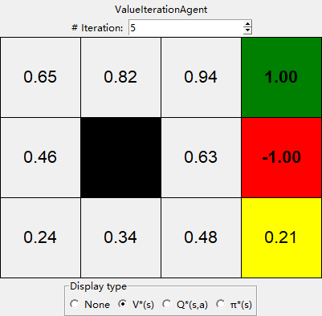
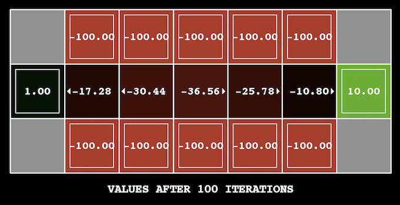
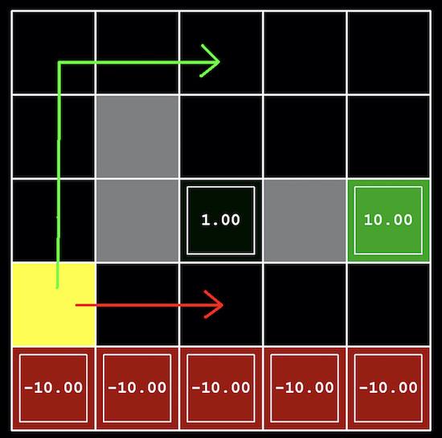

<!-- Check whether the assignment is ready to release -->
{{'now' | date: '%s'}}
{{page.release_date | date: '%s'}}
 
<div class="alert alert-danger">
Warning: this assignment is out of date.  It may still need to be updated for this year's class.  Check with your instructor before you start working on this assignment.
</div>

<!-- End of check whether the assignment is up to date -->

<!-- Check whether the assignment is up to date -->
{{'now' | date: '%Y'}}
{{page.due_date | date: '%Y'}}
 
<div class="alert alert-danger">
Warning: this assignment is out of date.  It may still need to be updated for this year's class.  Check with your instructor before you start working on this assignment.
</div>

<!-- End of check whether the assignment is up to date -->


<div class="alert alert-info">
This assignment is due on {{ page.due_date | date: "%A, %B %-d, %Y" }} before {{ page.due_date | date: "%I:%M%p" }}. 
</div>



<div class="alert alert-info">
You can download the materials for this assignment here:
<ul>

<li><a href="{{site.baseurl}}/{{item.url}}">{{ item.name }}</a></li>

</ul>
</div>



Homework 6: Markov Decision Processes [100 points]
=============================================================

## Instructions
In this project, you will implement value and policy iteration. You will test your agents on **Gridworld**.

A skeleton file [`agents.py`](agents.py) containing empty definitions for both agents is provided. You also need to download [`gridworld.py`](gridworld.py), which includes an MDP game `Gridworld` and its GUI.

You may import definitions from any standard Python library, and are encouraged to do so in case you find yourself reinventing the wheel. If you are unsure where to start, consider taking a look at the data structures and functions defined in the `collections`, `copy`, and `itertools` modules.

Your code will be autograded for technical correctness. Please ___do not___ change the names of any stub functions or classes within the code, or delete any functions we asked you to implement. You can add helper functions if needed.

Once you have completed the assignment, you should submit your file on [Gradescope]({{page.submission_link}}). You may submit as many times as you would like before the deadline, but only the last submission will be saved. 

## 0. Gridworld

Your agents will be given an MDP game, Gridworld.

In a Gridworld, each state is a tuple of integers $$(x, y)$$, corresponding to the coordinates on the grid. And for each non-terminal state, there are exactly four actions, going UP, DOWN, LEFT, or RIGHT. Gridworld also has two parameters, `noise` and `living_reward`.

`noise` defines the probability of the robot not doing exactly what you tell it to do. For example, if you tell the robot to go UP, the probability of it actually going up is $1-\text{noise}$; the probability of the agent going the perpendicular direction LEFT or RIGHT are both $$\frac{\text{noise}}{2}$$. Furthermore, if the robot is hitting a wall, then the outcome state will still be the same state, because the robot didn't move at all. By default, `noise` is $$0.2$$.

`living_reward` defines the reward given to the robot for each action that leads to a non-terminal state. By default it's $$0$$, so no reward given to the agent before reaching the terminal states.

However, your agents should be as generic as possible, and should not assume anything related to `Gridworld` in your agents. In fact, you should **not** import `gridworld.py` into your `agents.py`. Instead, you agents shall take in a generic `game` object at initialization, with `game` implementing the following interface:

```python
class MDPGame:
    states: Set[State]
    get_actions(state: State) -> Set[Action]
    get_transitions(current_state: State, action: Action) -> Dict[State, float]
    get_reward(current_state: State, action: Action, next_state: State) -> float
```

- `game.states` is a set of non-terminal `State`s in the game. A `State` is guaranteed hashable.
- `game.get_actions(state)` takes in a `State`, and returns a set of all possible `Action`s the agent can do in that state. If the `state` is a terminal state, then an empty set will be returned.
- `game.get_transitions(current_state, action)` takes in the current `State` and the `Action` the agent wants to execute. It then returns a mapping of the outcome states to the probability of arriving at that state. Note: you can use `.items()` on a dictionary to get a list of `(k, v)` pairs.
- `game.get_reward(current_state, action, next_state)` takes in the current `State`, the `Action`, and the outcome `State`, and returns the reward as a real number.


## 1. Value Iteration [45 Points]
Write a value iteration agent in class `ValueIterationAgent`, which has been partially specified for you in __agents.py__. 

`ValueIterationAgent` takes in an MDP `game` and the `discount` factor $$\gamma$$ on construction. It then should initialize all the state values to $0$ (i.e. $$V_0(s) =0$$). You need to implement the following methods for `ValueIterationAgent` using current estimated values $$V^*$$, which is $$V_0$$ at the beginning.

+ `agent.get_value(state)` returns the value of the `state`, $$V^*(s)$$.
+ `agent.get_q_value(state, action)` returns the q-state value of the `(state, action)` pair, $$Q^*(s, a)$$.
+ `agent.get_best_policy(state)` returns the best policy of the `state`, $$\pi^*(s)$$.

Then, once you implemented these, you can implement `agent.iterate()`, which it to iterate **only once** using Bellman equations, and store the new $V_{k+1}$ in place of $V^*$.

___Important:___ Use the "batch" version of value iteration where each vector $$V_{k+1}$$ is computed from a fixed previous state $$V^*$$ (like in lecture), not the "online" version where one single weight vector is updated in place. The difference is discussed in [Sutton & Barto](https://web.stanford.edu/class/psych209/Readings/SuttonBartoIPRLBook2ndEd.pdf) in the 6th paragraph of chapter 4.4.

For more instructions, refer to the lecture slides and comments in the skeleton file.

---

The following command loads your `ValueIterationAgent`:

```shell
python3 gridworld.py
```

In the GUI, you will see the current agent type displayed on the top. You should also see the current number of iteration on the top, the game board in the middle, and a selection of the current view mode on the bottom.

The terminal states are displayed with a color (either green or red) and the rewards are displayed in a bold font. The block in yellow is the starting state, and the blocks in completely black are non-existing states (walls) in the game. Other blocks are non-terminal states.

By changing the number of iterations on the top, you can view the state values, q-state values and policies your agent returns after running the $i$th iteration. You should expect to see all state values $$V^*(s)$$ being $0$ at the $0$th iteration.

Hint: On the default BookGrid, running value iteration for 5 iterations should give you the output below. 

<center>

</center>
Your value iteration agent will be graded on a new grid. We will check your values, q-state values, and policies after fixed numbers of iterations and at convergence (e.g. after 100 iterations).

## 2. Policy Iteration [25 Points]

To implement `PolicyIterationAgent`, you need to fix the policy $$\pi^*$$ at the beginning of policy iteration, and then keep iterating $$V^{\pi^*}(s)$$ until it converges (the biggest difference between the current iteration $$V^{\pi^*}_{k}(s)$$ and the last iteration $$V^{\pi^*}_{k-1}(s)$$ is less than $$\epsilon = 10^{-6}$$). You then can then update $$V^*(s)$$ to the converged $$V^{\pi^*}(s)$$ and claim the end of one policy iteration.

All other values (Q-state values, policies) should be calculated the same way as `ValueIterationAgent`, and the only difference is at the `iterate()` method. However, if you need to implement helper functions or override `ValueIterationAgent`'s methods, you can add them as well.

The following command loads your `PolicyIterationAgent`:

```shell
python3 gridworld.py -a policy
```

Hint: You should see the same value for `ValueIterationAgent` and `PolicyIterationAgent` after they converge, and `PolicyIterationAgent` should converge much faster than the `ValueIterationAgent`. 


Your policy iteration agent will be checked the same way as your value iteration agent.

## 3. Bridge Crossing Analysis [10 Points]

BridgeGrid is a grid world map with a low-reward terminal state and a high-reward terminal state separated by a narrow "bridge," on either side of which is a chasm of high negative reward. The agent starts near the low-reward state (the yellow block). With the default discount of $$0.9$$ and the default noise of $$0.2$$, the optimal policy does not cross the bridge. Change only ONE of the discount or the noise parameters so that the optimal policy causes the agent to attempt to cross the bridge. Put your answer in `bridge_crossing()` of `agents.py`.

To change the `discount` or `noise` in Gridworld GUI, use `--discount` or `--noise`. To use the `bridge` grid, add `bridge` to the end of the command line. The default parameter corresponds to:

```
python3 gridworld.py --discount 0.9 --noise 0.2 bridge
```

<center>

</center>
## 4. Policies [15 Points]
Consider the DiscountGrid layout, shown below. This grid has two terminal states with positive payoffs (in the middle row), a close exit with payoff +1 and a distant exit with payoff +10. The bottom row of the grid consists of terminal states with negative payoffs (shown in red); each state in this "cliff" region has payoff -10. The starting state is the yellow square. We distinguish between two types of paths: 

1. paths that "risk the cliff" and travel near the bottom row of the grid; these paths are shorter but risk earning a large negative payoff, and are represented by the red arrow in the figure below. 
2. paths that "avoid the cliff" and travel along the top edge of the grid. These paths are longer but are less likely to incur huge negative payoffs. These paths are represented by the green arrow in the figure below.

<center>

</center>
In this question, you will choose settings of the discount, noise, and living reward parameters for this MDP to produce optimal policies of several different types. Your setting of the parameter values for each part should have the property that, if your agent followed its optimal policy without being subject to any noise, it would exhibit the given behavior. If a particular behavior is not achieved for any setting of the parameters, assert that the policy is impossible by returning the string 'NOT POSSIBLE'. The default corresponds to:

```
python gridworld.py --discount 0.9 --noise 0.2 --living-reward 0.0 discount
```
Here are the optimal policy types you should attempt to produce:

<ol type="a">
	<li>Prefer the closer exit (+1), risking the cliff (-10)</li>
	<li>Prefer the closer exit (+1), but avoiding the cliff (-10)</li>
	<li>Prefer the distant exit (+10), risking the cliff (-10)</li>
	<li>Prefer the distant exit (+10), avoiding the cliff (-10)</li>
	<li>Avoid both exits and the cliff (so an episode should never terminate)</li>
</ol>

Questions 4a through question 4e should each return a 3-item tuple of (discount, noise, living reward) in analysis.py, or string 'NOT POSSIBLE' if it's impossible to achieve.

Note: You can check your policies in the GUI. For example, using a correct answer to 4a, the policy in the starting state should point to the right, the policy to its right should also point to the right, and the policy below terminal state $$1.00$$ should point up.

To quickly get to the converged policy, you can use `--iteration` option. For example

```shell
python gridworld.py --iteration 100 discount
```

Will begin the GUI on the 100th iteration.


## 5. Feedback [5 points]

1. **[1 point]** Approximately how many hours did you spend on this assignment?

2. **[2 point]** Which aspects of this assignment did you find most challenging? Were there any significant stumbling blocks?

3. **[2 point]**  Which aspects of this assignment did you like? Is there anything you would have changed?
