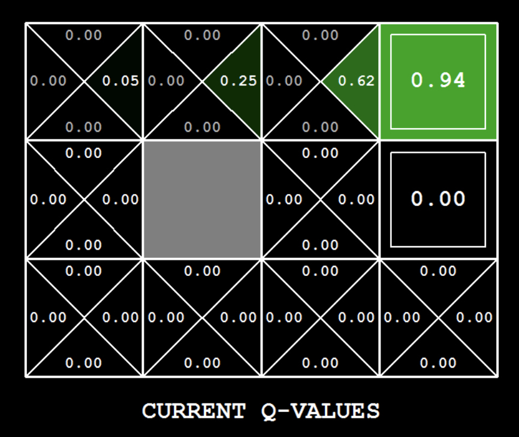

<!-- Check whether the assignment is ready to release -->
{{'now' | date: '%s'}}
{{page.release_date | date: '%s'}}
 
<div class="alert alert-danger">
Warning: this assignment is out of date.  It may still need to be updated for this year's class.  Check with your instructor before you start working on this assignment.
</div>

<!-- End of check whether the assignment is up to date -->


<!-- Check whether the assignment is up to date -->
{{'now' | date: '%Y'}}
{{page.due_date | date: '%Y'}}
 
<div class="alert alert-danger">
Warning: this assignment is out of date.  It may still need to be updated for this year's class.  Check with your instructor before you start working on this assignment.
</div>

<!-- End of check whether the assignment is up to date -->


<div class="alert alert-info">
This assignment is due on {{ page.due_date | date: "%A, %B %-d, %Y" }} before {{ page.due_date | date: "%I:%M%p" }}. 
</div>


<div class="alert alert-info">
You can download the materials for this assignment here:
<ul>

<li><a href="{{site.baseurl}}/{{item.url}}">{{ item.name }}</a></li>

</ul>
</div>



Homework 7: Reinforcement learning [100 points]
=============================================================

## Instructions
In the last homework, you have implemented value iteration agent, which does not actually learn from experience. Rather, it ponders its MDP model to arrive at a complete policy before ever interacting with a real environment. When it does interact with the environment, it simply follows the precomputed policy (e.g. it becomes a reflex agent). This distinction may be subtle in a simulated environment like a Gridword, but it's very important in the real world, where the real MDP is not available.

In this homework, You will write a Q-learning agent, which does very little on construction, but instead learns by trial and error from interactions with the environment through its `update(state, action, next_state, reward)` method. Then, you will implement an Approximate Q-leaning agent, which does feature extraction and act upon the weights of the features.

A skeleton file [`agents.py`](skeleton/agents.py) containing empty definitions for both agents is provided. You need to download [`gridworld.py`](skeleton/gridworld.py), which includes a `Gridworld` game and its GUI. Note that this Gridworld is not the same as the one in MDP, so make sure you redownload this file as well. You also need to download [`pacman.py`](skeleton/pacman.py), which includes a Pacman game and its GUI.

Your code will be autograded for technical correctness. Please ___do not___ change the names of any stub functions or classes within the code, or delete any functions we asked you to implement. You can add helper functions if needed.

Once you have completed the assignment, you should submit your file on [Gradescope]({{page.submission_link}}). You may submit as many times as you would like before the deadline, but only the last submission will be saved. 

## 1. Q-Learning [35 Points]

This time, although the Gridworld looks similar, it is not an MDP anymore. That means, the only information you get from the `game` object is `game.get_actions(state: State)`, which returns a set of `Action`s. All other methods have been removed.

You will also see that the GUI adds a new `episode` label. Each iteration is a single `update`, and each `episode` is a collections of iterations such that the agent starts from the starting state at the beginning of an episode and reaches a terminal state at the end of an episode.

A stub of a Q-learner is specified in `QLearningAgent`. A `QLearningAgent` takes in

- `game`, an object to get a set of available actions for a state $s$.
- `discount`, the discount factor $$\gamma$$.
- `learning_rate`, the learning rate $$\alpha$$.
- `explore_prob`, the probability of exploration $$\epsilon$$ for each iteration.

Note that the states in Gridworld aren't given as well. Your code should be able to deal with a new state and a new (state, action) pair.

Then you need to implement the following methods for this part:

- `agent.get_q_value(state, action)` returns the Q-value for (`state`, `action`) pair. $$Q(s, a)$$ from Q-table. For a never seen pair, the Q-value should be $0$.
- `agent.get_value(state)` returns the value of the `state` $V(s)$.
- `agent.get_best_policy(state)` returns the best policy of the `state`, $$\pi(s)$$.
- `agent.update(state, action, next_state, reward)` updates the Q-value for (`state`, `action`) pair, based on the value of the `next_state` and `reward` given.

Note: For `get_best_policy`, you should break ties randomly for better behavior. The `random.choice()` function will help.

For more instructions, refer to the lecture slides and comments in the skeleton file.

**Important:** Make sure that in your `get_value` and `get_best_policy` functions, you only access Q-values by calling `get_q_value`. This abstraction will be useful for the Approximate Q-learning you will implement later when you override `get_q_value` to use features of state-action pairs rather than state-action pairs directly.

With the Q-learning update in place, you can watch your Q-learner learn under manual control, using the keyboard arrow keys:

```
python gridworld.py
```

Hint: to help with debugging, you can turn off noise by using the `--noise 0.0` parameter in the command line (though this obviously makes Q-learning less interesting). If you manually steer up and then right along the optimal path for four episodes, you should see the following Q-values:

<center>

</center>

## 2. Epsilon Greedy [20 points]

Complete your Q-learning agent by implementing epsilon-greedy action selection in `agent.get_action(state)`, meaning it chooses random actions an $$\epsilon$$ fraction of the time, and follows its current best Q-values otherwise. Note that choosing a random action may result in choosing the best action - that is, you should not choose a random sub-optimal action, but rather any random legal action.

Your final Q-values should resemble those of your Value Iteration Agent, especially along well-traveled paths. However, your average returns will be lower than the Q-values predict because of the random actions and the initial learning phase.

You can choose an element from a list uniformly at random by calling the `random.choice` function. You can simulate a Bernoulli trial with probability $p$ of success by using `random.random() < p`, which returns `True` with probability $p$ and `False` with probability $1-p$.

## 3. Bridge Crossing Revisited [10 points]

First, train a completely random Q-learner with the default learning rate on the noiseless BridgeGrid for 50 episodes and observe whether it finds the optimal policy.

```
python gridworld.py --noise 0 bridge
```

Now try the same experiment with an epsilon of $0$ (adding `--epsilon 0` to the command line). Is there an epsilon and a learning rate for which it is highly likely (greater than 99%) that the optimal policy will be learned after 50 iterations? `question3()` in __agents.py__ should return EITHER a 2-item tuple of (epsilon, learning rate) OR the string 'NOT POSSIBLE' if there is none. Epsilon is controlled by `--epsilon`, learning rate by `--learning-rate`.

Note: Your response should be not depend on the exact tie-breaking mechanism used to choose actions. This means your answer should be correct even if for instance we rotated the entire bridge grid world 90 degrees.


## 4. Q-Learning and Pacman [10 points]

Time to play some Pacman! Pacman will play games in two phases. In the first phase, training, Pacman will begin to learn about the values of positions and actions. Because it takes a very long time to learn accurate Q-values even for tiny grids, Pacman's training games run in quiet mode by default, with no GUI (or console) display. Once Pacman's training is complete, it will enter playing mode. When playing, Pacman will use `get_best_policy` and not call `update` method, effectively stopping Q-learning and disabling exploration, in order to allow Pacman to exploit its learned policy. Playing games are shown in the GUI. Without any code changes you should be able to run Q-learning Pacman for very tiny grids as follows:

```
python pacman.py --train 2000 --play 10 small
```

`Pacman` game is only different in that it has default learning parameters that are more effective for the Pacman problem (epsilon=0.05, alpha=0.2, gamma=0.8). You will receive full credit for this question if the command above works without exceptions and your agent wins at least 80% of the time. The autograder will run 100 test games after the 2000 training games.

Hint: If your `QLearningAgent` works for **Gridworld** but does not seem to be learning a good policy for Pacman on smallGrid, it may be because your `get_action` and/or `get_best_policy` methods do not in some cases properly consider unseen actions. In particular, because unseen actions have by definition a Q-value of zero, if all of the actions that have been seen have negative Q-values, an unseen action may be optimal!

During training, you will see output every 100 games with statistics about how Pacman is faring. Epsilon is positive during training, so Pacman will play poorly even after having learned a good policy: this is because it occasionally makes a random exploratory move into a ghost. As a benchmark, it should take no more than 1,000 episodes before Pacman's rewards for a 100 episode segment becomes positive, reflecting that it's started winning more than losing. By the end of training, it should remain positive and be fairly high (between 100 and 350).

Once Pacman is done training, it should win very reliably in test games (at least 90% of the time), since now it is exploiting its learned policy.

However, you will find that training the same agent on the seemingly simple mediumGrid does not work well:

```
python pacman.py --train 2000 --play 10 medium
```

In our implementation, Pacman's average training rewards remain negative throughout training. At test time, it plays badly, probably losing all of its test games. Training will also take a long time, despite its ineffectiveness.

Pacman fails to win on larger layouts even if you increase the training time because each board configuration is a separate state with separate Q-values. It has no way to generalize that running into a ghost is bad for all positions. Obviously, this approach will not scale.

## 5. Approximate Q-Learning [20 points]

Implement an approximate Q-learning agent that learns weights for features of states, where many states might share the same features. Write your implementation in `ApproximateQAgent` class in __agents.py__, which is a subclass of ``QLearningAgent``.

Approximate Q-learning assumes the existence of a feature function $$f(s,a)$$ over state and action pairs, which yields a vector $$f_1(s,a) .. f_i(s,a) .. f_n(s,a)$$ of feature values. We provide feature functions for you already during the initialization of `ApproximateQAgent`. To use the `extractor`, take it as a function that accepts two arguments `state` and `action`, and it returns a dictionary that maps features to their values, i.e. `extractor(state: State, action: Action) -> Map[Feature, float]`. A `Feature` is guaranteed hashable.

Note: Again you can use `.items()` on a dictionary to get a list of `(k, v)` pairs.

The approximate Q-function takes the following form

$$
Q(s,a)=\sum_{i=1}^{n}{f_i(s,a)w_i}
$$

where each weight $$w_i$$ is associated with a particular feature $$f_i(s,a)$$. In your code, you should implement the weight vector as a dictionary mapping features (which the feature extractors will return) to weight values. You will update your weight vectors similarly to how you updated Q-values:

$$
\Delta = R + \gamma V(s') - Q(s, a)\\
w_i\leftarrow w_i + \alpha \cdot \Delta \cdot f_i(s,a)
$$

Note that the $$\Delta$$ term is the same as in normal Q-learning, and $$R$$ is the reward for $(s, a, s')$.

By default, `ApproximateQAgent` uses the `IdentityExtractor`, which assigns a single feature to every `(state, action)` pair. With this feature extractor, your Approximate Q-learning agent should work identically to `QLearningAgent`. You can test this with the following command:

```
python pacman.py --agent approx --train 2000 --play 10 small
```

Important: `ApproximateQAgent` is a subclass of `QLearningAgent`, and it therefore shares several methods like `get_action`. Make sure that your methods in `QLearningAgent` call `get_q_value` instead of accessing the Q-table directly, so that when you override `get_q_value` in your approximate agent, the new approximate Q-values are used to compute actions.

Once you're confident that your approximate learner works correctly with the identity features, run your approximate Q-learning agent with our custom feature extractor, which can learn to win with ease (only 100 episodes):

```
python pacman.py --agent approx --feature simple --train 100 --play 10 small
```

Even larger layouts should be no problem for your `ApproximateQAgent`.

```
python pacman.py --agent approx --feature simple --train 100 --play 10 medium
```

If you have no errors, your approximate Q-learning agent should win for mediumGrid almost every time with these simple features, even with only 50 training games.


## 6. Feedback [5 points]

1. **[1 point]** Approximately how many hours did you spend on this assignment?

2. **[2 point]** Which aspects of this assignment did you find most challenging? Were there any significant stumbling blocks?

3. **[2 point]** Which aspects of this assignment did you like? Is there anything you would have changed?
