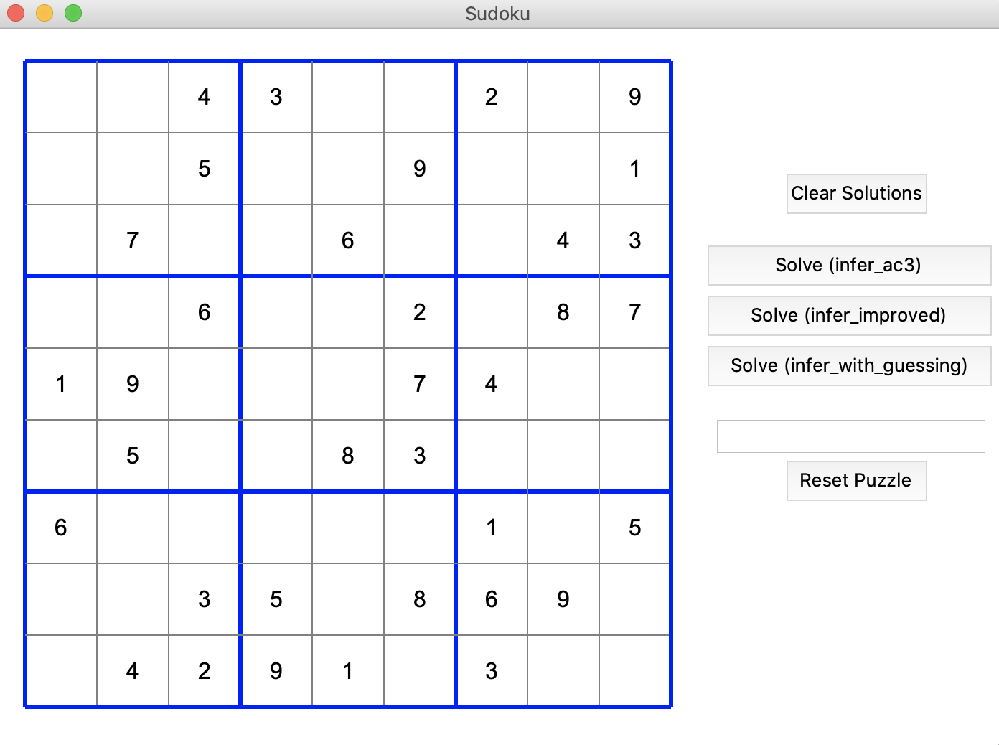

<!-- Check whether the assignment is ready to release -->
{{'now' | date: '%s'}}
{{page.release_date | date: '%s'}}
 
<div class="alert alert-danger">
Warning: this assignment is out of date.  It may still need to be updated for this year's class.  Check with your instructor before you start working on this assignment.
</div>

<!-- End of check whether the assignment is up to date -->

<!-- Check whether the assignment is up to date -->
{{'now' | date: '%Y'}}
{{page.due_date | date: '%Y'}}
 
<div class="alert alert-danger">
Warning: this assignment is out of date.  It may still need to be updated for this year's class.  Check with your instructor before you start working on this assignment.
</div>

<!-- End of check whether the assignment is up to date -->


<div class="alert alert-info">
This assignment is due on {{ page.due_date | date: "%A, %B %-d, %Y" }} before {{ page.due_date | date: "%I:%M%p" }}. 
</div>



<div class="alert alert-info">
You can download the materials for this assignment here:
<ul>

<li><a href="{{site.baseurl}}/{{item.url}}">{{ item.name }}</a></li>

<li><a href="https://drive.google.com/file/d/1j_4siiL_H0IYExmUdTMBNi5uHgTx_OvT/view?usp=sharing">{{ "1_million_sudoku" }}</a></li>
</ul>
</div>


<style>
            table.example {
                text-align: center;
                width: 100%;
            }
            table.sudoku {
                border: 3px solid black;
                margin: auto;
            }
            table.sudoku td {
                border: 1px solid black;
                height: 1.2em;
                width: 1.2em;
            }
            table.sudoku tr:nth-child(3n+3) {
                border-bottom: 3px solid black;
            }
            table.sudoku td:nth-child(3n+3) {
                border-right: 3px solid black;
            }
            table.sudoku .highlight {
                background-color: #ffcc66;
            }
            table.sudoku td.solution {
                color: blue;
            }
            table.sudoku-monospace {
                margin: auto;
            }
            table.sudoku-monospace td {
                height: 1.2em;
                width: 1.2em;
            }
</style>

Homework 5: Sudoku 
=============================================================

## Instructions

In this assignment, you will implement three inference algorithms for the popular puzzle game Sudoku.

A skeleton file [sudoku.py](sudoku.py) containing empty definitions for each question has been provided. Since portions of this assignment will be graded automatically, none of the names or function signatures in this file should be modified. However, you are free to introduce additional variables or functions if needed.

You may import definitions from any standard Python library, and are encouraged to do so in case you find yourself reinventing the wheel. If you are unsure where to start, consider taking a look at the data structures and functions defined in the `collections`, `copy`, and `itertools` modules.

You will find that in addition to a problem specification, most programming questions also include one or two examples from the Python interpreter. In addition to performing your own testing, you are strongly encouraged to verify that your code gives the expected output for these examples before submitting.

It is highly recommended that you follow the Python style guidelines set forth in [PEP 8](http://legacy.python.org/dev/peps/pep-0008/), which was written in part by the creator of Python. However, your code will not be graded for style.

Once you have completed the assignment, you should submit your file on [Gradescope]({{page.submission_link}}). 
You may submit as many times as you would like before the deadline, but only the last submission will be saved. 

## 1. Sudoku Solver [75 points]

In the game of Sudoku, you are given a partially-filled $9 \\times 9$ grid, grouped into a $3 \\times 3$ grid of $3 \\times 3$ blocks. The objective is to fill each square with a digit from 1 to 9, subject to the requirement that each row, column, and block must contain each digit exactly once.

In this section, you will implement the AC-3 constraint satisfaction algorithm for Sudoku, along with two extensions that will combine to form a complete and efficient solver.

A number of puzzles have been made available on the course website for testing, including:

*   An easy-difficulty puzzle: `easy.txt`.
    
*   Four medium-difficulty puzzles: `medium1.txt`, `medium2.txt`, `medium3.txt`, and `medium4.txt`.
    
*   Two hard-difficulty puzzles: `hard1.txt` and `hard2.txt`.
    

The examples in this section assume that these puzzle files have been placed in a folder named `sudoku` located in the same directory as the homework file.

An example puzzle originally from the Daily Pennsylvanian, available as `medium1.txt`, is depicted below.

<table class="example">
    <tr>
        <td>
            <table class="sudoku-monospace">
                <tr>
                    <td><code>*</code></td>
                    <td><code>1</code></td>
                    <td><code>5</code></td>
                    <td><code>*</code></td>
                    <td><code>2</code></td>
                    <td><code>*</code></td>
                    <td><code>*</code></td>
                    <td><code>*</code></td>
                    <td><code>9</code></td>
                </tr>
                <tr>
                    <td><code>*</code></td>
                    <td><code>4</code></td>
                    <td><code>*</code></td>
                    <td><code>*</code></td>
                    <td><code>*</code></td>
                    <td><code>*</code></td>
                    <td><code>7</code></td>
                    <td><code>*</code></td>
                    <td><code>*</code></td>
                </tr>
                <tr>
                    <td><code>*</code></td>
                    <td><code>2</code></td>
                    <td><code>7</code></td>
                    <td><code>*</code></td>
                    <td><code>*</code></td>
                    <td><code>8</code></td>
                    <td><code>*</code></td>
                    <td><code>*</code></td>
                    <td><code>*</code></td>
                </tr>
                <tr>
                    <td><code>9</code></td>
                    <td><code>5</code></td>
                    <td><code>*</code></td>
                    <td><code>*</code></td>
                    <td><code>*</code></td>
                    <td><code>3</code></td>
                    <td><code>2</code></td>
                    <td><code>*</code></td>
                    <td><code>*</code></td>
                </tr>
                <tr>
                    <td><code>7</code></td>
                    <td><code>*</code></td>
                    <td><code>*</code></td>
                    <td><code>*</code></td>
                    <td><code>*</code></td>
                    <td><code>*</code></td>
                    <td><code>*</code></td>
                    <td><code>*</code></td>
                    <td><code>6</code></td>
                </tr>
                <tr>
                    <td><code>*</code></td>
                    <td><code>*</code></td>
                    <td><code>6</code></td>
                    <td><code>2</code></td>
                    <td><code>*</code></td>
                    <td><code>*</code></td>
                    <td><code>*</code></td>
                    <td><code>1</code></td>
                    <td><code>5</code></td>
                </tr>
                <tr>
                    <td><code>*</code></td>
                    <td><code>*</code></td>
                    <td><code>*</code></td>
                    <td><code>6</code></td>
                    <td><code>*</code></td>
                    <td><code>*</code></td>
                    <td><code>9</code></td>
                    <td><code>2</code></td>
                    <td><code>*</code></td>
                </tr>
                <tr>
                    <td><code>*</code></td>
                    <td><code>*</code></td>
                    <td><code>4</code></td>
                    <td><code>*</code></td>
                    <td><code>*</code></td>
                    <td><code>*</code></td>
                    <td><code>*</code></td>
                    <td><code>8</code></td>
                    <td><code>*</code></td>
                </tr>
                <tr>
                    <td><code>2</code></td>
                    <td><code>*</code></td>
                    <td><code>*</code></td>
                    <td><code>*</code></td>
                    <td><code>3</code></td>
                    <td><code>*</code></td>
                    <td><code>6</code></td>
                    <td><code>5</code></td>
                    <td><code>*</code></td>
                </tr>
            </table>
        </td>
        <td>
            <table class="sudoku">
                <tr>
                    <td></td>
                    <td>1</td>
                    <td>5</td>
                    <td></td>
                    <td>2</td>
                    <td></td>
                    <td></td>
                    <td></td>
                    <td>9</td>
                </tr>
                <tr>
                    <td></td>
                    <td>4</td>
                    <td></td>
                    <td></td>
                    <td></td>
                    <td></td>
                    <td>7</td>
                    <td></td>
                    <td></td>
                </tr>
                <tr>
                    <td></td>
                    <td>2</td>
                    <td>7</td>
                    <td></td>
                    <td></td>
                    <td>8</td>
                    <td></td>
                    <td></td>
                    <td></td>
                </tr>
                <tr>
                    <td>9</td>
                    <td>5</td>
                    <td></td>
                    <td></td>
                    <td></td>
                    <td>3</td>
                    <td>2</td>
                    <td></td>
                    <td></td>
                </tr>
                <tr>
                    <td>7</td>
                    <td></td>
                    <td></td>
                    <td></td>
                    <td></td>
                    <td></td>
                    <td></td>
                    <td></td>
                    <td>6</td>
                </tr>
                <tr>
                    <td></td>
                    <td></td>
                    <td>6</td>
                    <td>2</td>
                    <td></td>
                    <td></td>
                    <td></td>
                    <td>1</td>
                    <td>5</td>
                </tr>
                <tr>
                    <td></td>
                    <td></td>
                    <td></td>
                    <td>6</td>
                    <td></td>
                    <td></td>
                    <td>9</td>
                    <td>2</td>
                    <td></td>
                </tr>
                <tr>
                    <td></td>
                    <td></td>
                    <td>4</td>
                    <td></td>
                    <td></td>
                    <td></td>
                    <td></td>
                    <td>8</td>
                    <td></td>
                </tr>
                <tr>
                    <td>2</td>
                    <td></td>
                    <td></td>
                    <td></td>
                    <td>3</td>
                    <td></td>
                    <td>6</td>
                    <td>5</td>
                    <td></td>
                </tr>
            </table>
        </td>
        <td>
            <table class="sudoku">
                <tr>
                    <td class="solution">6</td>
                    <td>1</td>
                    <td>5</td>
                    <td class="solution">3</td>
                    <td>2</td>
                    <td class="solution">7</td>
                    <td class="solution">8</td>
                    <td class="solution">4</td>
                    <td>9</td>
                </tr>
                <tr>
                    <td class="solution">8</td>
                    <td>4</td>
                    <td class="solution">9</td>
                    <td class="solution">5</td>
                    <td class="solution">1</td>
                    <td class="solution">6</td>
                    <td>7</td>
                    <td class="solution">3</td>
                    <td class="solution">2</td>
                </tr>
                <tr>
                    <td class="solution">3</td>
                    <td>2</td>
                    <td>7</td>
                    <td class="solution">9</td>
                    <td class="solution">4</td>
                    <td>8</td>
                    <td class="solution">5</td>
                    <td class="solution">6</td>
                    <td class="solution">1</td>
                </tr>
                <tr>
                    <td>9</td>
                    <td>5</td>
                    <td class="solution">1</td>
                    <td class="solution">4</td>
                    <td class="solution">6</td>
                    <td>3</td>
                    <td>2</td>
                    <td class="solution">7</td>
                    <td class="solution">8</td>
                </tr>
                <tr>
                    <td>7</td>
                    <td class="solution">3</td>
                    <td class="solution">2</td>
                    <td class="solution">8</td>
                    <td class="solution">5</td>
                    <td class="solution">1</td>
                    <td class="solution">4</td>
                    <td class="solution">9</td>
                    <td>6</td>
                </tr>
                <tr>
                    <td class="solution">4</td>
                    <td class="solution">8</td>
                    <td>6</td>
                    <td>2</td>
                    <td class="solution">7</td>
                    <td class="solution">9</td>
                    <td class="solution">3</td>
                    <td>1</td>
                    <td>5</td>
                </tr>
                <tr>
                    <td class="solution">1</td>
                    <td class="solution">7</td>
                    <td class="solution">3</td>
                    <td>6</td>
                    <td class="solution">8</td>
                    <td class="solution">5</td>
                    <td>9</td>
                    <td>2</td>
                    <td class="solution">4</td>
                </tr>
                <tr>
                    <td class="solution">5</td>
                    <td class="solution">6</td>
                    <td>4</td>
                    <td class="solution">7</td>
                    <td class="solution">9</td>
                    <td class="solution">2</td>
                    <td class="solution">1</td>
                    <td>8</td>
                    <td class="solution">3</td>
                </tr>
                <tr>
                    <td>2</td>
                    <td class="solution">9</td>
                    <td class="solution">8</td>
                    <td class="solution">1</td>
                    <td>3</td>
                    <td class="solution">4</td>
                    <td>6</td>
                    <td>5</td>
                    <td class="solution">7</td>
                </tr>
            </table>
        </td>
    </tr>
    <tr>
        <td>Textual Representation</td>
        <td>Initial Configuration</td>
        <td>Solved Configuration</td>
    </tr>
</table>
<br/>


1. **[3 points]** In this section, we will view a Sudoku puzzle not from the perspective of its grid layout, but more abstractly as a collection of cells. Accordingly, we will represent it internally as a dictionary mapping from cells, i.e. (row, column) pairs, to sets of possible values.  This dictionary should have a fixed (9 \\times 9=81) set of pairs of keys, but the number of elements in each set corresponding to a key will change as the board is being manipulated.
    
    In the `Sudoku` class, write an initialization method `__init__(self, board)` that stores such a mapping for future use. Also write a method `get_values(self, cell)` that returns the set of values currently available at a particular cell.  
    
    In addition, write a function `read_board(path)` that reads the board specified by the file at the given path and returns it as a dictionary. Sudoku puzzles will be represented textually as 9 lines of 9 characters each, corresponding to the rows of the board, where a digit between `"1"` and `"9"` denotes a cell containing a fixed value, and an asterisk `"*"` denotes a blank cell that could contain any digit.
    
    ```python
    >>> b = read_board("sudoku/medium1.txt")
    >>> Sudoku(b).get_values((0, 0))
    set([1, 2, 3, 4, 5, 6, 7, 8, 9])
    ```
    
    ```python
    >>> b = read_board("sudoku/medium1.txt")
    >>> Sudoku(b).get_values((0, 1))
    set([1])
    ```
    
2. **[2 points]** Write a function `sudoku_cells()` that returns the list of all cells in a Sudoku puzzle as (row, column) pairs. The line `CELLS = sudoku_cells()` in the `Sudoku` class then creates a class-level constant `Sudoku.CELLS` that can be used wherever the full list of cells is needed. Although the function `sudoku_cells()` could still be called each time in its place, that approach results in a large amount of repeated computation and is therefore highly inefficient. The ordering of the cells within the list is not important, as long as they are all present. (For more information on the difference between class-level constants and fields of a class, see [this helpful guide](https://www.python-course.eu/python3_class_and_instance_attributes.php)).
    
    ```python
    >>> sudoku_cells()
    [(0, 0), (0, 1), (0, 2), (0, 3), (0, 4), ..., (8, 5), (8, 6), (8, 7), (8, 8)]
    ```
    
3. **[3 points]** Write a function `sudoku_arcs()` that returns the list of all arcs between cells in a Sudoku puzzle corresponding to inequality constraints. In other words, each arc should be a pair of cells whose values cannot be equal in a solved puzzle. The arcs should be represented a two-tuples of cells, where cells themselves are (row, column) pairs. The line `ARCS = sudoku_arcs()` in the `Sudoku` class then creates a class-level constant `Sudoku.ARCS` that can be used wherever the full list of arcs is needed. The ordering of the arcs within the list is not important, as long as they are all present.  Note that this is asking not for the arcs in a particular board, but all of the arcs that exist on an empty board.
    
    ```python
    >>> ((0, 0), (0, 8)) in sudoku_arcs()
    True
    >>> ((0, 0), (8, 0)) in sudoku_arcs()
    True
    >>> ((0, 8), (0, 0)) in sudoku_arcs()
    True
    ```
        
    
    ```python
    >>> ((0, 0), (2, 1)) in sudoku_arcs()
    True
    >>> ((2, 2), (0, 0)) in sudoku_arcs()
    True
    >>> ((2, 3), (0, 0)) in sudoku_arcs()
    False
    ```
        
    
4. **[7 points]** In the `Sudoku` class, write a method `remove_inconsistent_values(self, cell1, cell2)` that removes any value in the set of possibilities for `cell1` for which there are no values in the set of possibilities for `cell2` satisfying the corresponding inequality constraint (which we have represented as an arc). Each cell argument will be a (row, column) pair. If any values were removed, return `True`; otherwise, return `False`.  Note that this question is asking you both to change the class attributes (i.e., change the dictionary representing the board) and to return a boolean value - in Python one can do both in the same method!
    
    *Hint: Think carefully about what this exercise is asking you to implement. How many values can be removed during a single invocation of the function?*
    
    ```python
    >>> sudoku = Sudoku(read_board("sudoku/easy.txt")) # See below for a picture.
    >>> sudoku.get_values((0, 3))
    set([1, 2, 3, 4, 5, 6, 7, 8, 9])
    >>> for col in [0, 1, 4]:
    ...     removed = sudoku.remove_inconsistent_values((0, 3), (0, col))
    ...     print(removed, sudoku.get_values((0, 3)))
    ...
    True set([1, 2, 3, 4, 5, 6, 7, 9])
    True set([1, 3, 4, 5, 6, 7, 9])
    False set([1, 3, 4, 5, 6, 7, 9])
    ```
    
5. **[10 points]** In the `Sudoku` class, write a method `infer_ac3(self)` that runs the AC-3 algorithm on the current board to narrow down each cell's set of values as much as possible. Although this will not be powerful enough to solve all Sudoku problems, it will produce a solution for easy-difficulty puzzles such as the one shown below. By "solution", we mean that there will be exactly one element in each cell's set of possible values, and that no inequality constraints will be violated.


    <table class="example">
        <tr>
            <td>
                <table class="sudoku">
                    <tr>
                        <td>8</td>
                        <td>2</td>
                        <td>1</td>
                        <td></td>
                        <td></td>
                        <td></td>
                        <td></td>
                        <td></td>
                        <td>7</td>
                    </tr>
                    <tr>
                        <td></td>
                        <td></td>
                        <td></td>
                        <td>8</td>
                        <td></td>
                        <td></td>
                        <td></td>
                        <td>6</td>
                        <td></td>
                    </tr>
                    <tr>
                        <td></td>
                        <td>6</td>
                        <td></td>
                        <td>9</td>
                        <td>3</td>
                        <td></td>
                        <td></td>
                        <td></td>
                        <td>5</td>
                    </tr>
                    <tr>
                        <td></td>
                        <td></td>
                        <td>8</td>
                        <td>2</td>
                        <td></td>
                        <td>1</td>
                        <td>6</td>
                        <td></td>
                        <td></td>
                    </tr>
                    <tr>
                        <td></td>
                        <td></td>
                        <td></td>
                        <td>7</td>
                        <td></td>
                        <td></td>
                        <td>2</td>
                        <td>8</td>
                        <td>4</td>
                    </tr>
                    <tr>
                        <td>2</td>
                        <td>4</td>
                        <td></td>
                        <td>6</td>
                        <td></td>
                        <td>3</td>
                        <td>7</td>
                        <td></td>
                        <td></td>
                    </tr>
                    <tr>
                        <td>6</td>
                        <td></td>
                        <td>5</td>
                        <td></td>
                        <td></td>
                        <td></td>
                        <td>1</td>
                        <td></td>
                        <td>3</td>
                    </tr>
                    <tr>
                        <td></td>
                        <td>7</td>
                        <td></td>
                        <td></td>
                        <td>5</td>
                        <td></td>
                        <td></td>
                        <td></td>
                        <td></td>
                    </tr>
                    <tr>
                        <td>9</td>
                        <td>1</td>
                        <td>2</td>
                        <td></td>
                        <td></td>
                        <td></td>
                        <td></td>
                        <td></td>
                        <td>6</td>
                    </tr>
                </table>
            </td>
            <td>
                <code>easy.txt</code>
            </td>
            <td>
                <table class="sudoku">
                    <tr>
                        <td>8</td>
                        <td>2</td>
                        <td>1</td>
                        <td class="solution">5</td>
                        <td class="solution">6</td>
                        <td class="solution">4</td>
                        <td class="solution">3</td>
                        <td class="solution">9</td>
                        <td>7</td>
                    </tr>
                    <tr>
                        <td class="solution">5</td>
                        <td class="solution">9</td>
                        <td class="solution">3</td>
                        <td>8</td>
                        <td class="solution">1</td>
                        <td class="solution">7</td>
                        <td class="solution">4</td>
                        <td>6</td>
                        <td class="solution">2</td>
                    </tr>
                    <tr>
                        <td class="solution">4</td>
                        <td>6</td>
                        <td class="solution">7</td>
                        <td>9</td>
                        <td>3</td>
                        <td class="solution">2</td>
                        <td class="solution">8</td>
                        <td class="solution">1</td>
                        <td>5</td>
                    </tr>
                    <tr>
                        <td class="solution">7</td>
                        <td class="solution">5</td>
                        <td>8</td>
                        <td>2</td>
                        <td class="solution">4</td>
                        <td>1</td>
                        <td>6</td>
                        <td class="solution">3</td>
                        <td class="solution">9</td>
                    </tr>
                    <tr>
                        <td class="solution">1</td>
                        <td class="solution">3</td>
                        <td class="solution">6</td>
                        <td>7</td>
                        <td class="solution">9</td>
                        <td class="solution">5</td>
                        <td>2</td>
                        <td>8</td>
                        <td>4</td>
                    </tr>
                    <tr>
                        <td>2</td>
                        <td>4</td>
                        <td class="solution">9</td>
                        <td>6</td>
                        <td class="solution">8</td>
                        <td>3</td>
                        <td>7</td>
                        <td class="solution">5</td>
                        <td class="solution">1</td>
                    </tr>
                    <tr>
                        <td>6</td>
                        <td class="solution">8</td>
                        <td>5</td>
                        <td class="solution">4</td>
                        <td class="solution">2</td>
                        <td class="solution">9</td>
                        <td>1</td>
                        <td class="solution">7</td>
                        <td>3</td>
                    </tr>
                    <tr>
                        <td class="solution">3</td>
                        <td>7</td>
                        <td class="solution">4</td>
                        <td class="solution">1</td>
                        <td>5</td>
                        <td class="solution">6</td>
                        <td class="solution">9</td>
                        <td class="solution">2</td>
                        <td class="solution">8</td>
                    </tr>
                    <tr>
                        <td>9</td>
                        <td>1</td>
                        <td>2</td>
                        <td class="solution">3</td>
                        <td class="solution">7</td>
                        <td class="solution">8</td>
                        <td class="solution">5</td>
                        <td class="solution">4</td>
                        <td>6</td>
                    </tr>
                </table>
            </td>
        </tr>
        <tr>
            <td>Initial Configuration</td>
            <td></td>
            <td>Result of Running AC-3</td>
        </tr>
    </table>

6. **[25 points]** Consider the outcome of running AC-3 on the medium-difficulty puzzle shown below. Although it is able to determine the values of some cells, it is unable to make significant headway on the rest.


    <table class="example">
        <tr>
            <td>
                <table class="sudoku">
                    <tr>
                        <td></td>
                        <td></td>
                        <td></td>
                        <td></td>
                        <td>8</td>
                        <td>3</td>
                        <td>4</td>
                        <td></td>
                        <td></td>
                    </tr>
                    <tr>
                        <td>3</td>
                        <td></td>
                        <td></td>
                        <td></td>
                        <td></td>
                        <td>4</td>
                        <td>8</td>
                        <td>2</td>
                        <td>1</td>
                    </tr>
                    <tr>
                        <td>7</td>
                        <td></td>
                        <td></td>
                        <td></td>
                        <td></td>
                        <td></td>
                        <td></td>
                        <td></td>
                        <td></td>
                    </tr>
                    <tr>
                        <td></td>
                        <td></td>
                        <td>9</td>
                        <td>4</td>
                        <td></td>
                        <td>1</td>
                        <td></td>
                        <td>8</td>
                        <td>3</td>
                    </tr>
                    <tr>
                        <td></td>
                        <td></td>
                        <td></td>
                        <td></td>
                        <td></td>
                        <td></td>
                        <td></td>
                        <td></td>
                        <td></td>
                    </tr>
                    <tr>
                        <td>4</td>
                        <td>6</td>
                        <td></td>
                        <td>5</td>
                        <td></td>
                        <td>7</td>
                        <td>1</td>
                        <td></td>
                        <td></td>
                    </tr>
                    <tr>
                        <td></td>
                        <td></td>
                        <td></td>
                        <td></td>
                        <td></td>
                        <td></td>
                        <td></td>
                        <td></td>
                        <td>7</td>
                    </tr>
                    <tr>
                        <td>1</td>
                        <td>2</td>
                        <td>5</td>
                        <td>3</td>
                        <td></td>
                        <td></td>
                        <td></td>
                        <td></td>
                        <td>9</td>
                    </tr>
                    <tr>
                        <td></td>
                        <td></td>
                        <td>7</td>
                        <td>2</td>
                        <td>4</td>
                        <td></td>
                        <td></td>
                        <td></td>
                        <td></td>
                    </tr>
                </table>
            </td>
            <td>
                <code>medium2.txt</code>
            </td>
            <td>
                <table class="sudoku">
                    <colgroup>
                        <col span="8">
                        <col class="highlight">
                    </colgroup>
                    <tr>
                        <td></td>
                        <td></td>
                        <td></td>
                        <td></td>
                        <td>8</td>
                        <td>3</td>
                        <td>4</td>
                        <td style="background-color: lawngreen">7</td>
                        <td></td>
                    </tr>
                    <tr>
                        <td>3</td>
                        <td></td>
                        <td></td>
                        <td></td>
                        <td></td>
                        <td>4</td>
                        <td>8</td>
                        <td>2</td>
                        <td>1</td>
                    </tr>
                    <tr class="highlight">
                        <td>7</td>
                        <td></td>
                        <td></td>
                        <td></td>
                        <td></td>
                        <td></td>
                        <td></td>
                        <td></td>
                        <td></td>
                    </tr>
                    <tr>
                        <td></td>
                        <td></td>
                        <td>9</td>
                        <td>4</td>
                        <td></td>
                        <td>1</td>
                        <td></td>
                        <td>8</td>
                        <td>3</td>
                    </tr>
                    <tr>
                        <td></td>
                        <td></td>
                        <td></td>
                        <td></td>
                        <td></td>
                        <td></td>
                        <td></td>
                        <td></td>
                        <td></td>
                    </tr>
                    <tr>
                        <td>4</td>
                        <td>6</td>
                        <td></td>
                        <td>5</td>
                        <td></td>
                        <td>7</td>
                        <td>1</td>
                        <td></td>
                        <td></td>
                    </tr>
                    <tr>
                        <td></td>
                        <td></td>
                        <td></td>
                        <td></td>
                        <td></td>
                        <td></td>
                        <td></td>
                        <td></td>
                        <td>7</td>
                    </tr>
                    <tr>
                        <td>1</td>
                        <td>2</td>
                        <td>5</td>
                        <td>3</td>
                        <td></td>
                        <td></td>
                        <td></td>
                        <td></td>
                        <td>9</td>
                    </tr>
                    <tr>
                        <td></td>
                        <td></td>
                        <td>7</td>
                        <td>2</td>
                        <td>4</td>
                        <td></td>
                        <td></td>
                        <td></td>
                        <td></td>
                    </tr>
                </table>
            </td>
        </tr>
        <tr>
            <td>Initial Configuration</td>
            <td></td>
            <td>Inference Beyond AC-3</td>
        </tr>
    </table>

    However, if we consider the possible placements of the digit 7 in the upper-right block, we observe that the 7 in the third row and the 7 in the final column rule out all but one square, meaning we can safely place a 7 in the indicated cell despite AC-3 being unable to make such an inference.
        
    In the `Sudoku` class, write a method `infer_improved(self)` that runs this improved version of AC-3, using `infer_ac3(self)` as a subroutine (perhaps multiple times). You should consider what deductions can be made about a specific cell by examining the possible values for other cells in the same row, column, or block. Using this technique, you should be able to solve all of the medium-difficulty puzzles.  Note that this goes beyond the typical AC3 approach because it involves constraints that relate more than 2 variables.
    
7. **[25 points]** Although the previous inference algorithm is an improvement over the ordinary AC-3 algorithm, it is still not powerful enough to solve all Sudoku puzzles. In the `Sudoku` class, write a method `infer_with_guessing(self)` that calls `infer_improved(self)` as a subroutine, picks an arbitrary value for a cell with multiple possibilities if one remains, and repeats. You should implement a backtracking search which reverts erroneous decisions if they result in unsolvable puzzles. For efficiency, the improved inference algorithm should be called once after each guess is made. This method should be able to solve all of the hard-difficulty puzzles, such as the one shown below.
    
    <table class="example">
        <tr>
            <td>
                <table class="sudoku">
                    <tr>
                        <td></td>
                        <td>9</td>
                        <td></td>
                        <td>7</td>
                        <td></td>
                        <td></td>
                        <td>8</td>
                        <td>6</td>
                        <td></td>
                    </tr>
                    <tr>
                        <td></td>
                        <td>3</td>
                        <td>1</td>
                        <td></td>
                        <td></td>
                        <td>5</td>
                        <td></td>
                        <td>2</td>
                        <td></td>
                    </tr>
                    <tr>
                        <td>8</td>
                        <td></td>
                        <td>6</td>
                        <td></td>
                        <td></td>
                        <td></td>
                        <td></td>
                        <td></td>
                        <td></td>
                    </tr>
                    <tr>
                        <td></td>
                        <td></td>
                        <td>7</td>
                        <td></td>
                        <td>5</td>
                        <td></td>
                        <td></td>
                        <td></td>
                        <td>6</td>
                    </tr>
                    <tr>
                        <td></td>
                        <td></td>
                        <td></td>
                        <td>3</td>
                        <td></td>
                        <td>7</td>
                        <td></td>
                        <td></td>
                        <td></td>
                    </tr>
                    <tr>
                        <td>5</td>
                        <td></td>
                        <td></td>
                        <td></td>
                        <td>1</td>
                        <td></td>
                        <td>7</td>
                        <td></td>
                        <td></td>
                    </tr>
                    <tr>
                        <td></td>
                        <td></td>
                        <td></td>
                        <td></td>
                        <td></td>
                        <td></td>
                        <td>1</td>
                        <td></td>
                        <td>9</td>
                    </tr>
                    <tr>
                        <td></td>
                        <td>2</td>
                        <td></td>
                        <td>6</td>
                        <td></td>
                        <td></td>
                        <td>3</td>
                        <td>5</td>
                        <td></td>
                    </tr>
                    <tr>
                        <td></td>
                        <td>5</td>
                        <td>4</td>
                        <td></td>
                        <td></td>
                        <td>8</td>
                        <td></td>
                        <td>7</td>
                        <td></td>
                    </tr>
                </table>
            </td>
            <td>
                <code>hard1.txt</code>
            </td>
            <td>
                <table class="sudoku">
                    <tr>
                        <td class="solution">2</td>
                        <td>9</td>
                        <td class="solution">5</td>
                        <td>7</td>
                        <td class="solution">4</td>
                        <td class="solution">3</td>
                        <td>8</td>
                        <td>6</td>
                        <td class="solution">1</td>
                    </tr>
                    <tr>
                        <td class="solution">4</td>
                        <td>3</td>
                        <td>1</td>
                        <td class="solution">8</td>
                        <td class="solution">6</td>
                        <td>5</td>
                        <td class="solution">9</td>
                        <td>2</td>
                        <td class="solution">7</td>
                    </tr>
                    <tr>
                        <td>8</td>
                        <td class="solution">7</td>
                        <td>6</td>
                        <td class="solution">1</td>
                        <td class="solution">9</td>
                        <td class="solution">2</td>
                        <td class="solution">5</td>
                        <td class="solution">4</td>
                        <td class="solution">3</td>
                    </tr>
                    <tr>
                        <td class="solution">3</td>
                        <td class="solution">8</td>
                        <td>7</td>
                        <td class="solution">4</td>
                        <td>5</td>
                        <td class="solution">9</td>
                        <td class="solution">2</td>
                        <td class="solution">1</td>
                        <td>6</td>
                    </tr>
                    <tr>
                        <td class="solution">6</td>
                        <td class="solution">1</td>
                        <td class="solution">2</td>
                        <td>3</td>
                        <td class="solution">8</td>
                        <td>7</td>
                        <td class="solution">4</td>
                        <td class="solution">9</td>
                        <td class="solution">5</td>
                    </tr>
                    <tr>
                        <td>5</td>
                        <td class="solution">4</td>
                        <td class="solution">9</td>
                        <td class="solution">2</td>
                        <td>1</td>
                        <td class="solution">6</td>
                        <td>7</td>
                        <td class="solution">3</td>
                        <td class="solution">8</td>
                    </tr>
                    <tr>
                        <td class="solution">7</td>
                        <td class="solution">6</td>
                        <td class="solution">3</td>
                        <td class="solution">5</td>
                        <td class="solution">2</td>
                        <td class="solution">4</td>
                        <td>1</td>
                        <td class="solution">8</td>
                        <td>9</td>
                    </tr>
                    <tr>
                        <td class="solution">9</td>
                        <td>2</td>
                        <td class="solution">8</td>
                        <td>6</td>
                        <td class="solution">7</td>
                        <td class="solution">1</td>
                        <td>3</td>
                        <td>5</td>
                        <td class="solution">4</td>
                    </tr>
                    <tr>
                        <td class="solution">1</td>
                        <td>5</td>
                        <td>4</td>
                        <td class="solution">9</td>
                        <td class="solution">3</td>
                        <td>8</td>
                        <td class="solution">6</td>
                        <td>7</td>
                        <td class="solution">2</td>
                    </tr>
                </table>
            </td>
        </tr>
        <tr>
            <td>Initial Configuration</td>
            <td></td>
            <td>Result of Inference with Guessing</td>
        </tr>
    </table>

8. **Sudoku GUI** 

	We provided a [GUI](sudokuGUI.py) for you to test your algorithms. The interface is shown below. You could try different solvers you implemented and reset the puzzle using the text input. The text input allows for two different puzzle formats (empty block with '*' or '0'). You could just directly copy and paste from the given text and csv file to reset the puzzle.
<center></center>

## Feedback [5 points]

1. **[1 point]** Approximately how many hours did you spend on this assignment?

2. **[2 point]** Which aspects of this assignment did you find most challenging? Were there any significant stumbling blocks?

3. **[2 point]**  Which aspects of this assignment did you like? Is there anything you would have changed?
