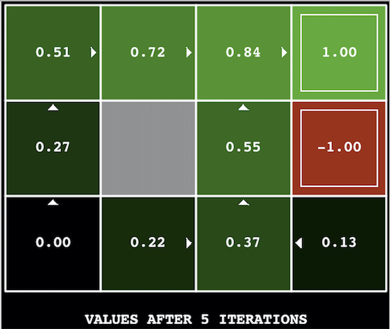
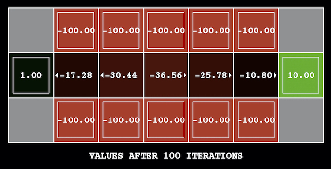
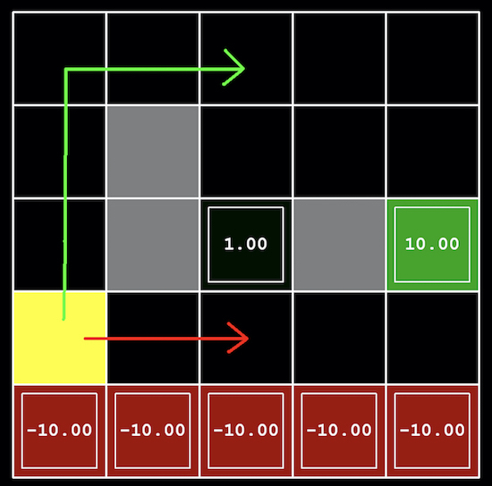

<!-- Check whether the assignment is up to date -->
{{'now' | date: '%Y'}}
{{page.due_date | date: '%Y'}}
 
<div class="alert alert-danger">
Warning: this assignment is out of date.  It may still need to be updated for this year's class.  Check with your instructor before you start working on this assignment.
</div>

<!-- End of check whether the assignment is up to date -->


<div class="alert alert-info">
This assignment is due on {{ page.due_date | date: "%A, %B %-d, %Y" }} before {{ page.due_date | date: "%I:%M%p" }}. 
</div>



<div class="alert alert-info">
You can download the materials for this assignment here:
<ul>

<li><a href="{{site.baseurl}}/{{item.url}}">{{ item.name }}</a></li>

</ul>
</div>



Homework 3: Markov Decision Processes and Reinforcement Learning [100 points]
=============================================================
 
## Instructions
In this project, you will implement value iteration.  You will test your agents on `Gridworld`.
The code for this project contains the following files, which are available in a [zip](https://github.com/artificial-intelligence-class/cis521_homeworks/raw/master/hw5/skeleton.zip) archive.
Files you will edit:
* valueIterationAgents.py: A value iteration agent for solving known MDPs.
* analysis.py: A file to put your answers to questions given in the project.

Files you should read but not edit:
+ __mdp.py__: Defines methods on general MDPs.
+ __learningAgents.py__: Defines the base classes ValueEstimationAgent and QLearningAgent, which your agents will extend.
+ __util.py__: Utilities, including util.Counter, which is particularly useful for q-learners.
+ __gridworld.py__: The Gridworld implementation

Files you can ignore:
+ __environment.py__: Abstract class for general reinforcement learning environments. Used by gridworld.py.
+ __graphicsGridworldDisplay.py__: Gridworld graphical display.
+ __graphicsUtils.py__: Graphics utilities.
+ __textGridworldDisplay.py__: Plug-in for the Gridworld text interface.
+ __graphicsCrawlerDisplay.py__: GUI for the crawler robot.

__What to submit__: You will fill in portions of `valueIterationAgents.py` and `analysis.py` during the assignment. You will submit only these files. Please don't change any others.

__Evaluation__: Your code will be autograded for technical correctness. Please ___do not___ change the names of any provided functions or classes within the code, or you will wreak havoc on the autograder. However, the correctness of your implementation -- not the autograder's judgements -- will be the final judge of your score. If necessary, we will review and grade assignments individually to ensure that you receive due credit for your work.

## MDPs [0 points]
To get started, run Gridworld in manual control mode, which uses the arrow keys:
```
python gridworld.py -m
```
You will see the two-exit layout. The blue dot is the agent. Note that when you press ___up___, the agent only actually moves north 80% of the time. Such is the life of a Gridworld agent! 
You can control many aspects of the simulation.  A full list of options is available by running:
```
python gridworld.py -h
```
The default agent moves randomly:
```
python gridworld.py -g MazeGrid
```
You should see the random agent bounce around the grid until it happens upon an exit.  Not the finest hour for an AI agent.

___Note:___ The Gridworld MDP is such that you first must enter a pre-terminal state (the double boxes shown in the GUI) and then take the special 'exit' action before the episode actually ends (in the true terminal state called `TERMINAL_STATE`, which is not shown in the GUI).  If you run an episode manually, your total return may be less than you expected, due to the discount rate (-d to change; 0.9 by default).
Look at the console output that accompanies the graphical output (or use -t for all text). You will be told about each transition the agent experiences (to turn this off, use -q). 
As in Pac-Man, positions are represented by (x,y) Cartesian coordinates and any arrays are indexed by `[x][y]`, with `'north'` being the direction of increasing `y`, etc.  By default, most transitions will receive a reward of zero, though you can change this with the living reward option (-r).
## 1. Value Iteration [50 Points]
Write a value iteration agent in `ValueIterationAgent`, which has been partially specified for you in __valueIterationAgents.py__.  Your value iteration agent is an offline planner, not a reinforcement agent, and so the relevant training option is the number of iterations of value iteration it should run (option `-i`) in its initial planning phase.  `ValueIterationAgent` takes an MDP on construction and runs value iteration for the specified number of iterations before the constructor returns.
Value iteration computes k-step estimates of the optimal values, Vk. In addition to running value iteration, implement the following methods for `ValueIterationAgent` using Vk.
+ `getValue(state)` returns the value of a state.
+ `getPolicy(state)` returns the best action according to computed values.
+ `getQValue(state, action)` returns the q-value of the (state, action) pair. 
These quantities are all displayed in the GUI: values are numbers in squares, q-values are numbers in square quarters, and policies are arrows out from each square.

___Important:___ Use the "batch" version of value iteration where each vector Vk is computed from a fixed vector Vk-1 (like in lecture), not the "online" version where one single weight vector is updated in place. The difference is discussed in [Sutton & Barto](https://web.stanford.edu/class/psych209/Readings/SuttonBartoIPRLBook2ndEd.pdf) in the 6th paragraph of chapter 4.1.

__Note__: A policy synthesized from values of depth k (which reflect the next k rewards) will actually reflect the next k+1 rewards (i.e. you return πk+1). Similarly, the q-values will also reflect one more reward than the values (i.e. you return Qk+1). You may assume that 100 iterations is enough for convergence in the questions below.
The following command loads your `ValueIterationAgent`, which will compute a policy and execute it 10 times. Press a key to cycle through values, q-values, and the simulation. You should find that the value of the start state (V(start)) and the empirical resulting average reward are quite close.
```
python gridworld.py -a value -i 100 -k 10
```

Hint: On the default BookGrid, running value iteration for 5 iterations should give you this output:
```
python gridworld.py -a value -i 5
```

When you run the iterations, the parameter `-s` will let you change the speed at which the simiulation runs. Using a value lower than `1` will slow down the speed of animation. This will come in handy for all problems when you need to visualize the end results. See
```
python gridworld.py -a value -i 5 -s 0.2
```




Your value iteration agent will be graded on a new grid. We will check your values, q-values, and policies after fixed numbers of iterations and at convergence (e.g. after 100 iterations).
Hint: Use the `util.Counter` class in __util.py__, which is a dictionary with a default value of zero. Methods such as `totalCount` should simplify your code. However, be careful with `argMax`: the actual argmax you want may be a key not in the counter!

## 2. Bridge Crossing Analysis [10 Points]

BridgeGrid is a grid world map with the a low-reward terminal state and a high-reward terminal state separated by a narrow "bridge", on either side of which is a chasm of high negative reward. The agent starts near the low-reward state. With the default discount of 0.9 and the default noise of 0.2, the optimal policy does not cross the bridge. Change only ONE of the discount and noise parameters so that the optimal policy causes the agent to attempt to cross the bridge. Put your answer in question2() of analysis.py. (Noise refers to how often an agent ends up in an unintended successor state when they perform an action.) The default corresponds to:




```
python gridworld.py -a value -i 100 -g BridgeGrid --discount 0.9 --noise 0.2
```

## 3. Policies [40 Points]
Consider the DiscountGrid layout, shown below. This grid has two terminal states with positive payoff (in the middle row), a close exit with payoff +1 and a distant exit with payoff +10. The bottom row of the grid consists of terminal states with negative payoff (shown in red); each state in this "cliff" region has payoff -10. The starting state is the yellow square. We distinguish between two types of paths: (1) paths that "risk the cliff" and travel near the bottom row of the grid; these paths are shorter but risk earning a large negative payoff, and are represented by the red arrow in the figure below. (2) paths that "avoid the cliff" and travel along the top edge of the grid. These paths are longer but are less likely to incur huge negative payoffs. These paths are represented by the green arrow in the figure below.




In this question, you will choose settings of the discount, noise, and living reward parameters for this MDP to produce optimal policies of several different types. Your setting of the parameter values for each part should have the property that, if your agent followed its optimal policy without being subject to any noise, it would exhibit the given behavior. If a particular behavior is not achieved for any setting of the parameters, assert that the policy is impossible by returning the string 'NOT POSSIBLE'. The default corresponds to:

`python gridworld.py -a value -i 100 -g DiscountGrid --discount 0.9 --noise 0.2 --livingReward 0.0`

Here are the optimal policy types you should attempt to produce:

(a) Prefer the close exit (+1), risking the cliff (-10)

(b) Prefer the close exit (+1), but avoiding the cliff (-10)

(c) Prefer the distant exit (+10), risking the cliff (-10)

(d) Prefer the distant exit (+10), avoiding the cliff (-10)

(e) Avoid both exits and the cliff (so an episode should never terminate)

question3(a) through question3(e) should each return a 3-item tuple of (discount, noise, living reward) in analysis.py.

Note: You can check your policies in the GUI. For example, using a correct answer to 3(a), the arrow in (0,1) should point east, the arrow in (1,1) should also point east, and the arrow in (2,1) should point north.

__Note:__ On some machines you may not see an arrow. In this case, press a button on the keyboard to switch to qValue display, and mentally calculate the policy by taking the arg max of the available qValues for each state.
 
