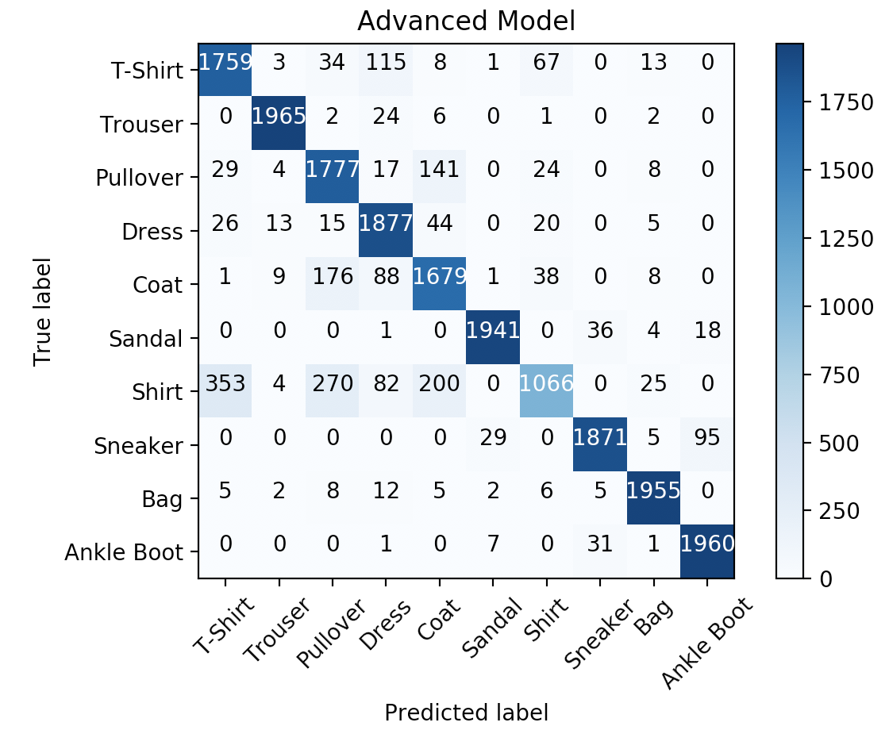

<!-- Check whether the assignment is up to date -->
{{'now' | date: '%B %d, %Y'}}
{{page.release_date | date: '%B %d, %Y'}}
 
<div class="alert alert-danger">
Warning: this assignment is out of date.  It may still need to be updated for this year's class.  Check with your instructor before you start working on this assignment.
</div>

<!-- End of check whether the assignment is up to date -->


<div class="alert alert-info">
This assignment is due on {{ page.due_date | date: "%A, %B %-d, %Y" }} before {{ page.due_date | date: "%I:%M%p" }}. 
</div>



<div class="alert alert-info">
You can download the materials for this assignment here:
<ul>

<li><a href="{{site.baseurl}}/{{item.url}}">{{ item.name }}</a></li>

</ul>
</div>


<style>
    div.algorithm {
        width: 90%;
        margin: 1em auto;
        font-family: Georgia,Times,Times New Roman,serif; 
    }
</style>


Homework 5: Perceptrons and Neural Networks [100 points]
=============================================================

## Instructions

In this assignment, you will gain experience working with binary and multiclass perceptrons. Then the later parts of the assignment involves implementing functions commonly used in Neural Networks from scratch without use of external libraries/packages other than [NumPy](http://www.numpy.org). Finally, you will build Neural Networks using one of the Machine Learning frameworks called [PyTorch](https://pytorch.org) for a [Fashion MNIST dataset](https://github.com/zalandoresearch/fashion-mnist).

There are **3 skeleton files** as listed at the top of the assignment. You should fill in your own code as suggested in this document. Since portions of this assignment will be graded automatically, none of the names or function signatures in this file should be modified. However, you are free to introduce additional variables or functions if needed.

You will find that in addition to a problem specification, most programming questions also include a pair of examples from the Python interpreter. These are meant to illustrate typical use cases, and should not be taken as comprehensive test suites.

You are strongly encouraged to follow the Python style guidelines set forth in [PEP 8](http://legacy.python.org/dev/peps/pep-0008/), which was written in part by the creator of Python. However, your code will not be graded for style.

Once you have finished the assignment, you should submit all 3 completed skeleton files on [Gradescope]({{page.submission_link}}). 
You may submit as many times as you would like before the deadline, but only the last submission will be saved. 

## 1. Perceptrons and Applications [50 points]

In this section, first, you will implement two varieties of the standard perceptron: one which performs binary classification, distinguishing between positive and negative instances, and one which performs multiclass classification, distinguishing between an arbitrary number of labeled groups.

Then after you implement the general-purpose perceptrons, you will use it to create classification systems for a number of specific problems. In each case, you will be responsible for creating feature vectors from the raw data, determining which type of perceptron should be used, and deciding how many passes over the training data should be performed. You will likely require some experimentation to achieve good results. The requisite data sets have been provided as Python objects in [perceptron_data.py](perceptron_data.py), which has been pre-imported under the module name data in the skeleton file.

1. **[10 points]** A binary perceptron is one of the simplest examples of a linear classifier. Given a set of data points each associated with a positive or negative label, the goal is to learn a vector $\vec{w}$  such that $\vec{w} \cdot \vec{x}\_+ > 0$ for positive instances $\vec{x}\_+$ and $\vec{w} \cdot \vec{x}\_- \le 0$ for negative instances $\vec{x}\_-$.

    One learning algorithm for this problem initializes the weight vector $\vec{w}$ to the zero vector, then loops through the training data for a fixed number of iterations, adjusting the weight vector whenever a sample is misclassified.

    <div class="algorithm">
        <p><b>Input:</b></p>
        <p>A list $T$ of training examples $(\vec{x}_1, y_1), \cdots, (\vec{x}_n, y_n)$, where $y_i \in \{+, -\}$; the number of passes $N$ to make over the data set.</p>
        <p><b>Output:</b></p>
        <p>The weight vector $\vec{w}$.</p>
        <p><b>Procedure:</b></p>
        <ol>
            <li>Initialize the weight vector as $\vec{w} \gets 0$.</li>
            <li><b>for</b> iteration $= 1$ <b>to</b> $N$ <b>do</b></li>
            <li style="text-indent: 1em"><b>for</b> each example $(\vec{x}_i, y_i) \in T$ <b>do</b></li>
            <li style="text-indent: 2em">Compute the predicted class as $\hat{y}_i = \text{sign}(\vec{w} \cdot \vec{x}_i)$.</li>
            <li style="text-indent: 2em"><b>if</b> $\hat{y}_i \ne y_i$ <b>then</b></li>
            <li style="text-indent: 3em">Set $\vec{w} \gets \vec{w} + \vec{x}_i$ if $y_i$ is positive, or $\vec{w} \gets \vec{w} - \vec{x}_i$ if $y_i$ is negative.</li>
            <li style="text-indent: 2em"><b>end if</b></li>
            <li style="text-indent: 1em"><b>end for</b></li>
            <li><b>end for</b></li>
        </ol>
    </div>

    Implement the initialization and prediction methods `__init__(self, examples, iterations)` and `predict(self, x)` in the `BinaryPerceptron class` according to the above specification.

    During initialization, you should train the weight vector $\vec{w}$ on the input data using iterations passes over the data set, then store $\vec{w}$ as an internal variable for future use. Each example in the examples list will be a 2-tuple $(\vec{x} , y)$ of a data point paired with its binary label `True` or `False`.

    The prediction method should take as input an unlabeled example $\vec{x}$ and compute the predicted label as sign($\vec{w} \cdot \vec{x}$), returning `True` if $\vec{w} \cdot \vec{x} > 0$ or `False` if $\vec{w} \cdot \vec{x} \le 0$.

    In this assignment, we will represent vectors such as $\vec{w}$ and $\vec{x}$ in Python as dictionary mappings from feature names to values. If a feature is absent from a vector, then its value is assumed to be zero. This allows for efficient storage of sparse, high-dimensional vectors, and encourages efficient implementations which consider only non-zero elements when computing dot products. Note that in general, the weight vector $\vec{w}$ will have a non-zero value associated with every feature, whereas individual instances $\vec{x}$ will have only a handful of non-zero values. You are encouraged to keep this asymmetry in mind when writing your code, as it can impact performance if not taken into account.


    ```python
    # Define the training and test data
    >>> train = [({"x1": 1}, True), ({"x2": 1}, True), ({"x1": -1}, False),
    ...         ({"x2": -1}, False)]
    >>> test = [{"x1": 1}, {"x1": 1, "x2": 1}, {"x1": -1, "x2": 1.5},
    ...         {"x1": -0.5, "x2": -2}]

    # Train the classifier for one iteration
    >>> p = BinaryPerceptron(train, 1)

    # Make predictions on the test data
    >>> [p.predict(x) for x in test]
    [True, True, True, False]
    ```

2. **[10 points]** A multiclass perceptron uses the same linear classification framework as a binary perceptron, but can accommodate an arbitrary number of classes rather than just two. Given a set of data points and associated labels, where the labels are assumed to be drawn from some set {$\mathscr{l}\_1, \cdots,\mathscr{l}\_m$}, the goal is to learn a collection of weight vectors $\vec{w}\_{\mathscr{l}\_1}, \cdots, \vec{w}\_{\mathscr{l}\_m}$ such that $\text{argmax}\_{\mathscr{l}\_k} (\vec{w}\_{\mathscr{l}\_k}\cdot \vec{x})$ equals the correct label $\mathscr{l}$ for each input pair $(\vec{x}, \mathscr{l})$.


    The learning algorithm for this problem is similar to the one for the binary case. All weight vectors are first initialized to zero vectors, and then several passes are made over the training data, with the appropriate weight vectors being adjusted whenever a sample is misclassified.


    <div class="algorithm">
        <p><b>Input:</b></p>
        <p>A list $T$ of training examples $(\vec{x}_1, y_1), \cdots, (\vec{x}_n, y_n)$, where the labels $y_i$ are drawn from the set $\{\ell_1, \cdots, \ell_m\}$; the number of passes $N$ to make over the data set.</p>
        <p><b>Output:</b></p>
        <p>The weight vectors $\vec{w}_{\ell_1}, \cdots, \vec{w}_{\ell_m}$.</p>
        <p><b>Procedure:</b></p>
        <ol>
            <li>Initialize the weight vectors as $\vec{w}_{\ell_k} \gets 0$ for $k = 1, \cdots, m$.</li>
            <li><b>for</b> iteration $= 1$ <b>to</b> $N$ <b>do</b></li>
            <li style="text-indent: 1em"><b>for</b> each example $(\vec{x}_i, y_i) \in T$ <b>do</b></li>
            <li style="text-indent: 2em">Compute the predicted label as $\hat{y}_i = \text{argmax}_{\ell_k} (\vec{w}_{\ell_k} \cdot \vec{x}_i)$.</li>
            <li style="text-indent: 2em"><b>if</b> $\hat{y}_i \ne y_i$ <b>then</b></li>
            <li style="text-indent: 3em">Increase the score for the correct class by setting $\vec{w}_{y_i} \gets \vec{w}_{y_i} + \vec{x}_i$.</li>
            <li style="text-indent: 3em">Decrease the score for the predicted class by setting $\vec{w}_{\hat{y}_i} \gets \vec{w}_{\hat{y}_i} - \vec{x}_i$.</li>
            <li style="text-indent: 2em"><b>end if</b></li>
            <li style="text-indent: 1em"><b>end for</b></li>
            <li><b>end for</b></li>
        </ol>
    </div>

    Implement the initialization and prediction methods `__init__(self, examples, iterations)` and  `predict(self, x)` in the `MulticlassPerceptron` class according to the above specification.

    During initialization, you should train the weight vectors $\vec{w}\_{\ell_k}$ on the input data using iterations passes over the data set, then store them as internal variables for future use. Each example in the examples list will be a 2-tuple $(\vec{x} , y)$ of a data point paired with its label. You will have to perform a single pass over the data set at the beginning to determine the set of labels which appear in the training examples. Do not make any assumptions about the form taken on by the labels; they might be numbers, strings, or other Python values.

    The prediction method should take as input an unlabeled example $\vec{x}$  and return the predicted label $\ell = \text{argmax}\_{\ell_k}(\vec{w}\_{\ell_k} \cdot \vec{x})$.


    ```python
    # Define the training data to be the corners and edge midpoints of the unit square
    >>> train = [({"x1": 1}, 1), ({"x1": 1, "x2": 1}, 2), ({"x2": 1}, 3),
    ...         ({"x1": -1, "x2": 1}, 4), ({"x1": -1}, 5), ({"x1": -1, "x2": -1}, 6),
    ...         ({"x2": -1}, 7), ({"x1": 1, "x2": -1}, 8)]

    # Train the classifier for 10 iterations so that it can learn each class
    >>> p = MulticlassPerceptron(train, 10)

    # Test whether the classifier correctly learned the training data
    >>> [p.predict(x) for x, y in train]
    [1, 2, 3, 4, 5, 6, 7, 8]
    ```

3. **[5 points]** Ronald Fisher's iris flower data set has been a benchmark for statistical analysis and machine learning since it was first released in 1936. It contains 50 samples from each of three species of the iris flower: iris setosa, iris versicolor, and iris virginica. Each sample consists of four measurements: the length and width of the sepals and petals of the specimen, in centimeters.

    Your task is to implement the `__init__(self, data)` and `classify(self, instance)` methods in the `IrisClassifier` class, which should perform training and classification on this data set. Example data will be provided as a list of 2-tuples $(\vec{x}, y)$, where $\vec{x}$ is a 4-tuple of real-valued measurements and $y$ is the name of a species. Test instances will be provided in the same format as the $\vec{x}$ components of the training examples.

    ```python
    >>> c = IrisClassifier(data.iris)
    >>> c.classify((5.1, 3.5, 1.4, 0.2))
    'iris-setosa'
    ```
    
    ```python
    >>> c = IrisClassifier(data.iris)
    >>> c.classify((7.0, 3.2, 4.7, 1.4))
    'iris-versicolor'
    ```
    
4. **[5 points]** The National Institute of Standards and Technology has released a collection of bitmap images depicting thousands of handwritten digits from different authors. Though originally presented as $32\times32$ blocks of binary pixels, the data has been pre-processed by dividing the images into nonoverlapping blocks of $4\times4$ pixels and counting the number of activated pixels in each block. This reduces the dimensionality of the data, making it easier to work with, and also provides some robustness against minor distortions. Each processed image is therefore represented by a list of $8\times 8=64$ values between 0 and 16 (inclusive), along with a label between 0 and 9 corresponding to the digit which was origially written.    
    Your task is to implement the `__init__(self, data)` and `classify(self, instance)` methods in the `DigitClassifier` class, which should perform training and classification on this data set. Example data will be provided as a list of 2-tuples $(\vec{x}, y)$, where $\vec{x}$ is a 64-tuple of pixel counts between 0 and 16 and $y$ is the digit represented by the image. Test instances will be provided in the same format as the $\vec{x}$ components of the training examples.

    ```python
    >>> c = DigitClassifier(data.digits)
    >>> c.classify((0,0,5,13,9,1,0,0,0,0,13,15,10,15,5,0,0,3,15,2,0,11,8,0,0,4,12,0,0,
    ...  8,8,0,0,5,8,0,0,9,8,0,0,4,11,0,1,12,7,0,0,2,14,5,10,12,0,0,0,0,6,13,10,0,0,0))
    0
    ```

5. **[5 points]** A simple data set of one-dimensional data is given in `data.bias`, where each example consists of a single positive real-valued feature paired with a binary label. Because the binary perceptron discussed in the previous section contains no bias term, a classifier will not be able to directly distinguish between the two classes of points, despite them being linearly separable. To see why, we observe that if the weight vector (consisting of a single component) is positive, then all instances will be labeled as positive, and if the weight vector is negative, then all instances will be labeled as negative. It is therefore necessary to augment the input data with an additional feature in order to allow a constant bias term to be learned.

    Your task is to implement the `__init__(self, data)` and `classify(self, instance)` methods in the `BiasClassifier` class to perform training and classification on this data set. Example data will be provided as a list of 2-tuples $(\vec{x}, y)$ of real numbers paired with binary labels. Test instances will be single numbers, and should be classified as either `True` or `False`. As discussed above, instances will have to be augmented with an additional feature before being fed into a perceptron in order for proper learning and classification to take place.

    ```python
    >>> c = BiasClassifier(data.bias)
    >>> [c.classify(x) for x in (-1, 0, 0.5, 1.5, 2)]
    [False, False, False, True, True]
    ```

6. **[7 points]** A mystery data set of two-dimensional data is given in `data.mystery1`, where each example consists of a pair of real-valued features and a binary label. As in the previous problem, this data set is not linearly separable on its own, but each instance can be augmented with one or more additional features derived from the two original features so that linear separation is possible in the new higher-dimensional space.


    Your task is to implement the `__init__(self, data)` and `classify(self, instance)` methods in the `MysteryClassifier1` class to perform training and classification on this data set. Example data will be provided as a list of 2-tuples $(\vec{x}, y)$ of pairs of real numbers and their associated binary labels. Test instances will be pairs of real numbers, and should be classified as either `True` or `False`. Instances will have to be augmented with one or more additional features before being fed into a perceptron in order for proper learning and classification to take place. We recommend first visualizing the data using your favorite plotting software in order to understand its structure, which should help make the appropriate transformation(s) more apparent.

    ```python
    >>> c = MysteryClassifier1(data.mystery1)
    >>> [c.classify(x) for x in ((0, 0), (0, 1), (-1, 0), (1, 2), (-3, -4))]
    [False, False, False, True, True]
    ```

7. **[8 points]** Another mystery data set of three-dimensional data is given in `data.mystery2`, where each example consists of a triple of real-valued features paired with a binary label. As in the previous few problems, this data set is not linearly separable on its own, but each instance can be augmented with one or more additional features so that linear separation is possible in the new higher-dimensional space.

    Your task is to implement the `__init__(self, data)` and `classify(self, instance)` methods in the `MysteryClassifier2` class to perform training and classification on this data set. Example data will be provided as a list of 2-tuples $(\vec{x}, y)$ of triples of real numbers paired with binary labels. Test instances will be triples of real numbers, and should be classified as either `True` or `False`. Instances will again have to be augmented with one or more additional features before being fed into a perceptron in order for proper learning and classification to take place. As before, we recommend first visualizing the data using your favorite plotting software in order to understand its structure, then thinking about what transformation(s) might help separate the two classes of data.

    ```python
    >>> c = MysteryClassifier2(data.mystery2)
    >>> [c.classify(x) for x in ((1, 1, 1), (-1, -1, -1), (1, 2, -3), (-1, -2, 3))]
    [True, False, False, True]
    ```

## 2. Neural Networks - Individual Functions for CNN [25 points]

The goal of this part of the assignment is to get an intuition of the underlying implementation used in Convolutional Neural Networks (CNN), specifically performing convolution and pooling, and applying an activation function.  

As mentioned in the instructions, you are restricted from using any external packages other than [NumPy](http://www.numpy.org). Numpy has a [Quickstart tutorial](https://docs.scipy.org/doc/numpy/user/quickstart.html), which we recommend looking at if you are not familiar or would like to refresh memory. 


1. **[9 points]** Write a function `convolve_greyscale(image, kernel)` that accepts a numpy array `image` of shape `(image_height, image_width)` (greyscale image) of integers and a numpy array `kernel` of shape `(kernel_height, kernel_width)` of floats. The function performs a convolution,  which consists of adding each element of the image to its local neighbors, weighted by the kernel (flipped both vertically and horizontally). 

    The result of this function is a new numpy array of floats that has the same shape as the input `image`. Apply zero-padding to the input image to calculate image edges. Note that the height and width of both `image` and `kernel` might not be equal to each other. You can assume `kernel_width` and `kernel_height` are odd numbers. 

    There exist a few visualisations hands-on experience of applying a convolution online, for instance a post by [Victor Powell](http://setosa.io/ev/image-kernels/). For more information, you can also use real images as an input.  We recommend selecting a few images of type `gray` from the Miscellaneous Volume  of the  [USC-SIPI Image Database](http://sipi.usc.edu/database/database.php?volume=misc). (Image in the third example below is taken from this dataset labelled under [5.1.09](http://sipi.usc.edu/database/download.php?vol=misc&img=5.1.09).)
            
    ```python
    >>> import numpy as np
    >>> image = np.array([
            [0,  1,  2,  3,  4],
            [ 5,  6,  7,  8,  9], 
            [10, 11, 12, 13, 14], 
            [15, 16, 17, 18, 19], 
            [20, 21, 22, 23, 24]])
    >>> kernel = np.array([
            [0, -1, 0],
            [-1, 5, -1],
            [0, -1, 0]])
    >>> print(convolve_greyscale(image, kernel))
    [[-6. -3. -1.  1.  8.]
     [ 9.  6.  7.  8. 19.]
     [19. 11. 12. 13. 29.]
     [29. 16. 17. 18. 39.]
     [64. 47. 49. 51. 78.]]
    ```

    ```python
    >>> import numpy as np
    >>> image = np.array([
            [0,  1,  2,  3,  4],
            [ 5,  6,  7,  8,  9], 
            [10, 11, 12, 13, 14], 
            [15, 16, 17, 18, 19], 
            [20, 21, 22, 23, 24]])
    >>> kernel = np.array([
            [1, 2, 3],
            [0, 0, 0],
            [-1, -2, -3]])
    >>> print(convolve_greyscale(image, kernel))
    [[  16.   34.   40.   46.   42.]
     [  30.   60.   60.   60.   50.]
     [  30.   60.   60.   60.   50.]
     [  30.   60.   60.   60.   50.]
     [ -46.  -94. -100. -106.  -92.]]
    ```

    ```python
    >>> import numpy as np
    >>> from PIL import Image
    >>> import matplotlib.pyplot as plt
    >>> image = np.array(Image.open('5.1.09.tiff'))
    >>> plt.imshow(image, cmap='gray')
    >>> plt.show()
    >>> kernel = np.array([
            [0, -1, 0],
            [-1, 5, -1],
            [0, -1, 0]])
    >>> output = convolve_greyscale(image, kernel)
    >>> plt.imshow(output, cmap='gray')
    >>> plt.show()
    >>> print(output)
    [[416. 352. 270. ... 152. 135. 233.]
     [274. 201. 126. ...  85.  69. 155.]
     [255. 151. 131. ...  56.  45. 164.]
     ...
     [274. 124. 159. ...  91. 176. 241.]
     [166. 139. 118. ... 122. 156. 280.]
     [423. 262. 280. ... 262. 312. 454.]]
    ```
    <table align="center">
        <tr>
            <td> </td>
            <td>&nbsp;&nbsp;&nbsp;&nbsp;&nbsp;&nbsp;</td>
            <td> </td>
        </tr>
    </table>
    <p align="center">
    Left: line 6 (before function invocation)
    <br>
    Right: line 10 (after function invocation) 
    </p>


2. **[2 points]** Write a function `convolve_rgb(image, kernel)` that accepts a numpy array `image` of shape `(image_height, image_width, image_depth)` of integers  and a numpy array `kernel` of shape `(kernel_height, kernel_width)` of floats. The function performs a convolution on each depth of an image, which consists of adding each element of the image to its local neighbors, weighted by the kernel (flipped both vertically and horizontally). 

    The result of this function is a new numpy array of floats that has the same shape as the input `image`. You can use `convolve_greyscale(image, filter)` implemented in the previous part to go through each depth of an image. As before, apply zero-padding to the input image to calculate image edges. Note that the height and width of both `image` and `kernel` might not be equal to each other. You can assume `kernel_width` and `kernel_height` are odd numbers.

    We recommend selecting a few images of type `color` from the Miscellaneous Volume of the  [USC-SIPI Image Database](http://sipi.usc.edu/database/database.php?volume=misc). (Images in the examples below are taken from this dataset labelled under [4.1.07](http://sipi.usc.edu/database/download.php?vol=misc&img=4.1.07))


    ```python
    >>> import numpy as np
    >>> from PIL import Image
    >>> import matplotlib.pyplot as plt
    >>> image = np.array(Image.open('4.1.07.tiff'))
    >>> plt.imshow(image)
    >>> plt.show()
    >>> kernel = np.array([
            [0.11111111, 0.11111111, 0.11111111],
            [0.11111111, 0.11111111, 0.11111111],
            [0.11111111, 0.11111111, 0.11111111]])
    >>> output = convolve_rgb(image, kernel)
    >>> plt.imshow(output.astype('uint8'))
    >>> plt.show()
    >>> print(np.round(output[0:3, 0:3, 0:3], 2))
    [[[ 63.67  63.44  47.22]
      [ 95.56  94.89  70.89]
      [ 95.56  94.78  70.89]]
    
     [[ 95.67  95.22  70.67]
      [143.33 142.56 105.89]
      [143.22 142.33 106.  ]]
    
     [[ 96.33  96.11  70.22]
      [144.11 144.   105.11]
      [143.78 143.44 105.22]]]
     
    ```

    <table align="center">
        <tr>
            <td> </td>
            <td>&nbsp;&nbsp;&nbsp;&nbsp;&nbsp;&nbsp;</td>
            <td> </td>
        </tr>
    </table>
    <p align="center">
    Left: line 6 (before function invocation)
    <br>
    Right: line 10 (after function invocation) 
    </p>


    ```python
    >>> import numpy as np
    >>> from PIL import Image
    >>> import matplotlib.pyplot as plt
    >>> image = np.array(Image.open('4.1.07.tiff'))
    >>> plt.imshow(image)
    >>> plt.show()
    >>> kernel = np.ones((11, 11))
    >>> kernel /= np.sum(kernel)
    >>> output = convolve_rgb(image, kernel)
    >>> plt.imshow(output.astype('uint8'))
    >>> plt.show()
    >>> print(np.round(output[0:3, 0:3, 0:3], 2))
    [[[43.26 43.31 31.32]
      [50.54 50.67 36.6 ]
      [57.83 58.   41.88]]
    
     [[50.64 50.86 36.51]
      [59.17 59.5  42.65]
      [67.73 68.1  48.81]]
    
     [[58.01 58.49 41.7 ]
      [67.79 68.41 48.72]
      [77.6  78.29 55.75]]]
    ```
    <table align="center">
        <tr>
            <td> </td>
            <td>&nbsp;&nbsp;&nbsp;&nbsp;&nbsp;&nbsp;</td>
            <td> </td>
        </tr>
    </table>
    <p align="center">
    Left: line 6 (before function invocation)
    <br>
    Right: line 11 (after function invocation) 
    </p>

3. **[10 points]** Write a function `max_pooling(image, kernel_size, stride)` that accepts a numpy array `image` of integers of shape `(image_height, image_width)` (greyscale image) of integers, a tuple `kernel_size` corresponding to `(kernel_height, kernel_width)`, and a tuple `stride` of `(stride_height, stride_width)` corresponding to the stride of pooling window. 

    The goal of this function is to reduce the spatial size of the representation and in this case reduce dimensionality of an image with max down-sampling. It is not common to pad the input using zero-padding for the pooling layer in Convolutional Neural Network and as such, so we do not ask to pad. Notice that this function must support overlapping pooling if `stride` is not equal to `kernel_size`. 

    As before, we recommend selecting a few images of type `gray` from the Miscellaneous Volume  of the  [USC-SIPI Image Database](http://sipi.usc.edu/database/database.php?volume=misc). (Image in three examples below are taken from this dataset labelled under [5.1.09](http://sipi.usc.edu/database/download.php?vol=misc&img=5.1.09).)

    ```python
    >>> image = np.array([
            [1, 1, 2, 4],
            [5, 6, 7, 8],
            [3, 2, 1, 0],
            [1, 2, 3, 4]])
    >>> kernel_size = (2, 2)
    >>> stride = (2, 2)
    >>> print(max_pooling(image, kernel_size, stride))
    [[6 8]
    [3 4]]
    ```

    ```python
    >>> image = np.array([
            [1, 1, 2, 4],
            [5, 6, 7, 8],
            [3, 2, 1, 0],
            [1, 2, 3, 4]])
    >>> kernel_size = (2, 2)
    >>> stride = (1, 1)
    >>> print(max_pooling(image, kernel_size, stride))
    [[6 7 8]
     [6 7 8]
     [3 3 4]]
    ```

    ```python
    >>> import numpy as np
    >>> from PIL import Image
    >>> import matplotlib.pyplot as plt
    >>> image = np.array(Image.open('5.1.09.tiff'))
    >>> plt.imshow(image, cmap='gray')
    >>> plt.show()
    >>> kernel_size = (2, 2)
    >>> stride = (2, 2)
    >>> output = max_pooling(image, kernel_size, stride)
    >>> plt.imshow(output, cmap='gray')
    >>> plt.show()
    >>> print(output)
    [[160 146 155 ...  73  73  76]
     [160 148 153 ...  75  73  84]
     [168 155 155 ...  80  66  80]
     ...
     [137 133 131 ... 148 149 146]
     [133 133 129 ... 146 144 146]
     [133 133 133 ... 151 148 149]]
    >>> print(output.shape)
    (128, 128)
    ```
    <table align="center">
        <tr>
            <td> </td>
            <td>&nbsp;&nbsp;&nbsp;&nbsp;&nbsp;&nbsp;</td>
            <td> </td>
        </tr>
    </table>
    <p align="center">
    Left: line 6 (before function invocation with image shape (256, 256))
    <br>
    Right: line 11 (after function invocation with image shape (128, 128)) 
    </p>


    ```python
    >>> import numpy as np
    >>> from PIL import Image
    >>> import matplotlib.pyplot as plt
    >>> image = np.array(Image.open('5.1.09.tiff'))
    >>> plt.imshow(image, cmap='gray')
    >>> plt.show()
    >>> kernel_size = (4, 4)
    >>> stride = (1, 1)
    >>> output = max_pooling(image, kernel_size, stride)
    >>> plt.imshow(output, cmap='gray')
    >>> plt.show()
    >>> print(output)
    [[160 160 155 ...  75  73  84]
     [162 160 155 ...  80  76  84]
     [168 168 155 ...  80  76  84]
     ...
     [137 133 133 ... 149 149 149]
     [133 133 133 ... 149 149 149]
     [133 133 133 ... 151 149 149]]
    >>> print(output.shape)
    (253, 253)
    ```

    <table align="center">
        <tr>
            <td> </td>
            <td>&nbsp;&nbsp;&nbsp;&nbsp;&nbsp;&nbsp;</td>
            <td> </td>
        </tr>
    </table>
    <p align="center">
    Left: line 6 (before function invocation with image shape (256, 256))
    <br>
    Right: line 11 (after function invocation with image shape (253, 253)) 
    </p>


    ```python
    >>> import numpy as np
    >>> from PIL import Image
    >>> import matplotlib.pyplot as plt
    >>> image = np.array(Image.open('5.1.09.tiff'))
    >>> plt.imshow(image, cmap='gray')
    >>> plt.show()
    >>> kernel_size = (3, 3)
    >>> stride = (1, 3)
    >>> output = max_pooling(image, kernel_size, stride)
    >>> plt.imshow(output, cmap='gray')
    >>> plt.show()
    >>> print(output)
    [[160 155 153 ... 100  76  73]
     [160 155 153 ... 113  82  73]
     [162 155 157 ... 118  82  76]
     ...
     [133 133 126 ... 155 148 149]
     [133 133 131 ... 149 148 148]
     [133 133 131 ... 146 151 149]]
    >>> print(output.shape)
    (254, 85)

    ```
    <table align="center">
        <tr>
            <td> </td>
            <td>&nbsp;&nbsp;&nbsp;&nbsp;&nbsp;&nbsp;</td>
            <td> </td>
        </tr>
    </table>
    <p align="center">
    Left: line 6 (before function invocation with image shape (256, 256))
    <br>
    Right: line 11 (after function invocation with image shape (254, 85)) 
    </p>

4. **[2 points]** Similarly to the previous part, write a function `average_pooling(image, kernel_size, stride)` that accepts a numpy array `image` of integers of shape `(image_height, image_width)` (greyscale image) of integers, a tuple `kernel_size` corresponding to `(kernel_height, kernel_width)`, and a tuple `stride` of `(stride_height, stride_width)` corresponding to the stride of pooling window. 

    The goal of this function is to reduce the spatial size of the representation and in this case reduce dimensionality of an image with average down-sampling. 

    As before, we recommend selecting a few images of type `gray` from the Miscellaneous Volume  of the  [USC-SIPI Image Database](http://sipi.usc.edu/database/database.php?volume=misc). (Image in the third example is taken from this dataset labelled under [5.1.09](http://sipi.usc.edu/database/download.php?vol=misc&img=5.1.09).)

    ```python
    >>> image = np.array([
            [1, 1, 2, 4],
            [5, 6, 7, 8],
            [3, 2, 1, 0],
            [1, 2, 3, 4]])
    >>> kernel_size = (2, 2)
    >>> stride = (2, 2)
    >>> print(average_pooling(image, kernel_size, stride))
    [[3.25 5.25]
     [2.   2.  ]]
    ```

    ```python
    >>> image = np.array([
            [1, 1, 2, 4],
            [5, 6, 7, 8],
            [3, 2, 1, 0],
            [1, 2, 3, 4]])
    >>> kernel_size = (2, 2)
    >>> stride = (1, 1)
    >>> print(average_pooling(image, kernel_size, stride))
    [[3.25 4.   5.25]
     [4.   4.   4.  ]
     [2.   2.   2.  ]]
    ```

    ```python
    >>> import numpy as np
    >>> from PIL import Image
    >>> import matplotlib.pyplot as plt
    >>> image = np.array(Image.open('5.1.09.tiff'))
    >>> plt.imshow(image, cmap='gray')
    >>> plt.show()
    >>> kernel_size = (2, 2)
    >>> stride = (2, 2)
    >>> output = average_pooling(image, kernel_size, stride)
    >>> plt.imshow(output, cmap='gray')
    >>> plt.show()    
    >>> print(output)
    [[152.   145.   154.   ...  65.5   71.    73.5 ]
     [152.75 145.5  143.25 ...  70.5   68.25  74.25]
     [160.5  149.5  146.25 ...  71.    62.25  75.  ]
     ...
     [129.   128.75 125.25 ... 144.   138.25 141.75]
     [127.75 128.   125.   ... 142.   135.75 142.25]
     [125.5  127.75 130.   ... 143.75 141.25 146.5 ]]
    >>> print(output.shape)
    (128, 128)
    ```

    <table align="center">
        <tr>
            <td> </td>
            <td>&nbsp;&nbsp;&nbsp;&nbsp;&nbsp;&nbsp;</td>
            <td> </td>
        </tr>
    </table>
    <p align="center">
    Left: line 6 (before function invocation with image shape (256, 256))
    <br>
    Right: line 11 (after function invocation with image shape (128, 128)) 
    </p>

    ```python
    >>> import numpy as np
    >>> from PIL import Image
    >>> import matplotlib.pyplot as plt
    >>> image = np.array(Image.open('5.1.09.tiff'))
    >>> plt.imshow(image, cmap='gray')
    >>> plt.show()
    >>> kernel_size = (4, 4)
    >>> stride = (1, 1)
    >>> output = average_pooling(image, kernel_size, stride)
    >>> plt.imshow(output, cmap='gray')
    >>> plt.show() 
    >>> print(output)
    [[148.8125 149.375  146.9375 ...  68.8125  69.875   71.75  ]
     [149.5    148.     145.625  ...  69.4375  69.4375  71.    ]
     [152.0625 149.     146.125  ...  68.      67.4375  69.9375]
     ...
     [128.375  127.     126.75   ... 140.     139.6875 139.5   ]
     [126.625  127.     127.1875 ... 140.75   140.9375 140.5   ]
     [127.25   127.8125 127.6875 ... 140.6875 141.0625 141.4375]]
    >>> print(output.shape)
    (253, 253)
    ```
    
    <table align="center">
        <tr>
            <td> </td>
            <td>&nbsp;&nbsp;&nbsp;&nbsp;&nbsp;&nbsp;</td>
            <td> </td>
        </tr>
    </table>
    <p align="center">
    Left: line 6 (before function invocation with image shape (256, 256))
    <br>
    Right: line 11 (after function invocation with image shape (253, 253)) 
    </p>

    ```python
    >>> import numpy as np
    >>> from PIL import Image
    >>> import matplotlib.pyplot as plt
    >>> image = np.array(Image.open('5.1.09.tiff'))
    >>> plt.imshow(image, cmap='gray')
    >>> plt.show()
    >>> kernel_size = (3, 3)
    >>> stride = (1, 3)
    >>> output = average_pooling(image, kernel_size, stride)
    >>> plt.imshow(output, cmap='gray')
    >>> plt.show() 
    >>> print(np.round(output, 5))
    [[148.11111 150.88889 149.33333 ...  79.33333  66.66667  69.55556]
     [150.11111 146.33333 147.55556 ...  85.       70.33333  69.     ]
     [150.33333 144.44444 146.55556 ...  93.44444  73.55556  68.22222]
     ...
     [127.88889 125.55556 118.66667 ... 146.      142.22222 138.66667]
     [126.11111 126.55556 123.77778 ... 143.66667 142.44444 140.22222]
     [127.88889 128.11111 125.88889 ... 142.88889 143.55556 141.55556]]
    >>> print(output.shape)
    (254, 85)
    ```
    
    <table align="center">
        <tr>
            <td> </td>
            <td>&nbsp;&nbsp;&nbsp;&nbsp;&nbsp;&nbsp;</td>
            <td> </td>
        </tr>
    </table>
    <p align="center">
    Left: line 6 (before function invocation with image shape (256, 256))
    <br>
    Right: line 11 (after function invocation with image shape (254, 85)) 
    </p>


5. **[2 points]** Write a function `sigmoid(x)` that accepts an a numpy array `x` and applies a sigmoid activation function on the input. 

     ```python
    >>> x = np.array([0.5, 3, 1.5, -4.7, -100])
    >>> print(sigmoid(x))
    [6.22459331e-01 9.52574127e-01 8.17574476e-01 9.01329865e-03 3.72007598e-44]
    ```

## 3. Neural Network for Fashion MNIST Dataset [25 points]

The goal of this part of the assignment is to get familiar with using one of the Machine Learning frameworks called [PyTorch](https://pytorch.org). 

The installation instructions can be found [here](https://pytorch.org/get-started/locally/). If you are having difficulty installing it, here is an alternative way to [setup PyTorch using miniconda](#setup).


### <a name="setup"></a>  (Setup PyTorch using miniconda)
Miniconda is a package, dependency and environment management for python (amongst other languages). It lets you install different versions of python, different versions of various packages in different environments which makes working on multiple projects (with different dependencies) easy.

There are two ways to use miniconda,

1. **Use an existing installation from another user (highly recommended)**: On ```biglab```, add the following line at the end of your ```~/.bashrc``` file.
```
export PATH="/home1/m/mayhew/miniconda3/bin:$PATH"
```
Then run the following command
```
source ~/.bashrc
```
If you run the command ```$ which conda```, the output should be ```/home1/m/mayhew/miniconda3/bin/conda```.

2. **Installing Miniconda from scratch**: On ```biglab```, run the following commands. Press Enter/Agree to all prompts during installation.
```
$ wget https://repo.continuum.io/miniconda/Miniconda3-latest-Linux-x86_64.sh
$ chmod +x Miniconda3-latest-Linux-x86_64.sh
$ bash Miniconda3-latest-Linux-x86_64.sh
```
After successful installation, running the command ```$ which conda``` should output ```/home1/m/$USERNAME/miniconda3/bin/conda```.


### Fashion MNIST Dataset

The [dataset.csv](dataset.csv) we will use is a sub-set of the Fashion MNIST train dataset. 

<p align="center">

</p>

<p align="center">

</p>

The dataset contains 20000 28x28 greyscale images, where each image has a label from one of 10 classes:

<center>
<table>
    <th>Label</th>
    <th>Description</th>
    <tr>
        <td>0</td>
        <td>T-shirt/top</td>
    </tr>
    <tr>
        <td>1</td>
        <td>Trouser</td>
    </tr>
    <tr>
        <td>2</td>
        <td>Pullover</td>
    </tr>
    <tr>
        <td>3</td>
        <td>Dress</td>
    </tr>
    <tr>
        <td>4</td>
        <td>Coat</td>
    </tr>
    <tr>
        <td>5</td>
        <td>Sandal</td>
    </tr>
    <tr>
        <td>6</td>
        <td>Shirt</td>
    </tr>
    <tr>
        <td>7</td>
        <td>Sneaker</td>
    </tr>
    <tr>
        <td>8</td>
        <td>Bag</td>
    </tr>
    <tr>
        <td>9</td>
        <td>Ankle boot</td>
    </tr>
</table>
</center>

<br/>

1. **[2 points]** The [dataset.csv](dataset.csv) is a comma-separated csv file with a header 'label, pixel1, pixel2, ..., pixel 784'. The first column 'label' is a label from 0 to 9 inclusively, and the rest of the columns 'pixel1' ... 'pixel784' are 784 pixels of an image for a corresponding label.  

    Your task is to fill in `load_data(file_path, reshape_images)`, where `file_path` is a string representing the path to a dataset and `reshape_images` is a boolean flag that indicates whether an image needs to be represented as one dimensional array of 784 pixels or reshaped to (1, 28, 28) array pixels.  This function returns 2 numpy arrays, where the first array corresponds to images and the second to labels. 
     
    Since there are 20000 images and labels in `dataset.csv`, you should expect something as follows when the function is called with `reshape_images` set to `False`:

    ```python
    >>> X, Y = load_data('dataset.csv', False)
    >>> print(X.shape)
    (20000, 784)
    >>> print(Y.shape)
    (20000,)
    ```

    And something as follows when the function is called with `reshape_images` set to `True`:
    ```python
    >>> X, Y = load_data('dataset.csv', True)
    >>> print(X.shape)
    (20000, 1, 28, 28)
    >>> print(Y.shape)
    (20000,)
    ```

    Here is a way to visualise the first image of our data: 

    ```python
    >>> import matplotlib.pyplot as plt
    >>> class_names = ['T-Shirt', 'Trouser', 'Pullover', 'Dress', 'Coat', 'Sandal', 'Shirt', 'Sneaker', 'Bag', 'Ankle Boot']
    >>> X, Y = load_data('dataset.csv', False)
    >>> plt.imshow(X[0].reshape(28, 28), cmap='gray')
    >>> plt.title(class_names[Y[0]])
    >>> plt.show()
    ```
    <p align="center">
    
    </p>


    **Data Loading and Processing in PyTorch**

    The `load_data(file_path, reshape_images)` function gets called in the `FashionMNISTDataset` class, which is given in the skeleton file. The `FashionMNISTDataset` class is a custom dataset that inherits [`torch.utils.data.Dataset`](https://pytorch.org/docs/stable/_modules/torch/utils/data/dataset.html#Dataset), which is an abstract class representing a dataset in PyTorch. We filled in the required `__len__` and `__getitem__` functions to return the size of the dataset and to add support the indexing of the dataset. 

    ```python
    from torch.utils.data import Dataset
    class FashionMNISTDataset(Dataset):
        def __init__(self, file_path, reshape_images):
            self.X, self.Y = load_data(file_path, reshape_images)

        def __len__(self):
            return len(self.X)

        def __getitem__(self, index):
            return self.X[index], self.Y[index]
    ```

    Similarly to the previous snippets of code:

    ```python
    >>> dataset= FashionMNISTDataset('dataset.csv', False)
    >>> print(dataset.X.shape)
    (20000, 784)
    >>> print(dataset.Y.shape)
    (20000,)
    >>> dataset= FashionMNISTDataset('dataset.csv', True)
    >>> print(dataset.X.shape)
    (20000, 1, 28, 28)
    >>> print(dataset.Y.shape)
    (20000,)
    ```

    This `FashionMNISTDataset` class can be used by [`torch.utils.data.DataLoader`](https://pytorch.org/docs/stable/_modules/torch/utils/data/dataloader.html#DataLoader), which is a dataset iterator and that provides ways to batch the data, shuffle the data, or load the data in parallel. Here is a snippet of code that uses `torch.utils.data.DataLoader` with  `batch_size` set to 10: 
    ```python
    >>> dataset = FashionMNISTDataset('dataset.csv', False)
    >>> data_loader = torch.utils.data.DataLoader(dataset=dataset, batch_size=10, shuffle=False)
    >>> print(len(data_loader))
    2000
    >>> images, labels = list(data_loader)[0]
    >>> print(type(images))
    <class torch.LongTensor>
    >>> print(images)
    <class torch.LongTensor>

        0     0     0  ...     25     9     0
        0     0     0  ...      0     0     0
        0     0     0  ...      0     0     0
           ...         ...           ...       
        0     0     0  ...      0     0     0
        0     0     0  ...      0     0     0
        0     0     1  ...      0     0     0
    [torch.LongTensor of size 10x784]
    >>> print(type(labels))
    <class torch.LongTensor>
    >>> print(labels)

     5
     0
     1
     4
     7
     6
     2
     1
     9
     0
    [torch.LongTensor of size 10]
    ```
    Note that we added the code to load the data with `torch.utils.data.DataLoader` in the `main()` function of the skeleton file. 

2. **[23 points]** For the next part of the assignment we give you a few functions that you are welcome to use and modify.  They are:

    * The `train(model, data_loader, num_epochs, learning_rate)` function, which accepts the following arguments
        - a `model` which is a subclass of [`torch.nn.Module`](https://pytorch.org/docs/stable/_modules/torch/nn/modules/module.html#Module), 
        - a `data_loader` which is a class of [`torch.utils.data.DataLoader`](https://pytorch.org/docs/stable/_modules/torch/utils/data/dataloader.html#DataLoader) 
        - two hyper-parameters: `num_epochs` and `learning_rate`.
        This function trains a `model` for the specified `num_epochs` using [`torch.nn.CrossEntropyLoss`](https://pytorch.org/docs/stable/nn.html#loss-functions) loss function and [`torch.optim.Adam`](https://pytorch.org/docs/stable/optim.html) as an optimizer. Once in a specified amount of iterations, the function prints the current loss, train accuracy, train F1-score for the model. 

    * The `evaluate(model, data_loader)` function, which accepts
        - a `model` which is a subclass of [`torch.nn.Module`](https://pytorch.org/docs/stable/_modules/torch/nn/modules/module.html#Module) 
        - a `data_loader` which is a class of [`torch.utils.data.DataLoader`](https://pytorch.org/docs/stable/_modules/torch/utils/data/dataloader.html#DataLoader).

        The `evaluate` function returns a list of actual labels and a list of predicted labels by that `model` for this `data_loader` class. This function can be used to get the metrics, such as accuracy or F1-score.

    * The `plot_confusion_matrix(cm, class_names, title=None)` function, which visualises a confusion matrix. It accepts
        - a confusion matrix `cm`, 
        - a list of corresponding `class_names` 
        - an optional `title`. 

        The `plot_confusion_matrix` function was modified from [here](https://scikit-learn.org/stable/auto_examples/model_selection/plot_confusion_matrix.html).


    All you have to do is to fill in `__init__(self)` and  `forward(self, x)` for 3 different classes: *Easy*, *Medium*, and *Advanced*.  

    + **[5 pts] Easy Model:** In this part we ask you to fill in `__init__(self)` and  `forward(self, x)` of the `EasyModel` class. `EasyModel` is a subclass of [`torch.nn.Module`](https://pytorch.org/docs/stable/_modules/torch/nn/modules/module.html#Module), which is a base class for all neural network models in PyTorch. 
    We ask you to build a model that consists of a single linear layer (using [`torch.nn.Linear`](https://pytorch.org/docs/stable/nn.html#linear-layers)).  You will need to write one line of code.  It starts with `self.fc = torch.nn.Linear`. It maps the size of the representation of an image to the number of classes.
    We recommend to have look around the API for [`torch.nn`](https://pytorch.org/docs/stable/nn.html). 

        Once you have filled in `__init__(self)` and  `forward(self, x)` of the `EasyModel` class you should expect something similar to this:

        ```python
        >>> class_names = ['T-Shirt', 'Trouser', 'Pullover', 'Dress', 'Coat', 'Sandal', 'Shirt', 'Sneaker', 'Bag', 'Ankle Boot']
        >>> num_epochs = 2
        >>> batch_size = 100
        >>> learning_rate = 0.001
        >>> data_loader = torch.utils.data.DataLoader(dataset=FashionMNISTDataset('dataset.csv', False),  batch_size=batch_size, shuffle=True)
        >>> easy_model = EasyModel()
        >>> train(easy_model, data_loader, num_epochs, learning_rate)
        Epoch : 0/2, Iteration : 49/200,  Loss: 5.7422, Train Accuracy: 73.3450, Train F1 Score: 72.6777
        Epoch : 0/2, Iteration : 99/200,  Loss: 7.6222, Train Accuracy: 76.7650, Train F1 Score: 75.8522
        Epoch : 0/2, Iteration : 149/200,  Loss: 8.9238, Train Accuracy: 76.9600, Train F1 Score: 76.6251
        Epoch : 0/2, Iteration : 199/200,  Loss: 6.3722, Train Accuracy: 76.9450, Train F1 Score: 77.1084
        Epoch : 1/2, Iteration : 49/200,  Loss: 6.0220, Train Accuracy: 72.7300, Train F1 Score: 73.4246
        Epoch : 1/2, Iteration : 99/200,  Loss: 4.4724, Train Accuracy: 78.5450, Train F1 Score: 78.6831
        Epoch : 1/2, Iteration : 149/200,  Loss: 3.9865, Train Accuracy: 79.5950, Train F1 Score: 79.3139
        Epoch : 1/2, Iteration : 199/200,  Loss: 4.8550, Train Accuracy: 75.4150, Train F1 Score: 73.7432
        >>> y_true_easy, y_pred_easy = evaluate(easy_model, data_loader)
        >>> print(f'Easy Model: '
                  f'Final Train Accuracy: {100.* accuracy_score(y_true_easy, y_pred_easy):.4f},',
                  f'Final Train F1 Score: {100.* f1_score(y_true_easy, y_pred_easy, average="weighted"):.4f}')
        Easy Model: Final Train Accuracy: 75.4150, Final Train F1 Score: 73.7432
        >>> plot_confusion_matrix(confusion_matrix(y_true_easy, y_pred_easy), class_names, 'Easy Model')
        ```
        <p align="center">
        
        </p>


        We reserved multiple datasets for testing with the same distribution of labels as given in `dataset.csv`. We will train and evaluate your model on our end using the same `train()` and `evaluate()` functions as given. 
        Full points will be given for an `Easy Model` for num_epochs = 2, batch_size = 100, learning_rate = 0.001 if the accuracy on the reserved datasets and F1-Score is >= 73%.


    + **[8 pts] Medium Model:** In this part we ask you to fill in `__init__(self)` and  `forward(self, x)` of the `MediumModel` class that is a subclass of [`torch.nn.Module`](https://pytorch.org/docs/stable/_modules/torch/nn/modules/module.html#Module). 
    We ask you to build a model that consists of a multiple fully-connected linear layers (using [`torch.nn.Linear`](https://pytorch.org/docs/stable/nn.html#linear-layers)).
    The network architecture is open-ended, so it is up to you to decide the number of linear layers and the size of nodes within the hidden layer(s). There are many tutorials online for you to use, for instance [this blog post](http://adventuresinmachinelearning.com/pytorch-tutorial-deep-learning/) gives a good solution for our  `Medium` class  by building a Fully-Connected Network with 2 hidden layers.  You can also use activation functions like ReLU. 
    Remember that the input to this model is the size of a one dimensional representation of an image and the output is the number of classes as for the Easy Model.

        Once you have filled in `__init__(self)` and  `forward(self, x)` of the `MediumModel` class you should expect something similar to this:
        ```python
        >>> class_names = ['T-Shirt', 'Trouser', 'Pullover', 'Dress', 'Coat', 'Sandal', 'Shirt', 'Sneaker', 'Bag', 'Ankle Boot']
        >>> num_epochs = 2
        >>> batch_size = 100
        >>> learning_rate = 0.001
        >>> data_loader = torch.utils.data.DataLoader(dataset=FashionMNISTDataset('dataset.csv', False),  batch_size=batch_size, shuffle=True)
        >>> medium_model = MediumModel()
        >>> train(medium_model, data_loader, num_epochs, learning_rate)
        >>> y_true_medium, y_pred_medium = evaluate(medium_model, data_loader)
        Epoch : 0/2, Iteration : 49/200,  Loss: 0.7257, Train Accuracy: 76.7000, Train F1 Score: 76.6240
        Epoch : 0/2, Iteration : 99/200,  Loss: 0.6099, Train Accuracy: 79.6000, Train F1 Score: 79.3427
        Epoch : 0/2, Iteration : 149/200,  Loss: 0.3406, Train Accuracy: 80.3550, Train F1 Score: 79.2653
        Epoch : 0/2, Iteration : 199/200,  Loss: 0.4423, Train Accuracy: 82.2350, Train F1 Score: 82.1259
        Epoch : 1/2, Iteration : 49/200,  Loss: 0.6591, Train Accuracy: 82.2450, Train F1 Score: 81.5656
        Epoch : 1/2, Iteration : 99/200,  Loss: 0.5055, Train Accuracy: 81.7150, Train F1 Score: 81.2029
        Epoch : 1/2, Iteration : 149/200,  Loss: 0.4616, Train Accuracy: 83.9600, Train F1 Score: 83.4397
        Epoch : 1/2, Iteration : 199/200,  Loss: 0.3895, Train Accuracy: 84.3500, Train F1 Score: 84.3794
        >>> print(f'Medium Model: '
              f'Final Train Accuracy: {100.* accuracy_score(y_true_medium, y_pred_medium):.4f},',
              f'Final F1 Score: {100.* f1_score(y_true_medium, y_pred_medium, average="weighted"):.4f}')
        Medium Model: Final Train Accuracy: 84.3500, Final F1 Score: 84.3794
        >>> plot_confusion_matrix(confusion_matrix(y_true_medium, y_pred_medium), class_names, 'Medium Model')
        ```

        <p align="center">
        
        </p>


        As before, we reserved multiple datasets for testing with the same distribution of labels as given in `dataset.csv`. We will train and evaluate your model on our end using the same `train()` and `evaluate()` functions as given. 
        Full points will be given for a `Medium Model` for num_epochs = 2, batch_size = 100, learning_rate = 0.001 if the accuracy on the reserved datasets and F1-Score is >= 82%.


    + **[10 pts] Advanced Model:** In this part we ask you to fill in `__init__(self)` and  `forward(self, x)` of the `Advanced` class that is a subclass of [`torch.nn.Module`](https://pytorch.org/docs/stable/_modules/torch/nn/modules/module.html#Module).
    We ask you to build a Convolutional Neural Network, which will consists of one or more convolutional layers ([`torch.nn.Conv2d`](https://pytorch.org/docs/stable/nn.html#convolutional-layers)) connected by the linear layers. The architecture is open-ended, so it is up to you to decide the number of layers, kernel size, activation functions etc. 
    You can see performance of different architectures for this dataset [here](https://github.com/zalandoresearch/fashion-mnist/blob/master/README.md#Benchmark). 
    The input to this model, unlike the input for `Easy` and `Medium` Models is expected to be different, and this is the reason why we asked you to reshape the images in Part 2.1. The output of this model remains the same as before.

        Once you have filled in `__init__(self)` and  `forward(self, x)` of the `EasyModel` class you can use the following to see the performance of your  

        ```python
        >>> class_names = ['T-Shirt', 'Trouser', 'Pullover', 'Dress', 'Coat', 'Sandal', 'Shirt', 'Sneaker', 'Bag', 'Ankle Boot']
        >>> num_epochs = 2
        >>> batch_size = 100
        >>> learning_rate = 0.001
        >>> data_loader_reshaped = torch.utils.data.DataLoader(dataset=FashionMNISTDataset('dataset.csv', True), batch_size=batch_size, shuffle=True)
        >>> advanced_model = AdvancedModel()
        >>> train(advanced_model, data_loader_reshaped, num_epochs, learning_rate)
        >>> y_true_advanced, y_pred_advanced = evaluate(advanced_model, data_loader_reshaped)
        Epoch : 0/2, Iteration : 49/200,  Loss: 0.7043, Train Accuracy: 80.2100, Train F1 Score: 79.9030
        Epoch : 0/2, Iteration : 99/200,  Loss: 0.4304, Train Accuracy: 84.0650, Train F1 Score: 83.9004
        Epoch : 0/2, Iteration : 149/200,  Loss: 0.4911, Train Accuracy: 85.0850, Train F1 Score: 84.4854
        Epoch : 0/2, Iteration : 199/200,  Loss: 0.3728, Train Accuracy: 86.9900, Train F1 Score: 86.9663
        Epoch : 1/2, Iteration : 49/200,  Loss: 0.3628, Train Accuracy: 87.2150, Train F1 Score: 86.9041
        Epoch : 1/2, Iteration : 99/200,  Loss: 0.3961, Train Accuracy: 87.7100, Train F1 Score: 87.7028
        Epoch : 1/2, Iteration : 149/200,  Loss: 0.3038, Train Accuracy: 88.9200, Train F1 Score: 88.9186
        Epoch : 1/2, Iteration : 199/200,  Loss: 0.3445, Train Accuracy: 89.2500, Train F1 Score: 88.8764
        >>> print(f'Advanced Model: '
          f'Final Train Accuracy: {100.* accuracy_score(y_true_advanced, y_pred_advanced):.4f},',
          f'Final F1 Score: {100.* f1_score(y_true_advanced, y_pred_advanced, average="weighted"):.4f}')
        Advanced Model: Final Train Accuracy: 89.2500, Final F1 Score: 88.8764
        plot_confusion_matrix(confusion_matrix(y_true_advanced, y_pred_advanced), class_names, 'Advanced Model')
        ```

        <p align="center">
        
        </p>


        As before, we reserved multiple datasets for testing with the same distribution of labels as given in `dataset.csv`. We will train and evaluate your model on our end using the same `train()` and `evaluate()` functions as given. 
        Full points will be given for a `Advanced Model` for num_epochs = 2, batch_size = 100, learning_rate = 0.001 if the accuracy on the reserved datasets and F1-Score is >= 88%.
