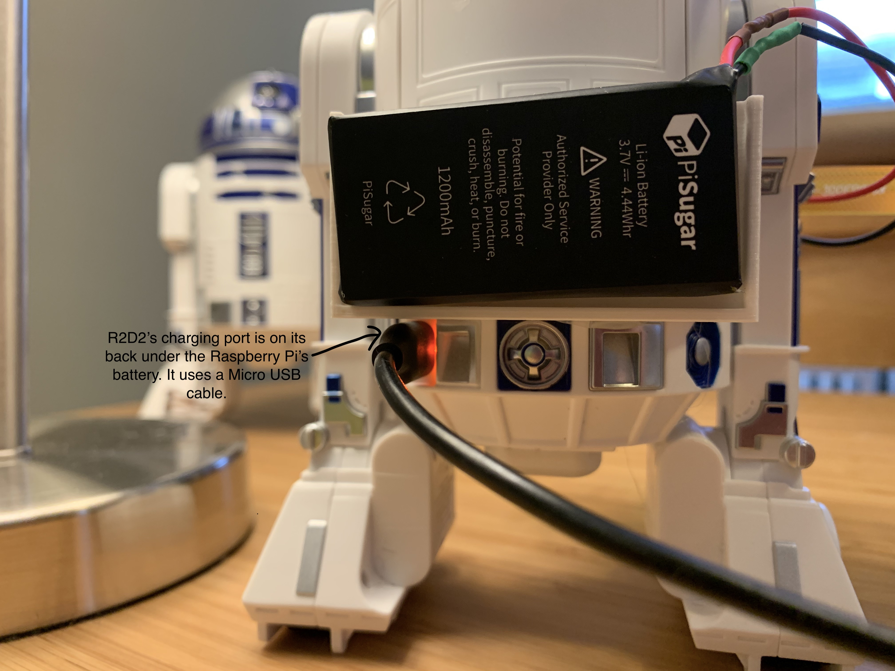

<!-- Check whether the assignment is ready to release -->
{{'now' | date: '%s'}}
{{page.release_date | date: '%s'}}
 
<div class="alert alert-danger">
Warning: this assignment is out of date.  It may still need to be updated for this year's class.  Check with your instructor before you start working on this assignment.
</div>

<!-- End of check whether the assignment is up to date -->


<!-- Check whether the assignment is up to date -->
{{'now' | date: '%Y'}}
{{page.due_date | date: '%Y'}}
 
<div class="alert alert-danger">
Warning: this assignment is out of date.  It may still need to be updated for this year's class.  Check with your instructor before you start working on this assignment.
</div>

<!-- End of check whether the assignment is up to date -->


<div class="alert alert-info">
This assignment is due on {{ page.due_date | date: "%A, %B %-d, %Y" }} before {{ page.due_date | date: "%I:%M%p" }}. 
</div>


<div class="alert alert-info">
Before beginning, you'll need these supplies:
<ul>

<li><a href="{{item.url}}">{{ item.name }}</a></li>

</ul>
</div>




<div class="alert alert-info">
You can download the materials for this assignment here:
<ul>

<li><a href="{{item.url}}">{{ item.name }}</a></li>

</ul>
</div>


# Robot Exercise 0: Use Python to Control R2D2

## Part 1: Setup Instructions

These instructions will walk you through how to install the software computer so that you can control your R2D2 with our Python API.

### Charge your R2D2 

To turn on your R2D2, you should plug a micro USB cable into its charging port, which is on the back of the robot in the bottom lefthand corner.  If the sensor pack has already been glued onto your robot, then you'll find the robot's charging port just below the batter on its lefhand side. You can plug the other end of the USB cable into a phone charger or your computer.  The indicator light will turn green when the battery is fully charged.
When you're ready to use your robot, you should unplug it.

<center>

</center>


### Update your R2D2's Firmware

If you purchased an R2D2 yourself, rather than borrowing one from us, you may need to update its firmware.  To do this, you should install the Star Wars Droids App by Sphero on your smartphone.  The first time you run it, it will update your R2D2's firmware to the latest version. 

### Install the Python API on your Computer

First make sure your Python version is greater than or equal to 3.7. 
Then install the Python library written for Sphero robots [spherov2.py](https://github.com/artificial-intelligence-class/spherov2.py):

```shell
pip3 install spherov2
```
We provide two approaches for you to control the R2D2 - using your own PC (with Bluetooth) and using other machines (RPi).
### Using your own PC to control the robot
Make sure there is a low energy Bluetooth adapter (Bluetooth 4.0 or above) on your computer, then install the Bluetooth library using the following command:

```shell
pip3 install bleak
```

If the installation went well, you shouldn't have to do anything else. Next, run the following code in python to control the R2D2:

```python
from spherov2 import scanner
from spherov2.sphero_edu import SpheroEduAPI

toy = scanner.find_toy()
with SpheroEduAPI(toy) as droid:
    droid.roll(0, 100, 3)
```
The robot should roll forward with speed 100 for 3 seconds. The `scanner` will find the Bluetooth address of the R2D2/R2Q5. You can also find toys using specific filters such as the ID tag on the back of the droids.

`SpheroEduAPI` is a high level API used in sending commands to the droid. Please refer to [this documentation](https://spherov2.readthedocs.io/en/latest/sphero_edu.html) for more information.


## Part 2: Let's get rolling (Practice Python Skills via R2D2) [25 points]
Now it's your turn to practice! We have provided some functions for you to implement, which will also enhance your python skills. Download the skeleton file for this section [here](r2d2_hw0.py). Please refer to this [document](https://spherov2.readthedocs.io/en/latest/sphero_edu.html) for more details of the R2-D2's API.
### 1. Lists and For loops [5 points]
Python's for loop allows us to execute a series of roll commands based on a list of triples in the form of `(heading, speed, duration)`. 

* Implement a function called `drive_with_commands` which will ask the R2-D2 to execute a list of roll commands.

```python
with SpheroEduAPI(toy) as droid:
    # Square Trajectory
    roll_commands = [(0, 100, 1), (90, 100, 1), (180, 100, 1), (270, 100, 1)]
    drive_with_commands(droid, roll_commands)

    # Pentagon Trajectory
    roll_commands = [(0, 100, 1), (72, 100, 1), (144, 100, 1), (216, 100, 1), (288, 100, 1)]
    drive_with_commands(droid, roll_commands)
```

* Write a **one-line function** `sort_lambda(roll_commands)` that uses a lambda function to first sort the `roll_commands` by duration, and then by speed, both in increasing order, and **in-place**.

### 2. Functions (Drive Regular Polygon) [5 points]
Instead of manually specifying the commands to have the robot drive in a square or a pentagon, let’s write a function that will let it drive in the shape of any regular polygon. The figure shown below describes the angle relationship of a polygon and the equation to compute the interior angle. 

* Complete the function `drive_polygon` which will let the R2D2 follow a trajectory of a polygon with `n` sides.

<p float="left">
  
   
</p>

### 3. Dictionaries (RGB LED) [5 points]
Python dictionaries are hash tables that let us store key-value pairs. Let's use a dictionary to map color names (Strings) to their corresponding RGB values. We'll store the RGB values as a `Color` object that indicates the intensity of each of these colors (ranging from 0 to 255). 

<p float="center">
  
   
</p>

* We provide such a dictionary in the skeleton code. Your task is to implement the function `set_lights(color, which_light='both')` which uses the API `set_main_led()` and `set_back_led()` to change the lights of the R2D2 according to the input color. 

* It should be noted that the `color` argument could either be the color name or the hexadecimal color which means you have to write a helper function `hex2rgb()` to convert HEX to RGB. 

```python
>>> print(hex2rgb('#B4FBB8'))
Color(r=180, g=251, b=184)
```
### 4. Driving with the Keyboard Arrow Keys [10 points]
Let’s design a video game style controller for the robot, where we can use the arrow keys to change its speed (by pressing up or down) and its orientation (by pressing left or right)

* We give you a function for reading in a keystroke from the keyboard called `getkey()` and your task is to complete the `drive_with_keyboard()` function which continuously reads in the keyboard input and uses it to drive the robot. (<em>Hint: Use [`set_heading()`](https://spherov2.readthedocs.io/en/latest/sphero_edu.html#spherov2.sphero_edu.SpheroEduAPI.set_heading) and [`set_speed()`](https://spherov2.readthedocs.io/en/latest/sphero_edu.html#spherov2.sphero_edu.SpheroEduAPI.set_speed)</em>)
* Press the `up` arrow key to increase the speed by `speed_delta`, press the `down` arrow key to decrease the speed by `speed_delta`; press the `left` arrow key to decrease the heading by `heading_delta`, and press the `right` arrow key to increase the heading by `heading_delta`. Press the `esc` button to exit the keyboard driving mode.
* You are required to make a short video as a demonstration of this function. We will grade you based on the performance.

<center>

</center>

### 5. Sending a Message via Morse Code
In Star Wars, R2-D2 delivers a message from Princess Leia to Obi-Wan Kenobi.  Our robots can only play pre-programmed sounds, so we will use the robot's lights to blink out the message "Help me, Obi-Wan Kenobi. You're my only hope." in [Morse Code](https://en.wikipedia.org/wiki/Morse_code). See a demo below:

<center>

</center>

Here we will use the Python concept of a [generator](https://wiki.python.org/moin/Generators). Generators behave similar to iterators like lists, so they can be used in Python's for loops.  They have the added nice property of creating the next item on-demand, which means that they can often be more efficient than the equivalent operation of generating a list and returning its iterator. That property is nice in this example, since the message that Leia sent to Obi-Wan is actually quite a bit longer than everyone remembers:

<blockquote style="font-size:15px">
General Kenobi. Years ago, you served my father in the Clone Wars. Now he begs you to help him in his struggle against the Empire. I regret that I am unable to present my father's request to you in person, but my ship has fallen under attack and I'm afraid my mission to bring you to Alderaan has failed. I have placed information vital to the survival of the Rebellion into the memory systems of this R2 unit. My father will know how to retrieve it. You must see this droid safely delivered to him on Alderaan. This is our most desperate hour. Help me, Obi-Wan Kenobi. You're my only hope.
</blockquote>

Implement the following functions:

```python
def encode_in_morse_code(message): 
    # TODO - yield a string of morse code (dots and dashes) for each encodable character in the message

def blink(droid, duration):
    # TODO - make the holo projector blink

def play_message(droid, message, dot_duration, dash_duration, time_between_blips, time_between_letters):
    # TODO - blink out the message on the holo projector

```
Hint: To set holo-projector on/off, do `droid.set_holo_projector_led(255)`, and `droid.set_holo_projector_led(0)`.


## Part 3: Using the Sensor Pack

If you've got the sensor pack, you can [continue on to set it up and get data from the sensors.](sensor-pack-setup.html) 
**Requirements**

1. Modify the `drive_with_keyboard()` function in the last section and add new commands `tab` and `return` to rotate R2-D2's head by `dome_delta` and `space` to switch between tripod and bipod modes.
2. Implement the `get_droid_info()` function which updates a global dictionary `droid_info` which contains the velocity, heading, acceleration, etc. Refer [here](https://spherov2.readthedocs.io/en/latest/sphero_edu.html#sensors) for the details of the API. Notice that the API does not provide dome angle `dome` (which is an integer) and the stance of the droid `tripod` (which is `True` if the droid is in tripod mode and `False` if it's in bipod mode). You have to record the state somewhere in your code, and update them accordingly with the keyboard commands.
3. Display the sensor data on the video streaming window. (We have done this step for you in `plot_info`, but feel free to modify it)
4. To show the performance of your implementation, you could use the save video option in the skeleton code to record the video stream. This task is graded based on the video. In order to get full credit, you have to use each command (key) **at least** once and the robot's action corresponding to the commands should be shown in the video clearly.

Once you've finished filling in these functions, you can use `start_surveillance(droid)` to start the surveillance mode and test out your implementation.
