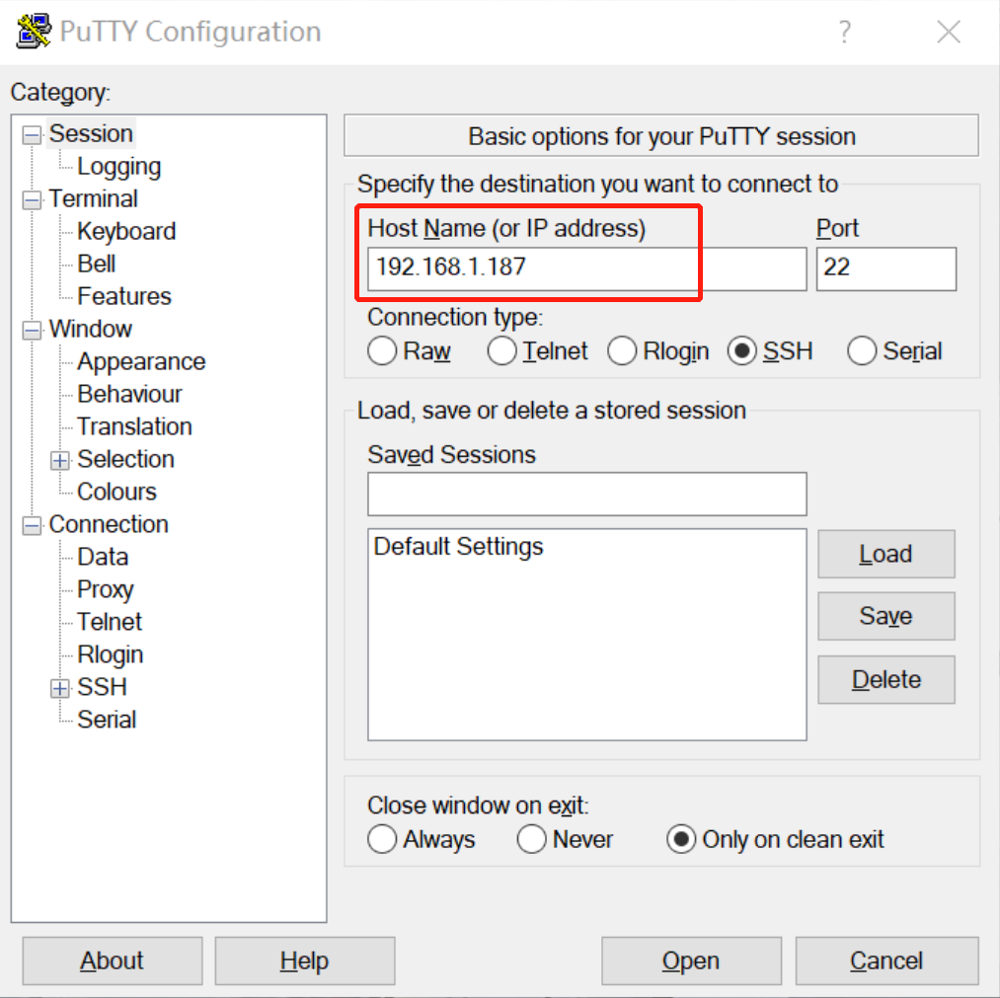


<div class="alert alert-info">
Before beginning, you'll need these materials:
<ul>

<li><a href="{{item.url}}">{{ item.name }}</a></li>

</ul>
</div>



## Setting up your R2D2 and Sensor Pack

These instructions will walk you through how to install the software on your Raspberry Pi Sensor Pack so that you can control your R2D2 with our Python API.

### 0. Charging your R2D2 and your Sensor Pack


### 1. Installing Software on the Raspberry Pi
The sensor pack uses the [Raspberry Pi Zero](https://en.wikipedia.org/wiki/Raspberry_Pi#Pi_Zero).  The Raspberry Pi Zero uses a [micro SD card](https://en.wikipedia.org/wiki/SD_card#Micro) as its storage space.  We will install an operating system for the Raspberry Pi Zero, along with all of the software that we'll need to control the robot, by writing a disk image file to your micro SD card. 

Here is how to put an image file on your Micro SD card:
* Put your micro SD card into a [USB SD card reader](https://www.amazon.com/s?k=micro+sd+card+reader), and insert the card reader in your computer's USB port.
* Download the [image file](https://drive.google.com/file/d/1XCulQIJeKBYETBc-63kWurN-2qw5MeHO/view?usp=sharing) from our Google drive.
* Flash the image onto the SD card.  We recommend using [balenaEtcher](https://www.balena.io/etcher/) which is  free software that is available for all platforms.

### 2. Connect the Raspberry Pi to Wi-Fi

After the SD card is flashed, you need to set up access to your Wi-Fi network. Download this [configuration file](wpa_supplicant.conf).  Make sure you don't rename the file – it needs to be `wpa_supplicant.conf` in order for the Raspberry Pi's operating system to find it.  The file contents contain the following details:

```shell
ctrl_interface=DIR=/var/run/wpa_supplicant GROUP=netdev
update_config=1
country=US

network={
  ssid="WIFI_NETWORK_NAME"
  psk="WIFI_PASSWORD"
}
```

You need edit the file to replace `WIFI_NETWORK_NAME` with  your Wi-Fi name and `WIFI_PASSWORD` to be your Wi-Fi password.  Then put the edited file in the `boot` partition of your SD card. If you are using Windows and the prompt comes up saying you should format the disk before using it, **DO NOT** format it. Just look for the partition with name `boot`.

Then safely eject the SD card reader from your computer, and remove the Micro SD card from it. Plug the Micro SD card into the slot on the Raspberry Pi.  The slot is located on the right hand side of the device.  Turn on the Raspberry Pi by pressing the small power switch near the top left corner of the device. If everything goes well, the Raspberry Pi will connect to your Wi-Fi.

For students who don't have a private Wi-Fi network, you can use a Wi-Fi Hotspot feature on your computer or your smartphone. Alternately, if you're on campus, you can use `AirPennNet-Device` by following the instructions [here](https://www.isc.upenn.edu/how-to/using-wireless-penn#For-devices). Those instructions will ask for the MAC address of your Raspberry Pi, which should be listed on the device body.

<!--
#### Connect to Raspberry Pi via USB Serial

For students that don't have a SD card reader and wants to start immediately, you can try out the more advanced method to temporarily connect to your Rapberry Pi via USB serial. Simply plug a micro USB cable from the USB OTG port on the Rapberry Pi to your computer, and there should be a new serial TTY/COM device pops up. Connect using PuTTY on Windows or `screen` command line tool on Linux/MacOS. You can look for more information online.
-->

### 3. SSH into Raspberry Pi

If your Raspberry Pi successfully connected to your Wi-Fi network, then we can remotely access the Raspberry Pi from your computer using Secure Shell (SSH).

Before using SSH, we must first know the IP address of the Raspberry Pi. We could use the IP scanner apps to find its IP address, here is some free software that you can use to find its IP address:


| Android/iOS |  MacOS  |       Windows       | Linux/Windows/MacOS |
|:-----------:|:-------:|:-------------------:|:-------------------:|
|     [Fing](https://www.fing.com/products)    | [Lanscan](https://apps.apple.com/us/app/lanscan/id472226235?mt=12) | [Advanced IP Scanner](https://www.advanced-ip-scanner.com/index2.php) |   [Angry IP Scanner](https://angryip.org/download/#linux)  |

<table><tr>
<td>  </td>
<td>  </td>
</tr>
</table>

After you find the IP address of your Raspberry Pi, it's time to SSH into it. The default username to login to the Raspberry Pi is **`pi`** and the password is **`raspberry`**. There are many tutorials online for how to use SSH, here, we'll just give some simple instructions on different platforms.

* **Windows**
	* Using Windows 10's built-in SSH commands, click [here](https://www.howtogeek.com/336775/how-to-enable-and-use-windows-10s-built-in-ssh-commands/) for details. Once SSH client is installed, you can follow the same steps below for MacOS / Linux.
	* Another option is [PuTTY](https://www.chiark.greenend.org.uk/~sgtatham/putty/latest.html), download and install it. PuTTY has a GUI where you can insert in the IP address and it will launch a terminal window. Then you just need to type the username (`pi`) and password (`raspberry`) and you are good to go.

<table><tr>
<td>  </td>
<td>  </td>
</tr>
</table>

* **MacOS / Linux**

Open a terminal window and then run:

```shell
ssh pi@xxx.xxx.xxx.xxx
[enter the password when prompt]
```

Where `xxx.xxx.xxx.xxx` is the IP address of your Raspberry Pi.

### 4. Basic Bash Skills

Once you have logged into your Raspberry Pi, you'll see a bash command line prompt.  If you haven't used a command line before, there are a lot of tutorials on bash commands available online, here we just introduce some useful commands which are frequently utilized.

* `cd` **Change Directory:** `cd folder` to change to the working directory you are currently under to `folder`, see more details [here](https://linuxize.com/post/linux-cd-command/).

* `ls` **List Files/Directory:** `ls folder` to list information about files and directories under `folder`, see more details [here](https://linuxize.com/post/how-to-list-files-in-linux-using-the-ls-command/).

* `cat` **Display/Copy/Create Text Files:** `cat filename` to display the content of a file with `filename`, see more details [here](https://www.interserver.net/tips/kb/linux-cat-command-usage-examples/).

* `rm` **Remove File/Directory:** `rm filename` to remove a file or directory with `filename`, see more details [here](https://www.computerhope.com/unix/urm.htm).

* `nano` **Text Editor:** `nano filename` to edit the file with `filename`. It's a command-line based text editor, see more details [here](https://www.howtogeek.com/howto/42980/the-beginners-guide-to-nano-the-linux-command-line-text-editor/).

* `password` **Change the password:** It is recommended to change the password once you get your Raspberry Pi.

* `screen` **Start a terminal session in the background:** `screen -S name` to start a named session called `name`. Press `Ctrl-A` and then press `D` to detach the session.  `screen -r name` to attach to the session called `name`. This allows you to start a terminal that won't be terminated when you disconnect from SSH. See more details [here](https://linuxize.com/post/how-to-use-linux-screen/).

* **Commands for Raspberry Pi:** 
	* System configuration: `sudo raspi-config`
	* Reboot: `sudo reboot now`
	* Shutdown: `sudo shutdown now`
	
	You should ***always*** shut down properly before you unplug the power. Failed to do so may result in data corruption, and you may need to re-flash the image when that happens.
