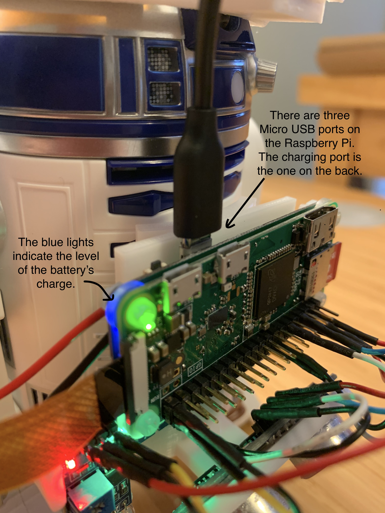
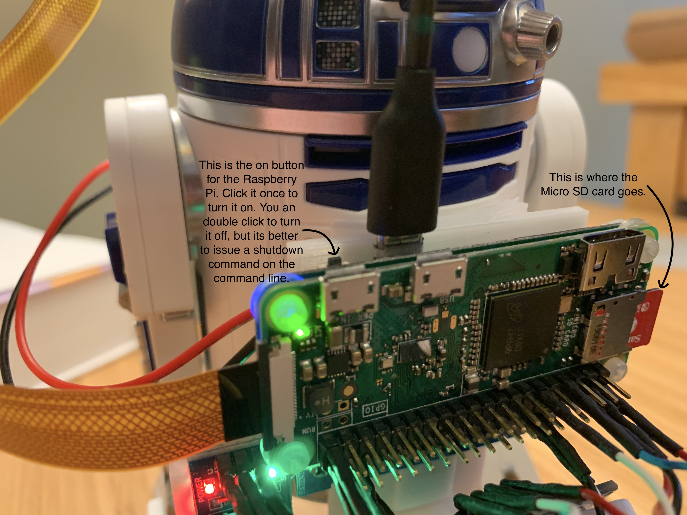
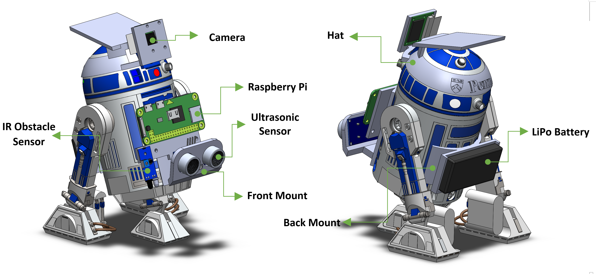

<!-- Check whether the assignment is ready to release -->
{{'now' | date: '%s'}}
{{page.release_date | date: '%s'}}
 
<div class="alert alert-danger">
Warning: this assignment is out of date.  It may still need to be updated for this year's class.  Check with your instructor before you start working on this assignment.
</div>

<!-- End of check whether the assignment is up to date -->


<!-- Check whether the assignment is up to date -->
{{'now' | date: '%Y'}}
{{page.due_date | date: '%Y'}}
 
<div class="alert alert-danger">
Warning: this assignment is out of date.  It may still need to be updated for this year's class.  Check with your instructor before you start working on this assignment.
</div>

<!-- End of check whether the assignment is up to date -->


<div class="alert alert-info">
This assignment is due on {{ page.due_date | date: "%A, %B %-d, %Y" }} before {{ page.due_date | date: "%I:%M%p" }}. 
</div>


<div class="alert alert-info">
Before beginning, you'll need these supplies:
<ul>

<li><a href="{{item.url}}">{{ item.name }}</a></li>

</ul>
</div>




<div class="alert alert-info">
You can download the materials for this assignment here:
<ul>

<li><a href="{{item.url}}">{{ item.name }}</a></li>

</ul>
</div>


## Part 1: Set Up your Sensor Pack

These instructions will walk you through how to install the software on your Raspberry Pi Sensor Pack so that you can control your R2D2 with our Python API.

### Charge your Sensor Pack

To charge your sensor pack, plug a micro USB cable into its charging port.  There are three micro USB ports on the Raspberry Pi sensor pack – two on the front and one on the bac. Only the one on the back will charge the battery.   There are a set of blue LED lights on the sensor pack located just behind the camera ribbon.  These blue lights indicate the charge level of the battery. 

<center>

</center>


### Install Software on the Raspberry Pi

The sensor pack uses the [Raspberry Pi Zero](https://en.wikipedia.org/wiki/Raspberry_Pi#Pi_Zero).  The Raspberry Pi Zero uses a [micro SD card](https://en.wikipedia.org/wiki/SD_card#Micro) as its storage space.  We will install an operating system for the Raspberry Pi Zero, along with all of the software that we'll need to control the robot, by writing a disk image file to your micro SD card. 

Here is how to put the disk image file on your Micro SD card:
* Put your micro SD card into a [USB SD card reader](https://www.amazon.com/s?k=micro+sd+card+reader), and insert the card reader in your computer's USB port.
* Download the [image file](https://drive.google.com/file/d/1XCulQIJeKBYETBc-63kWurN-2qw5MeHO/view?usp=sharing) from our Google drive.
* Flash the image onto the SD card.  We recommend using [balenaEtcher](https://www.balena.io/etcher/) which is  free software that is available for all platforms.

### Connect the Raspberry Pi to Wi-Fi

After the SD card is flashed, you need to set up access to your Wi-Fi network. Please make sure the frequency of your WI-FI is **2.4G Hz** not 5G Hz. Then, download this [configuration file](wpa_supplicant.conf).  Make sure you don't rename the file – it needs to be `wpa_supplicant.conf` in order for the Raspberry Pi's operating system to find it.  The file contents contain the following details:

```shell
ctrl_interface=DIR=/var/run/wpa_supplicant GROUP=netdev
update_config=1
country=US

network={
  ssid="WIFI_NETWORK_NAME"
  psk="WIFI_PASSWORD"
}
```

You need edit the file to replace `WIFI_NETWORK_NAME` with  your Wi-Fi name and `WIFI_PASSWORD` to be your Wi-Fi password.  Then put the edited file in the `boot` partition of your SD card. If you are using Windows and the prompt comes up saying you should format the disk before using it, **DO NOT** format it. Just look for the partition with name `boot`.

Then safely eject the SD card reader from your computer, and remove the Micro SD card from it. Plug the Micro SD card into the slot on the Raspberry Pi.  The slot is located on the right hand side of the device.  Turn on the Raspberry Pi by pressing the small power switch near the top left corner of the device. If everything goes well, the Raspberry Pi will connect to your Wi-Fi.


<center>

</center>

<!--
If you don't have a home Wi-Fi network, you can use a Wi-Fi Hotspot feature on your computer or your smartphone. Alternately, if you're on campus, you can use `AirPennNet-Device` by following the instructions [here](https://www.isc.upenn.edu/how-to/using-wireless-penn#For-devices). Those instructions will ask for the MAC address of your Raspberry Pi, which should be listed on the device body.
-->

<!--
#### Connect to Raspberry Pi via USB Serial

For students that don't have a SD card reader and wants to start immediately, you can try out the more advanced method to temporarily connect to your Rapberry Pi via USB serial. Simply plug a micro USB cable from the USB OTG port on the Rapberry Pi to your computer, and there should be a new serial TTY/COM device pops up. Connect using PuTTY on Windows or `screen` command line tool on Linux/MacOS. You can look for more information online.
-->

### SSH into the Raspberry Pi

If your Raspberry Pi successfully connected to your Wi-Fi network, then we can remotely access the Raspberry Pi from your computer using Secure Shell (SSH).

Before using SSH, we must first know the IP address of the Raspberry Pi. We could use the IP scanner apps to find its IP address, here is some free software that you can use to find its IP address:

* Android/iOS - [Fing](https://www.fing.com/products)
* MacOS - [Lanscan](https://apps.apple.com/us/app/lanscan/id472226235?mt=12) 
* Windows - [Advanced IP Scanner](https://www.advanced-ip-scanner.com/index2.php)
* Linux/Windows/MacOS -  [Angry IP Scanner](https://angryip.org/download/#linux)

<!--
<center>


</center>
-->

After you find the IP address of your Raspberry Pi, it's time to SSH into it. The default username to login to the Raspberry Pi is **`pi`** and the password is **`raspberry`**. There are many tutorials online for how to use SSH, here, we'll just give some simple instructions on different platforms.

#### MacOS and Linux

Open a terminal window and then run:

```shell
ssh pi@xxx.xxx.xxx.xxx
[enter the password when prompted]
```

Where `xxx.xxx.xxx.xxx` is the IP address of your Raspberry Pi.


#### Windows

If you want to use Windows 10's built-in SSH commands, [click here for details](https://www.howtogeek.com/336775/how-to-enable-and-use-windows-10s-built-in-ssh-commands/). Once SSH client is installed, you can follow the same steps below for MacOS / Linux.

Another option on Widnows is [PuTTY](https://www.chiark.greenend.org.uk/~sgtatham/putty/latest.html), download and install it. PuTTY has a GUI where you can insert in the IP address and it will launch a terminal window. 

<center>
 
</center>

You'll see a terminal window like this:
<center>
 
</center>
Then you just need to type the username (`pi`) and password (`raspberry`) and you are good to go.


<div class="alert alert-info" markdown="1">
### Basic Bash Skills

Once you have logged into your Raspberry Pi, you'll see a command line prompt that will let you type in Unix-style bash commands.  If you haven't used a command line before, there are a lot of tutorials on bash commands available online, here we just introduce some useful commands which are frequently utilized.

* `cd` **Change Directory:** `cd folder` to change to the working directory you are currently under to `folder`, see more details [here](https://linuxize.com/post/linux-cd-command/).

* `ls` **List Files/Directory:** `ls folder` to list information about files and directories under `folder`, see more details [here](https://linuxize.com/post/how-to-list-files-in-linux-using-the-ls-command/).

* `cat` **Display/Copy/Create Text Files:** `cat filename` to display the content of a file with `filename`, see more details [here](https://www.interserver.net/tips/kb/linux-cat-command-usage-examples/).

* `rm` **Remove File/Directory:** `rm filename` to remove a file or directory with `filename`, see more details [here](https://www.computerhope.com/unix/urm.htm).

* `nano` **Text Editor:** `nano filename` to edit the file with `filename`. It's a command-line based text editor, see more details [here](https://www.howtogeek.com/howto/42980/the-beginners-guide-to-nano-the-linux-command-line-text-editor/).

* `password` **Change the password:** It is recommended to change the password once you get your Raspberry Pi.

* `screen` **Start a terminal session in the background:** `screen -S name` to start a named session called `name`. Press `Ctrl-A` and then press `D` to detach the session.  `screen -r name` to attach to the session called `name`. This allows you to start a terminal that won't be terminated when you disconnect from SSH. See more details [here](https://linuxize.com/post/how-to-use-linux-screen/).
</div>


<div class="alert alert-info" markdown="1">
### Bash Commands for the Raspberry Pi

* System configuration: `sudo raspi-config`
* Reboot: `sudo reboot now`
* Shutdown: `sudo shutdown now`
	
You should ***always*** shut down properly before you unplug the power. Failed to do so may result in data corruption, and you may need to re-flash the image when that happens.

</div>


### Optional: Using the Raspberry Pi to Control the Robot 
If your computer doesn't have Bluetooth (or if its Bluetooth is too old), then you can use the Raspberry Pi that comes with the robot as a backup option to connect to the robot. The Raspberry Pi can act as a relay server between the robot and the client (your computer) which will run the actual code.

<!--
To use this method, you will need some basic `ssh` knowledge, here is a [**guide**](ssh_bash_skills.md) on how to connect to the Raspberry Pi.

You will need to `pip3 install bleak` on the target machine first. We have already done this for you on the RPi.
-->

To start the server on Raspberry Pi, run:

```shell
sudo -E python3 -m spherov2.adapter.tcp_server
```

After you have successfully launched the server on the Raspberry Pi, you can connect to it from your own computer using the TCP adapter argument to the `find_toy` function.  You can run this Python code on your computer:

```python
from spherov2 import scanner
from spherov2.sphero_edu import SpheroEduAPI
from spherov2.adapter.tcp_adapter import get_tcp_adapter

toy = scanner.find_toy(adapter=get_tcp_adapter('xxx.xxx.x.xxx')) # The IP Address of the server machine
with SpheroEduAPI(toy) as api:
    api.roll(0, 100, 3)
```


## Part 2: Understanding the Sensor Systems

### 1. Mechanical Design

The basic Sphero R2D2 does not have many built in sensors.  We upgraded the droid with a sensor pack that can be attached to the robot via a 3D printed mount.  We add an ultrasonic sensor range finder, an IR cliff sensor, and a camera.

<center>

</center>

* **3D Print Mount**: It contains three parts, front mount, back mount and top hat. The front mount is connected to the R2-D2 using magnets which means you could easily remove it when necessary. The back mount and top hat are attached to the R2-D2 by glue. There is an [AprilTag](https://roboticsknowledgebase.com/wiki/sensing/apriltags/) stuck to the hat for position tracking.
* **Raspberry Pi**: The Raspberry Pi is connected to the front mount via magnets and it is powered by the LiPo battery.
* **Power Management Board**: This board is closely attached to the Raspberry Pi with screws to control the power from the LiPo battery and prevent damage caused by a short circuit.
* **LiPo Battery**: The LiPo battery is equipped on the back mount using magnets. There also exists a tiny AprilTag for position tracking.
* **Ultrasonic Sensor**: The ultrasonic sensor uses sound waves to measure the distance to obstacles, here is an [introduction](https://www.maxbotix.com/articles/how-ultrasonic-sensors-work.htm) on how it works. In our design, the ultrasonic sensor is mounted on the front armor with glue to detect the obstacles in front of the R2-D2.
* **IR Obstacle Sensor**: Instead of utilizing sound waves, the Infrared Transmitter (IR) obstacle sensor uses light radiation to perceive the obstacles. Please refer [here](https://www.electronicshub.org/ir-sensor/) for details. The IR sensor is linked to the front mount using screws and points to the ground to detect cliffs.
* **Camera**: The camera is mounted on the hat with screws which can be easily dismounted. The camera has a high resolution of 1080p/30fps. A detailed description of the camera specs can be found [here](https://www.amazon.com/Camera-Module-Raspberry-Webcam-Megapixel/dp/B07QNSJ32M/ref=pd_lpo_147_img_2/131-5121704-3399433?_encoding=UTF8&pd_rd_i=B07QNSJ32M&pd_rd_r=db2bf780-0d92-4bb7-baac-a6c85ef80149&pd_rd_w=jpCCk&pd_rd_wg=66dxv&pf_rd_p=7b36d496-f366-4631-94d3-61b87b52511b&pf_rd_r=CM3XAE7MQVH2XWJ8T55C&refRID=CM3XAE7MQVH2XWJ8T55C&th=1).
* **How to turn it on?**: There is a small button on the power management board. Press it once to start the system and double click to shut down the system.
* **How to charge?**: To charge the R2-D2, there is a micro-USB port on the lower left corner at the rear of R2-D2. To charge the Raspberry Pi, there are three micro-USB ports, two on the Raspberry Pi and one on the power management board. You should charge the battery via the one on the power management board.

### 2. Circuit Design and Control Logic
The figure below shows the circuit diagram of the sensor system. If you unplug any of these wires by mistake, you could easily fix them by following this diagram. The control logic is also demonstrated below for you to understand how the system works.

<table><tr>
<td>  </td>
<td>  </td>
</tr>
<tr>
<td style="text-align:center">Circuit Diagram</td>
<td style="text-align:center">Control Logic</td>
</tr>
</table>

#### Circuit
Here are some descriptions of the circuit diagram, refer [here](https://raspberrypi.stackexchange.com/questions/83610/gpio-pinout-orientation-raspberypi-zero-w) for the PIN layout of Raspberry Pi zero.

* **Ultrasonic Sensor** : Vcc - PIN 2, Gnd - perfboard - PIN6, Trig - PIN7 (GPIO 4), ECHO - perfboard - PIN 11 (GPIO 17).
* **IR Obstacle Sensor** : Vcc - PIN 4, Gnd - PIN 39, Out - PIN 40 (GPIO 21)

#### Control Logic

* **Raspberry Pi**: Handles signals sent from the camera and the sensors, and sends them to the PC when requested. The RPi could also work as the server to send commands to the R2-D2 if your PC does not have a Bluetooth adapter.
* **PC**: Your PC could generate target commands to the R2-D2 based on the sensor data sent from Raspberry Pi.
* **R2-D2 & Sensors**: Joined by the 3D print mount as the terminal equipment to show the functions. 

### 3. Receive the Sensor Data

Before starting this section, make sure to have successfully SSHed into the Raspberry Pi unit on the R2D2 following this [`document`](ssh_bash_skills.md). Once you've successfully SSHed into the R2D2s RPi unit, run the `ls` command. It should show you two files; `camera_server.py` and `sensor_server.py`.


Download [`rpi_sensor.py`](rpi_sensor.py) to your computer, which contains some utility functions required to receive the sensor data.

#### Camera


**On the Rasperry Pi's command line:**

Run the following code to start the video server.

```shell
python3 camera_server.py
```
You should see the message `Waiting for a TCP connection on x.x.x.x:65433...`.

**On your computer's shell terminal:**

Install [OpenCV](https://github.com/skvark/opencv-python) on your computer using the following command:

```shell
pip3 install opencv-python
```

Then use the given function in `rpi_sensor.py` to create and run a python script as follows:

```python
from rpi_sensor import RPiSensor
import cv2

if __name__ == '__main__':
    with RPiCamera('tcp://IP_ADDRESS:65433') as camera: # Replace IP_ADDRESS with the IP address of your Raspberry Pi
        while True:
            cv2.imshow('R2D2 camera', camera.get_frame())
            key = cv2.waitKey(1)
            if key == ord('q'):
                cv2.destroyAllWindows()
                break
```

If every thing goes well, you will be able to see a real time video streaming window pop on your screen.

**Note:** Remember that you have to start the camera server on your Raspberry Pi before running the client code.

#### Sensors

In addition to the built-in sensors [API](https://spherov2.readthedocs.io/en/latest/sphero_edu.html#sensors), we provide a server to obtain data from the ultrasonic sensor and cliff detection sensor. To start the sensor server, run the following command on the Raspberry Pi shell terminal:

```shell
python3 sensor_server.py
```

We provide an `RPiSensor` class in `rpi_sensor.py`. You could connect to the sensor server with the following code:

```python
from rpi_sensor import SensorClient

with RPiSensor('IP_ADDRESS') as sensor: # IP address of Raspberry Pi
    print(sensor.get_obstacle_distance())  # Distance to the obstacle in terms of centimeters
    print(sensor.get_cliff())  # 0 - no cliff, 1 - detected cliff
```

To fetch the ultrasonic sensor data, use the method `.get_obstacle_distance()`. Similarly, use `.get_cliff()` for cliff detection.

### Combine R2D2 with the Camera & Sensors (Surveillance Mode) [5 points]

Now it's your turn to complete the second part of the script, in which you are required to combine the `drive_with_keyboard()` function with the sensor/camera system. Inspired by the head-up display (HUD) system of jet fighter, we could display the sensor information on the video streaming window shown below.

<p float="left">
  
   
</p>

Implementation details are in the main assignment writeup.