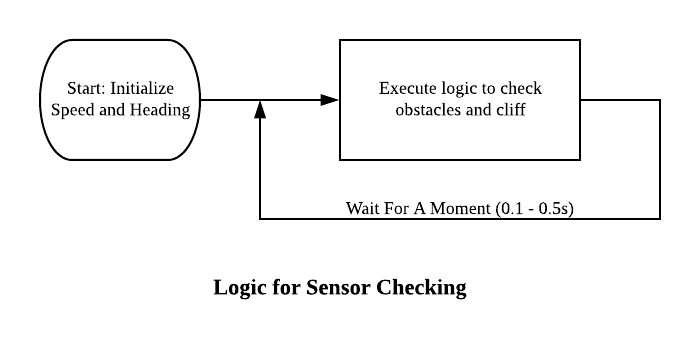
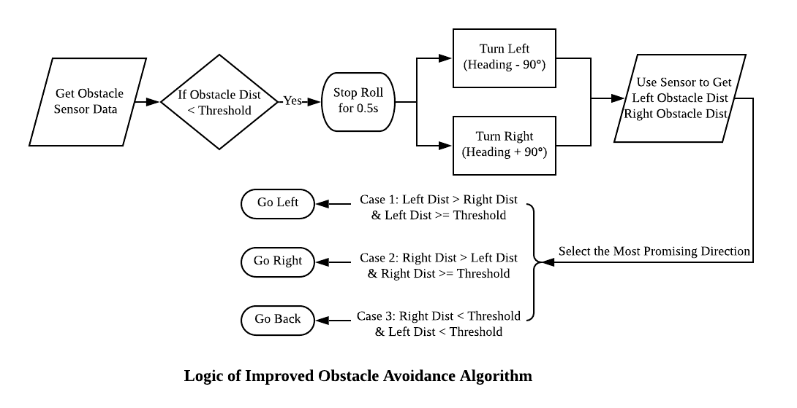
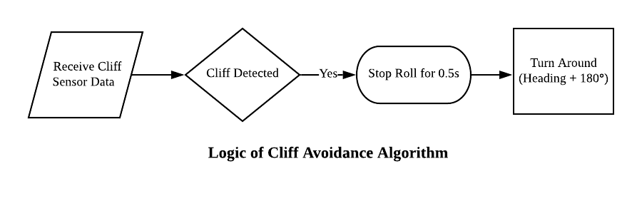
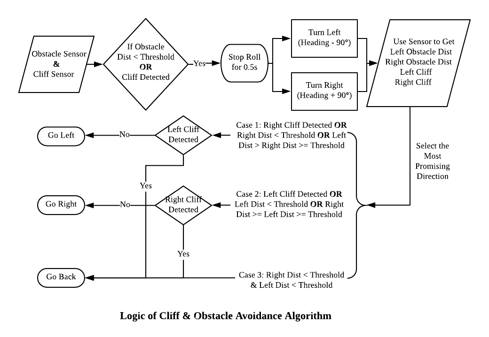
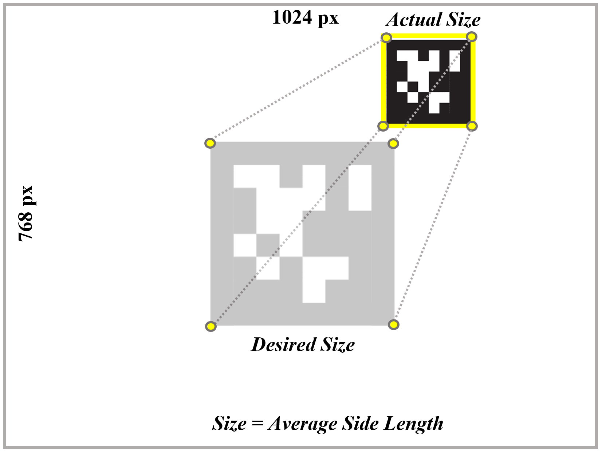

<!-- Check whether the assignment is ready to release -->
{{'now' | date: '%s'}}
{{page.release_date | date: '%s'}}
 
<div class="alert alert-danger">
Warning: this assignment is out of date.  It may still need to be updated for this year's class.  Check with your instructor before you start working on this assignment.
</div>

<!-- End of check whether the assignment is up to date -->


<!-- Check whether the assignment is up to date -->
{{'now' | date: '%Y'}}
{{page.due_date | date: '%Y'}}
 
<div class="alert alert-danger">
Warning: this assignment is out of date.  It may still need to be updated for this year's class.  Check with your instructor before you start working on this assignment.
</div>

<!-- End of check whether the assignment is up to date -->


<div class="alert alert-info">
This assignment is due on {{ page.due_date | date: "%A, %B %-d, %Y" }} before {{ page.due_date | date: "%I:%M%p" }}. 
</div>


<div class="alert alert-info">
Before beginning, you'll need these supplies:
<ul>

<li><a href="{{item.url}}">{{ item.name }}</a></li>

</ul>
</div>




<div class="alert alert-info">
You can download the materials for this assignment here:
<ul>

<li><a href="{{item.url}}">{{ item.name }}</a></li>

</ul>
</div>


# Robot Exercise 1: R2-D2 as an Intelligent Agent

## Preface
Luke and R2-D2 were shot down by the enemy while driving the X-wing fighter, falling to a barren planet full of rocks and cracks. R2-D2 has to avoid hitting obstacles and falling off cliffs, while following Luke closely. To achieve these goals, R2-D2 must take advantage of its new sensors and camera to act rationally and prevent getting lost.

## Instructions
In this assignment, you will use the external sensor system controlled by the Raspberry Pi and learn how to let the robot act rationally according to the environment. If you've forgotten how to use it, please refer to [hw0](http://artificial-intelligence-class.org/r2d2_assignments/20fall/hw0/sensor-pack-setup.html) for details. 

A skeleton file [r2d2_hw1.py](r2d2_hw1.py) containing empty definitions for each question has been provided. Some helper functions required for [sensors](rpi_sensor.py) and [simulators](simulator.py) are also provided. Please do not change any of the helper functions. Since portions of this assignment will be graded automatically, none of the names or function signatures in this file should be modified. However, you are free to introduce additional variables or functions if needed.

You are strongly encouraged to follow the Python style guidelines set forth in PEP 8, which was written in part by the creator of Python. However, your code will not be graded for style.

Once you have completed the assignment, you should submit your file on [Gradescope]().

## Part 1: Acting Rationally - Cliff & Obstacle Detection [30 points]
An agent is anything that can be viewed as perceiving its environment through sensors and acting upon that environment through actuators. In this part, the R2-D2 uses the ultrasonic sensor and the IR obstacle sensor as introduced in [Homework 0](http://artificial-intelligence-class.org/r2d2_assignments/20fall/hw0/sensor-pack-setup.html) to perceive the environment and make decisions based on the sensor data.

We provide a [simulator](simulator.py) for you to test out your functions before applying them on the real robot. To use the simulator, run the  function `droid_explore()` (which is provided in the skeleton file). There are several test mazes in the simulator file for you to validate the algorithms. Remember to add the line `droid.update_location()` to display a real time plot.

### 1. Obstacle Avoidance [15 Points]
#### Built-in `on_collision` Function for Avoidance [5 points]

The [Sphero API](https://spherov2.readthedocs.io/en/latest/sphero_edu.html#events) provides an `on_collision` event which can detect whether the R2-D2 has hit something or not by using its built-in accelerometer. Your task is to fill out the `on_collision()` function:

```python
def on_collision(droid: SpheroEduAPI):
    # code to execute on collision

droid.register_event(EventType.on_collision, on_collision)
```

When a collision is detected, this function should immediately stop the droid from rolling and change the droid's main LED to red (RGB 255, 0, 0) by using the `set_main_led` function. Then it should continue to make the droid roll in the opposite direction with a speed of 80 after a 1 second sleep. Don't forget to turn the LED off (set it back to black) when the droid starts rolling again. As stated earlier, please use the `droid_explore()` function to test out your implementation.

#### Ultrasonic Sensor for Avoidances [10 points]

Notice that the built-in sensor only reports an obstacle when the droid collides with it. The [ultrasonic sensor](https://en.wikipedia.org/wiki/Ultrasonic_transducer), on the other hand, uses the time that the ultrasound takes to get reflected off of an object to estimate the distance to the target. To prevent collisions, the R2-D2 will use the ultrasonic sensor to detect the distance to any obstacles and act rationally based on the feedback.


* **Implement `obstacle_avoidance()`** 

  This function allows the R2-D2 to turn around after detecting any obstacle. The following image outlines the logic:

<center>

</center>

Notice that the function only acquires the sensor data and does the checking once. In order for it to avoid obstacles successfully, we need to do this checking every once in a while, as shown in the following figure:

<center>

</center>

We have implemented a `while` loop inside the `droid_explore()` function in the skeleton code, which will call on the corresponding check every 0.1 seconds. You can use this function to test out your implementation of `obstacle_avoidance()`. Please note that you will have to similarly test out the following functions (`obstacle_avoidance_improved()`,`cliff_avoidance()` and `cliff_obstacle_avoidance()`) using the `droid_explore()` function.

<!-- This logic applies to all of the following functions as well, which means you should only need to be replacing what is inside the `while` loop. -->

Make sure to test out your implementation using the simulator first. If it passes the test cases, you could put some obstacles on the ground to test it out on the R2D2. As an example, please refer to the following figures:


<p float="left">
  
   
</p>

* **Implement the `obstacle_avoidance_improved()`**

It is obvious that the algorithm we implemented above is not perfect as the droid could only explore a limited area. To improve this, we could modify the function with the following logic:

1. Stop for 0.5 second when detecting an obstacle.
2. Turn left and get the obstacle distance on the left side.
3. Turn right and get the obstacle distance on the right side.
4. Choose the side with the longer obstacle distance; if both side are close to obstacles, then turn around.

A flow chart of this logic is shown below:

<center>

</center>


If you follow the requirements correctly, you will see the performance of the droid in the simulation and of the R2D2 as shown below:

<p float="left">
  
   
</p>

### 2. Drop Avoidance [5 Points]

To avoid falling off a cliff on some barren planet, R2-D2 will use the IR obstacle sensor to detect the cliff under its track. The [IR obstacle sensor](https://wiki.eprolabs.com/index.php?title=IR_Obstacle_Sensor) measures the distance from an obstacle by emitting or detecting infrared radiation.

* **Turn the knob to adjust the detection distance**

  First, we must adjust the detection range of the IR obstacle sensor to achieve the desired performance. There is a small screw on the IR sensor that you will have to turn (using a sharp tool or a screwdriver) to change the detection distance. To achieve the desired range, first switch the R2-D2 to Tripod mode. The light on the IR sensor should be on when there's no cliff, and off when the droid is on the edge of a cliff. Take a look at [this video](https://youtu.be/f59R8tjP3ks) as an example.

* **Implement `cliff_avoidance()`**

  Similar to `obstacle_avoidance()`, the R2-D2 should turn around when a cliff is detected. The logic is shown as follows:

<center>

</center>

To test out your implementation of this function, please use `droid_explore()` with the 3rd simulation test (`test_maze3`) before trying it out with the actual R2D2. If it works correctly in the simulator, you could take a box (not too high) to conduct an experiment on the real droid. *Please* take care not to break the R2-D2 when doing the experiment.

<p float="left">
  
   
</p>

### 3. Combine the Two Goals [10 Points]

Now it is time to combine the two goals and let the R2-D2 make decisions based on the data of the two sensors. We provide an outline of the logic shown in the figure below, but feel free to come up with your own ideas. We will test your algorithm using the simulator and grade you based on the size of the explored area. `test_maze4` in the simulator file is a good test-case for your algorithm.

Here is a [demo](https://www.youtube.com/watch?v=PNuBswLqymg) for this function.

<p float="left">
	 
	
</p>

## Part 2: Maximize Performance Measure - AprilTag Tracking [10 points]

As mentioned in the lecture, a rational agent acts to maximize the object criterion. In this task, we would like the R2-D2 to keep the AprilTag at the center of its sight and maintain a fixed distance.
### 1. Introduction on AprilTag
[AprilTag](https://april.eecs.umich.edu/software/apriltag) is a visual fiducial system that looks like a QR code which is useful for a wide variety of tasks including augmented reality (AR), robotics, and camera calibration. You can understand how it works from this [paper](https://april.eecs.umich.edu/media/pdfs/olson2011tags.pdf). For this course, we just call a function that implements this technique. If you're interested and want to dig deeper, please take CIS-580 and/or CIS-581! 

The tags can be easily created by printing it out on ordinary paper. We have provided a [PDF](AprilTag.pdf) version of the tag family `tag_36h11` for you to print out. Install the python package for AprilTag using the following command: 

```shell
pip3 install pupil-apriltags
```

### 2. Introduction on PID controller

[Proportional–Integral–Derivative (PID) controller](https://en.wikipedia.org/wiki/PID_controller) is a widely applied feedback control approach. A PID controller continuously calculates an error value as the difference between a desired setpoint and the current setpoint, and applies a correction based on the proportional, integral, and derivative terms of the error. Here is the equation of a PID controller:

$$ u(t) = K_\text{p} e(t) + K_\text{i} \int_0^t e(t') \,dt' + K_\text{d} \frac{de(t)}{dt} $$

For this task, you are **not** required to fully understand how a PID controller works. We just use this technique to make the R2-D2 have better performance. First, please install a python PID package using the following command:

```shell
pip3 install simple-pid
```

Then given a `pid` object, use it like

```
output = pid(input)
```

Where `input` is the input to the PID controller and `output` is a float number that indicates the offset.


The following flow chart demonstrates the logic of using a PID controller to track an AprilTag. You need to follow this logic to complete the following tasks and fine tune the PID parameters to obtain better performance. 

<center>

</center>

We have pre-tuned the parameters in the skeleton code but feel free to fine tune the parameters further to improve the performance. Here are some basic rules of how to tune the PID controller

1. Set all gains to zero.
2. Increase the P gain until the response to a disturbance is a steady oscillation.
3. Increase the D gain until the the oscillations go away (i.e. it's critically damped).
4. Repeat steps 2 and 3 until increasing the D gain does not stop the oscillations.
5. Set P and D to the last stable values.
6. Increase the I gain until it brings you to the setpoint with the number of oscillations desired (normally zero but a quicker response can be had if you don't mind a couple oscillations of overshoot)

### 3. AprilTag Tracking [5 points]

Luke captured a Stormtrooper and asked R2-D2 to guard him. R2-D2 has to keep changing its heading to track the AprilTag held by the prisoner. In this task, you are required to complete the `april_tag_tracking()` function which takes in the `x` and `y` coordinates of the April Tag as input, processes the `x` coordinate through the PID controller, and sets the heading of the R2-D2 based on the PID output. Please use the `rolling_with_u()` function to test out your implementation of this function. Use this [April Tag](AprilTag.pdf) to guide your R2D2. The figure below gives you an idea of the performance expected.

<p float="left">
	 
	
</p>

### 4. AprilTag Following [5 points]

Luke interrogated the Stormtrooper and obtained information that would help him escape this planet. R2-D2 must follow Luke closely to prevent getting lost. To achieve this goal, R2-D2 has to keep changing its speed based on the distance to the AprilTag. In this task, you need to complete the `april_tag_following()` function, in which the average side length of the April tag is fed as input to the PID controller, and the corresponding output is used to set the speed of the R2-D2. Again, please use the `rolling_with_u()` function to test out your implementation of this function. The figure below gives you an idea of the performance expected.

<p float="left">
	 
	
</p>

### Video Submission for this part [5 points]

Please record a short video to demonstrate the performance of your AprilTag Tracker.

**Optional** After you finish this part, you could find a partner who also has a R2D2 and you could conduct a robot chasing application. You could attached a small Apriltag on the backpack battery of one R2D2 and use `drive_with_keyboard` you implemented in hw0 to drive this R2D2. The second R2D2 will just run `rolling_with_u`  to follow the first R2D2. Here is a [demo](https://www.youtube.com/watch?v=aHuZVwZAsAM). 

## Recommended Readings
[A robust and flexible visual fiducial system](https://april.eecs.umich.edu/media/pdfs/olson2011tags.pdf), Edwin Olson, Proceedings of the IEEE International Conference on Robotics and Automation (ICRA), May 2011.

[AprilTag 2: Efficient and robust fiducial detection](https://april.eecs.umich.edu/media/pdfs/wang2016iros.pdf), John Wang and Edwin Olson, Proceedings of the IEEE/RSJ International Conference on Intelligent Robots and Systems(IROS), Oct 2016.
