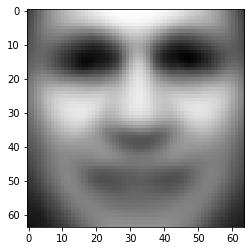
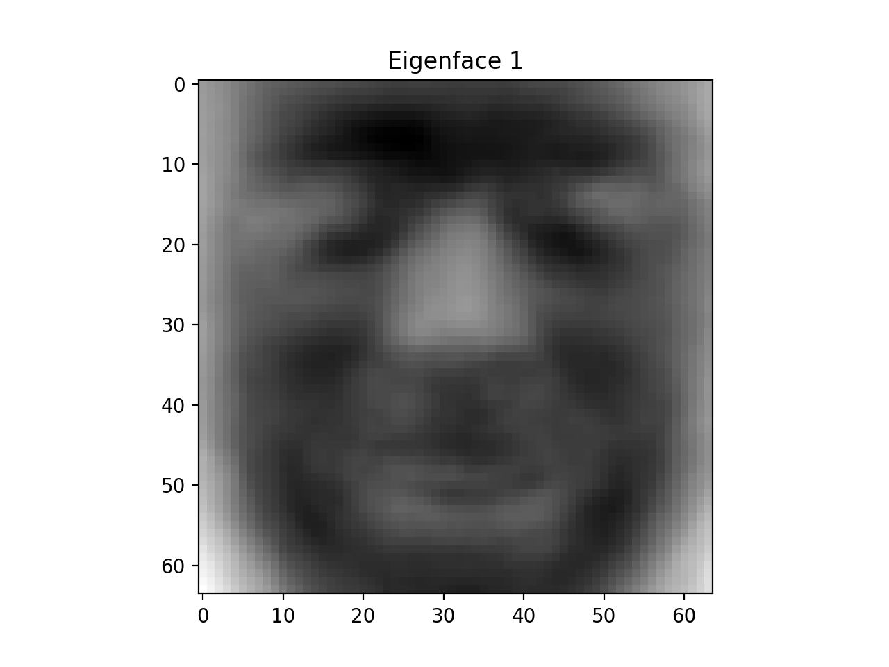

# Robot Excercise 4: Deep Learning Application

## Preface
The COVID-19 spreads to the whole Galaxy, the planet where R2D2 lives included. To slow down the propagation speed of the virus, R2D2 has a new mission to recognize the faces and find people who don't wear masks. R2D2 will take advantage of its new deep learning module to learn from the dataset gathered from other planets.

## Instruction
This assignment consists of 3 parts. In part 1, you will learn how to use [PCA](https://en.wikipedia.org/wiki/Principal_component_analysis) to implement a face detector. 

In part 2, you will combine the Qlearning knowledge introduced in the lecture and the OpenCV face detector to complete a face tracking task. 

While for part 3, you will utlize the Convolutional Neural Network (CNN) to conduct a mask classification which is closely related to the pandemic we are experiencing.

The skeleton codes are provided in [r2d2_hw4.py](r2d2_hw4.py) and [notebook](). You could use the [Google Colab](https://colab.research.google.com/) to edit the notebook file and conduct the training using the free GPU from Google. 

## Part 1: PCA Face Recognition

Principle Component Analysis (PCA) is a widely used approach for dimension reduction and making prediction models. For example, for a person with many personalities, you could always find several main personalities to describe him. And PCA does the similar job, which could pick several features to describe a large data. 

PCA consists of two main steps:

1. Compute the [covariance matrix]() of the dataset.
2. Compute the [eigenvalue]() and [eigenvector]() of the covariance matrix.

These are basic linear algebra concepts and if you are unfamiliar with these terms, please click the Wiki link for reference.

Now swith to our face detection task, just like the eigenvector, we could also use PCA to find some [eigenfaces](https://en.wikipedia.org/wiki/Eigenface), aka principle faces, to represent human faces. 

<p align="center">
  
</p>

### 1. Data Preprocess

To find the effective eigenfaces, we need a large amount of real human faces as our dataset. The [Labeled Faces in the Wild Home (LFW)](https://devconnected.com/how-to-count-files-in-directory-on-linux/) provides over 13,000 faces and we selected the first 2,000 faces which are large enought for our task. You could download the dataset [here](faces.p) or just run the cell in the notebook to fetch the data.

To use the dataset, run the following code to convert it to a numpy array

```python
>>> import pickle
>>> faces = pickle.load(open("faces.p", "rb"))
>>> print(faces.shape)
(2000, 64, 64)
```
This array contains 2000 rows, each row represents a face with the size of 64 by 64 pixels.

**TODO**

* Implement the `flatten_faces(faces)` which flatten the 2D face to a 1D vector.

	```python
	>>> face_vectors = flatten_faces(faces)
	>>> print(face_vectors.shape)
	(2000, 4096)
	```
* Implement the `cal_avgface(face_vectors)` which takes the mean of all face vectors to get the average face of the dataset.

	```python
	>>> average_face = cal_avgface(face_vectors)
	>>> print(average_face.shape)
	(4096,)
	```

	You could also take a look at how it looks like by running:

	```python3
	>>> import matplotlib.pyplot as plt
	>>> plt.imshow(average_face.reshape(64, 64), cmap='gray')
	>>> plt.show()
	```
	<p align="center">
	  
	</p>

	<p align="center">
	    <em>Average Face</em>
	</p>

	If your result looks like above, you are on the right track and you could save the average face by:

	```python
	>>> pickle.dump(average_face, open('average_face.p', 'wb'))
	```

### 2. Compute the Eigenface
Now we could start to compute the eigenfaces, as mentioned before, we need two steps to get the eigenfaces - compute the covariance matrix and take the eigenvector of this matrix. The math theory part is shown below, you could also read this [instruction](http://www.vision.jhu.edu/teaching/vision08/Handouts/case_study_pca1.pdf) from JHU for details.

**TODO**

* Implement the `cal_covariance(A)` which takes in the face vector minus by the average face and return the covariance matrix given the equation $$C = AA^T$$

	```python
	>>> A = face_vectors - average_face
	>>> C = cal_covariance(A)
	>>> print(C.shape)
	(2000, 200)
	```

* Implement the `cal_eigenvectors(C)` which takes in the covariance matrix and return the eigenvectors **sorted** by the **descending** order of the eigenvalue. It may take around 30 seconds for compution.

	```python
	>>> eigenvectors = cal_eigenvectors(C)
	>>> print(eigenvectors.shape)
	(2000, 2000)
	```

* Implement the `cal_eigenfaces(eigenvectors)` which transform the eigenvectors to eigenfaces using the formula $$eigenfaces = (A^T \cdot eigenvectors)^T$$

	```python
	>>> eigenfaces = cal_eigenfaces(eigenvectors)
	>>> print(eigenfaces.shape)
	(2000, 4096)
	```
	You could take a look at what the first several eigenfaces look like by:
	
	```python
	>>> plt.imshow(eigenfaces[0].reshape(64, 64), cmap='gray')
	>>> plt.show()
	```
	
	<p align="center">
	  
	</p>

	If your result looks similar as above, you could save the eigenfaces using:

	```python
	pickle.dump(eigenfaces, open('eigenfaces.p', 'wb'))
	```

### 3. Projection on Face Space
After we get the eigenfaces, we could project any image to the face space. We could calculate the distance between original image and the projected image to indentify whether it is a human face and thus the face detector is bulit. The figure shown below demonstrates how we could use the approach to detect human face. The distance of CCB's is mush smaller than the kitten's which means it is more likely to be a human face.

<p align="center">
  
</p>

**TODO**

* Implement the `proj2face_space(target_vector, eigenfaces)` which takes in the target vector whe want to analyze and the eigenfaces and return its projection vector on the face space. It includes two steps:
	* Compute the weights of each eigenfaces, $$weight = eigenfaces \cdot target_vector^T$$, and **normalize** it to a unit vector.
	* Mutiple the weight with the eigenfaces using $$weight^T \cdot eigenfaces$$

	```python
	>>> face_space_vector = proj2face_space(target_vector, eigenfaces)
	>>> print(face_space_vector.shape)
	(4096,)
	```

* Implement the `dist2face_space(target_vector, face_space_vector)` which returns the euclidean distance between the two vectors. You may use the [np.linalg](https://numpy.org/doc/stable/reference/routines.linalg.html) API.

#### 4. Real-Time Face Detector

If everything goes well so far, you could now use the Raspberry pi camera system to bulid a face detector. We provide a function called `pca_face_detection(camera, k, threshold)` in the skeleton code, and please make sure you put the **eigenfaces.p** and **averageface.p** in the same directory of the skeleton file. The argument `k` represents the number of eigenfaces you want to use and the `threshold` stands for the boundary of distinguish human face. The TA used k=20 and threshold=50000 which works well. You may need to fine tune these parameters to get better performance.

```
with RPiCamera('tcp://IP_ADDRESS:65433') as camera:
	pca_face_detection(camera, 20, 50000)
``` 

<p align="center">
  
</p>

## Part 2: Face Tracking via Q-learning

In part 1, we constructed a very simple face detector, but it is not robust and cannot tracking the position of the face. However, with the help of deep learning, there are various of face detection methods now. [Harr Feature-based Cascade face detection](https://docs.opencv.org/3.4/db/d28/tutorial_cascade_classifier.html) is one of the most famous methods which has already been implemented in OpenCV, you could use it by downloading this [xml](haarcascade_frontalface_default.xml) file and run the following code:

```python
face_cascade = cv2.CascadeClassifier('haarcascade_frontalface_default.xml')
faces = face_cascade.detectMultiScale(gray, scaleFactor=1.1, minNeighbors=5, minSize=(30, 30))
```
It will return a list of bounding box coordinates of the faces detected in the image.

## Part 3. Mask Detection
> “We need, as a nation, to show a degree of consistency of everybody following public-health recommendations on wearing masks or other face coverings”, said Dr. Fauci.

Now it's time to apply the machine learning skills to deal with the big challeng we are facing now! In this part, we will implement a real time mask detector using the camera system and the R2D2 will change it's main light according to the detection results. This homework is mainly described in this [notebook](), you could directly edit it in Google Colab.

### 1. Data Preprocessing
We use the dataset from kaggle, [here]() is the original dataset in xml type. We have preprocessed the original dataset into a dictionary with the format {'image': np.array, 'label': 'good'/'bad'}.

**TODO**

* Implement the `preprocess(image)` which transforms the image data according to the following steps:
	* Convert gray image to RGB
	* Resize the image to 128 * 128
	* Scale the value of each pixel from [0, 255] to [-1, 1]

### 2. Baseline - Perceptron
For the baseline model, we simply flatten the image data and utlize Perceptron as our classifier.

**TODO**

* Implement the `flatten(images)` which convert the 2D images to 1D vector.
* Conduct a perceptron classification on the dataset.

### 3. Build Your Own CNN Model

In this section, you are required to construct a nerual network using the [keras](https://keras.io) platform.

**TODO**

Build a neural network (show below) according to the following descriptions:

* Convolution with 32 filters with kernel size 7x7 followed by ReLU activation function;
* Max Pool with filter size/pool size = 7 and stride = 4;
* Convolution with 16 filters with kernel size 5x5 followed by ReLU activation function;
* Max Pool with filter size/pool size = 7 and stride = 4;
* Flatten layer to transform 3D layers to a single tensor/vector;
* Fully Connected with 64 neurons and ReLU activation function
* Fully Connected with 2 neurons and softmax activation function

<p align="center">
  
</p>

### 4. Advanced CNN Model using ImageNet

To get better performance, we could use more complicated networks. There are various of architectures available in [keras](https://keras.io/api/applications/) like [VGG](https://keras.io/api/applications/vgg/), [InceptionV3](https://keras.io/api/applications/vgg/), etc.

### 5. Real-Time Mask Detector

After finding the most appropriate face detector and you fine tuned mask classifier. It's the time to apply these on the R2D2. First, save your model with the weights. Then use the given scripts and follow the instructions on the course website, you will be able to let the R2D2 follow your face and identify whether you are wearing a mask.

<p align="center">
  
</p>