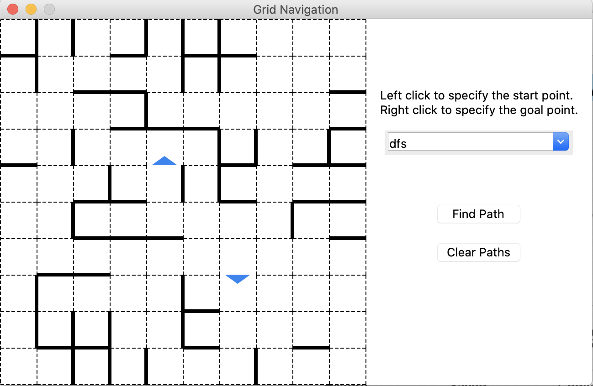
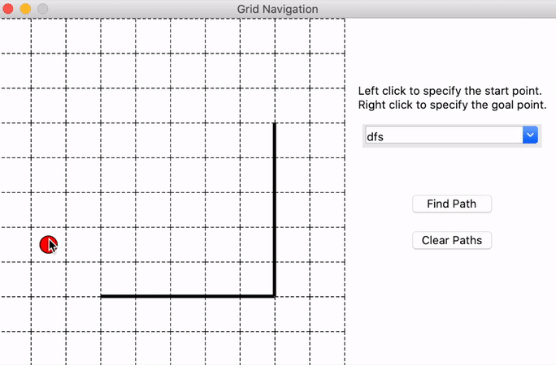
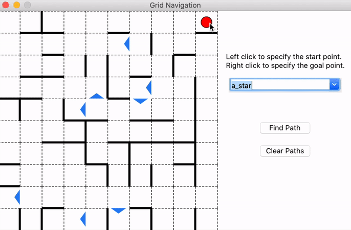
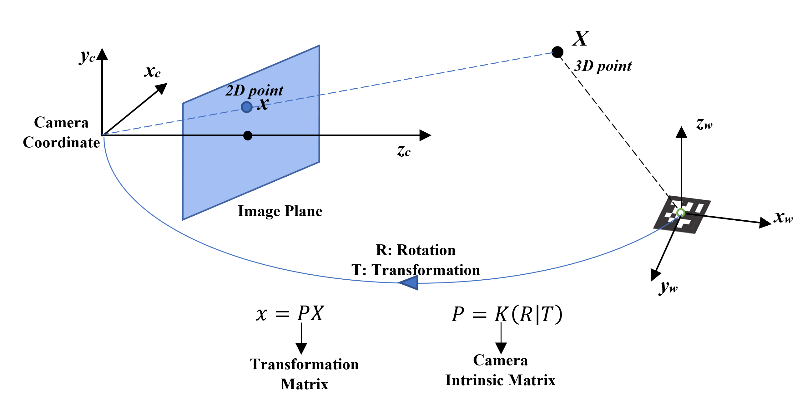
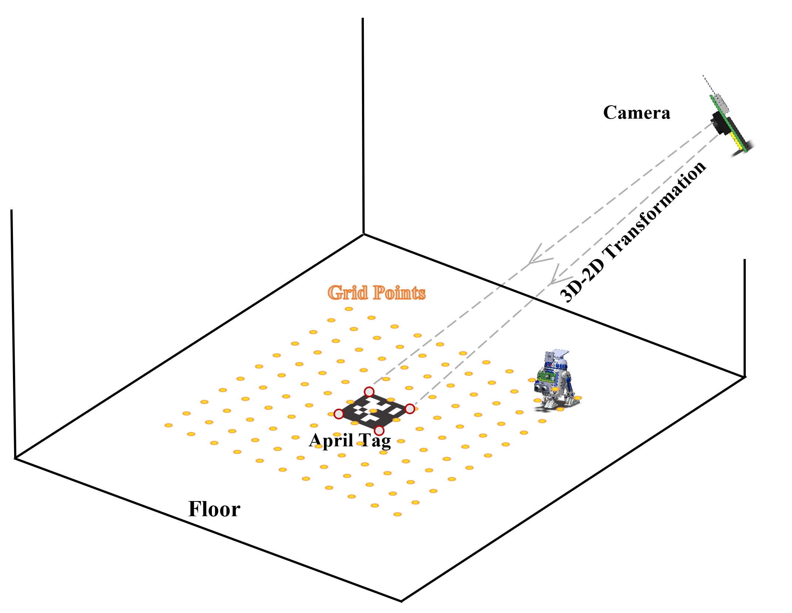
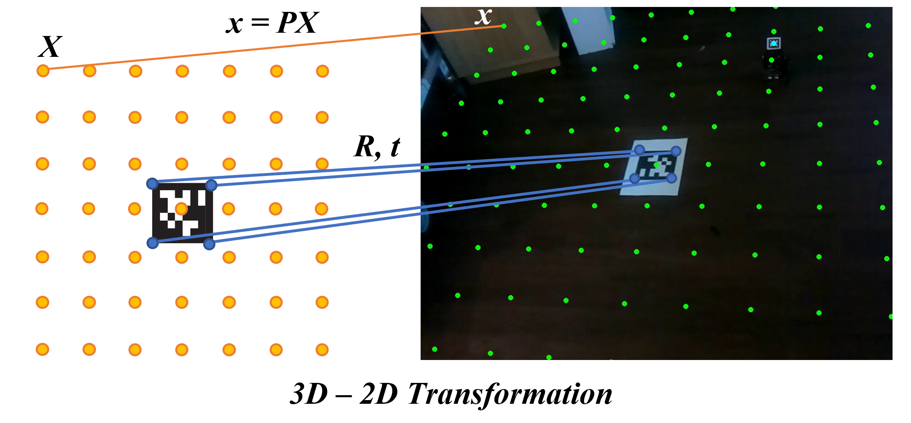

<!-- Check whether the assignment is ready to release -->
{{'now' | date: '%s'}}
{{page.release_date | date: '%s'}}
 
<div class="alert alert-danger">
Warning: this assignment is out of date.  It may still need to be updated for this year's class.  Check with your instructor before you start working on this assignment.
</div>

<!-- End of check whether the assignment is up to date -->


<!-- Check whether the assignment is up to date -->
{{'now' | date: '%Y'}}
{{page.due_date | date: '%Y'}}
 
<div class="alert alert-danger">
Warning: this assignment is out of date.  It may still need to be updated for this year's class.  Check with your instructor before you start working on this assignment.
</div>

<!-- End of check whether the assignment is up to date -->


<div class="alert alert-info">
This assignment is due on {{ page.due_date | date: "%A, %B %-d, %Y" }} before {{ page.due_date | date: "%I:%M%p" }}. 
</div>


<div class="alert alert-info">
You can download the materials for this assignment here:
<ul>

<li><a href="{{item.url}}">{{ item.name }}</a></li>

</ul>
</div>


# Robot Exercise 2: Robot Navigation

## Preface
During a reconnaissance mission gone wrong, R2-D2 was attacked by Stormtroopers, leaving his executive control unit disconnected from his motor control unit. Luckily, R2-D2's motor control unit can still access his 9G-capable network card. He just needs you to SSH into his motor control unit and guide him to the rendezvous with C-3PO and Luke, but time is of the essence, so you must use A\* search to get him there as fast as possible. He just needs you to program and run the A\* search algorithm and integrate motor controls via his motor control unit API.

## Part 1: Compare Different Searching Algorithms [72 points]

## Instructions
In this assignment, you'll learn the differences between "uninformed" search algorithms like BFS and DFS, and "informed" search algorithms like A\*. You will use both types of algorithms to solve multi-dimensional mazes and see how their performance compares (and save R2-D2!). 

A skeleton file [r2d2_hw2.py](r2d2_hw2.py) containing empty definitions for each question has been provided. Some helper functions and functions required for [GUI](r2d2_hw2_gui.py) are also provided. Please do not change any of that. Since portions of this assignment will be graded automatically, none of the names or function signatures in this file should be modified. However, you are free to introduce additional variables or functions if needed.

You are strongly encouraged to follow the Python style guidelines set forth in PEP 8, which was written in part by the creator of Python. However, your code will not be graded for style.

Once you have completed the assignment, you should submit your file on [Gradescope]({{page.submission_link}}).

Since this is an extra credit assignment, late submissions will not be accepted (you cannot use late days on this assignment).

## 1. Implement a Graph [7 points]
In order to solve a maze, we first need to create a representation of a maze to run our algorithms on. We will implement our maze as a graph, where each vertex represents a grid cell, and an edge between vertices represents the ability to traverse between those grid cells.

There are many different ways we can implement a graph, and these design decisions will impact the running time of our algorithms. For this part, we will implement a directed, unweighted graph with its edges stored as an adjacency list.

Implement a **directed** graph with the following interface: 

```python
class Graph:
    """A directed Graph representation"""

    def __init__(self, vertices: Set[Vertex], edges: Set[Edge]):
       ...

    def neighbors(self, u: Vertex) -> Set[Vertex]:
        """Return the neighbors of the given vertex u as a set"""
        ...

    def bfs(self, start: Vertex, goal: Vertex) -> Tuple[Optional[List[Vertex]], Set[Vertex]]:
        """Use BFS algorithm to find the path from start to goal in the given graph."""
        ...

    def dfs(self, start: Vertex, goal: Vertex) -> Tuple[Optional[List[Vertex]], Set[Vertex]]:
        """Use BFS algorithm to find the path from start to goal in the given graph."""
        ...

    def a_star(self, start: Vertex, goal: Vertex) -> Tuple[Optional[List[Vertex]], Set[Vertex]]:
        """Use A* algorithm to find the path from start to goal in the given graph."""
        ...

    def tsp(self, start: Vertex, goals: Set[Vertex]) -> Tuple[Optional[List[Vertex]], Optional[List[Vertex]]]:
        """Use A* algorithm to find the path that begins at start and passes through all the goals in the given graph,
           in an order such that the path is the shortest."""
        ...
```
1. The initialization of `Graph(V, E)` should take in a set of vertices `V = {v_1, v_2, ...}` and a set of edges `E = {(v_1, v_2), (v_3, v_4), ...}`.

2. **[7 points]** `neighbors(u)` should take in a vertex `u` and return the set of vertices such that there is a path from `u` to every vertex in that set (you don't need to include `u` in that set). Try to avoid recomputing neighborhoods every time the function is called since for large graphs this can waste a lot of time. *Hint*: You should convert the list of edges into an **adjacency list** representation.

For example, for this 2x2 graph,

```python
>>> V = {(0, 0), (0, 1), (1, 0), (1, 1)}
>>> E = {((0, 0), (0, 1)), ((0, 1), (1, 1)), ((1, 1), (1, 0))}
>>> G = Graph(V, E)
>>> G.neighbors((0, 0))
{(0, 1)}
```
You could use the provided GUI to test your implementation by typing the following command:

```shell
python3 r2d2_hw2_gui.py {number of rows} {number of columns}
```

It will generate a random maze with the size of the number of columns and rows you defined. For example, if you run:

```shell
python3 r2d2_hw2_gui.py 10 10
```

You will see a window popping up shown as below which is a 10 by 10 maze with random obstacles.

If you don't add any parameters when running the GUI, then the GUI would use the custom map defined in the `custom_map` method in the file. You can change the method to use your custom map.

It should be noticed that the blue triangles represent the direction of the edges between the vertices, if there is only one directed edge between the cells.

<p align="center">
  
</p>


## 2. Implement BFS and DFS [30 points]
BFS and DFS, two algorithms that you will revisit again and again in this course, are two of the most primitive graph algorithms. 
Using pseudocode from [here](https://en.wikipedia.org/wiki/Breadth-first_search#Pseudocode) and [here](https://en.wikipedia.org/wiki/Depth-first_search#Pseudocode) and the lecture slides, implement both of them from the skeleton code below:

```python
def bfs(self, start: Vertex, goal: Vertex) -> Tuple[Optional[List[Vertex]], Set[Vertex]]:
    ...  # TODO

def dfs(self, start: Vertex, goal: Vertex) -> Tuple[Optional[List[Vertex]], Set[Vertex]]:
    ...  # TODO
```

These two functions should return a tuple of the path and the nodes visited during the searching algorithms. See docstrings of these methods for more information. You could use the GUI to test your implementation by using the custom map:

```shell
python3 r2d2_hw2_gui.py
```

It will generate a test maze shown below and you could **left-click** on the grids to select the start point and **right-click** to select the goal point. Then you could use the drop-down menu on the right side to choose the algorithm you want to use and click 'Find Path' to show the solutions generated by your implementation. The blue squares denote the nodes visited during the searching process. What's more, you could clear the path and select the start and goal again.

<p align="center">
  
</p>

## 3. Implement A\* Search [35 points]

* **A star [15 points]** Using the pseudocode [here](https://en.wikipedia.org/wiki/A*_search_algorithm#Pseudocode) and the lecture slides, implement A\* search by finish the following function:

```
def a_star(self, start: Vertex, goal: Vertex) -> Tuple[Optional[List[Vertex]], Set[Vertex]]:
    ...  # TODO
```

* **Traveling Sales Person (TSP) [20 points]** Try to apply [Traveling Sales Person (TSP)](https://en.wikipedia.org/wiki/Travelling_salesman_problem) algorithm to solve a search problem with multiple goals. The `tsp` method should return the shortest path which visits all the goal nodes (note that your path should begin with the start node). You could use `itertools.permutations` to generate all the combinations of two target nodes and use A\* to calculate the cost of each combination, then find the optimal order that has the shortest total cost.

```python
def tsp(self, start: Vertex, goals: Set[Vertex]) -> Tuple[Optional[List[Vertex]], Optional[List[Vertex]]]:
    ...  # TODO
```

If you finish all the steps above, you are able to use the provided GUI to display your solutions. You could choose different methods (dfs, bfs, a_star, tsp) in the GUI and compare the results of them. The nodes that visited in your algorithm will be colored and you could find the difference between these method through it.

<p align="center">

</p>

## Part 2. Let your R2-D2 rolling in Augment Reality (AR) Environment [28 points]

Now it's time for R2-D2 to show off the path planning skills in real world. In this part, we will use the camera system mounted on the R2-D2. If you forget how to use the Raspberry Pi to control the camera, please go back to the hw0 for reference. The camera and front mount is connected to the hat via magnet and could be easily removed. Remove the front mount, battery and camera and regroup them as the configuration shown below.

### 1. Camera Transformation Matrix (Theory)
In order to implement the AR application, we must have a way to interact between 3D world and 2D image. A widely used approach is transformation matrix which defines the relationship between real world coordinate and camera coordinate. We will not have in-depth explanation for this concept and if you find this field interesting, CIS-580 could be a good choice.

Here is the diagram of camera-world system:

<p align="center">

</p>

Given the coordinate of a 3D point in real world, we could use the transformation matrix to calculate its image coordinate. The transformation matrix **P** consists of the rotation **R** (roll, pitch, yaw), translation **T** (the coordinate of real world origin in camera coordinate) between the two coordinate systems, as well as the intrinsic matrix of camera **K**. We could convert any points in real world to the image points using this equation $$x = PX$$.

### 2. Generate AR Maze
Based on the camera transformation matrix theory introduced above, we could apply this technique to create a AR maze. 

<p align="center">
  
   
</p>

In the last assignment, we introduced the [AprilTag]() which could also be used for AR application. As the figure shown below, we could use AprilTag to compute the rotation and translation matrices between the world coordinate and the camera coordinate. This step has been done by the detector package We could use this two matrices to get the transformation matrix. Then for any points in the real world, we could compute its image coordinate based on the $$x = PX$$.

For example, we defined a n by n grids on the ground (same z value). We could display it on the image using the 3D-2D transformation.

<p align="center">

</p>

* **TODO** Now it's your turn to implement two functions to display the AR maze.
	* `get_transformation(K, R, T)` **[5 points]** takes in the camera intrinsic matrix K, rotation matrix R and transformation matrix T and return the transformation matrix P.
	
	* `convert_3d_to_2d(P, points_3d)` **[5 points]** convert the 3D coordinates to 2D image points. It should be noticed that after you apply the function $$x = PX$$, you will get a 3D coordinate that is relative to the camera center, with unit of focal length. Therefore to convert it to a point on the 2D image, you have to normalize the all the 3D coordinates by their Z values, and return only the list of `(x, y)` values in order. You can take a look at [this slide](https://www.cs.cmu.edu/~16385/s17/Slides/11.1_Camera_matrix.pdf) for more information.
	
	* `convert_2d_to_relative(point_2d, maze_in_2d)` **[5 points]** should convert a 2D image point to maze coordinates using the given maze coordinates in 2D image. The given `maze_in_2d` is a (row + 1) x (col + 1) sized array. If a 2D image point `(x, y)` is in the bounding box of the maze coordinates `maze_in_2d[i][j], maze_in_2d[i + 1][j], maze_in_2d[i + 1][j + 1], maze_in_2d[i][j + 1]`, then return `(i, j)` as `(x, y)` is inside that cell. For simplicity, you can assume the bounding box is parallel to the xy axes.

If everything goes well so far, you could now try the real time AR in your room. Put the AprilTag on the floor and keep it flatten. Then you could turn on the Raspberry Pi and launch the camera server. If you forget how to use the camera, please go back to hw0 for reference.

Run the following code and try the AR maze (Before running, don't forget to replace the IP address in line 77 in this file):

```shell
python3 ar_maze.py
```

It should launch a video streaming window showing grids. Left click on the block to select start and right click to select goals. You could select multiple goals and de-select by click on the cell again. Hover your mouse over a block and press **'b'** to define and un-define obstacles. Press **'f'** to stop on one frame and press again to resume. Press **'s'** to calculate the path using the tsp algorithm you implemented in part 1 to calculate the overall shortest path. Press **'q'** to exit.

<p align="center">

</p>


### 3. Rolling in AR

* `path_to_moves(path)` **[8 points]** take in a calculated path and return a list of tuples which are commands for R2-D2 with the first element being the heading and the second element being the distance to move. The direction range from 0 - 360, and you should use the provided `heading_mapping`. The output should look like this:

	```shell
	>>> path = [(0, 0), (0, 1), (0, 2), (1, 2), (2, 2)]
	>>> movement = path_to_moves(path)
	[(90, 2), (180, 2)]
	```

* Finally implement `droid_roll` which takes in a path and execute the path on the droid by first converting it to movements using `path_to_moves`. You can use `droid.roll(speed, direction, time)` method for the droid to roll. The speed and time combination may varies according to the size of real world map.

After implementing everything, put your R2-D2 at the center of the starting point you chose in the AR maze, make sure it is heading the same direction with the AprilTag. Press **'r'** in AR maze to execute the path using the robot. 

Here is a [demo](https://www.youtube.com/watch?v=6W8RBCcJ23A).

### 4. Video Submission [5 points]
To show off your AR path planning, please record a short video (screen recording) to demonstrate what you have done. Submit the link of your video using this [form](https://forms.gle/fpHb4HnVkEZf72FU6) .
