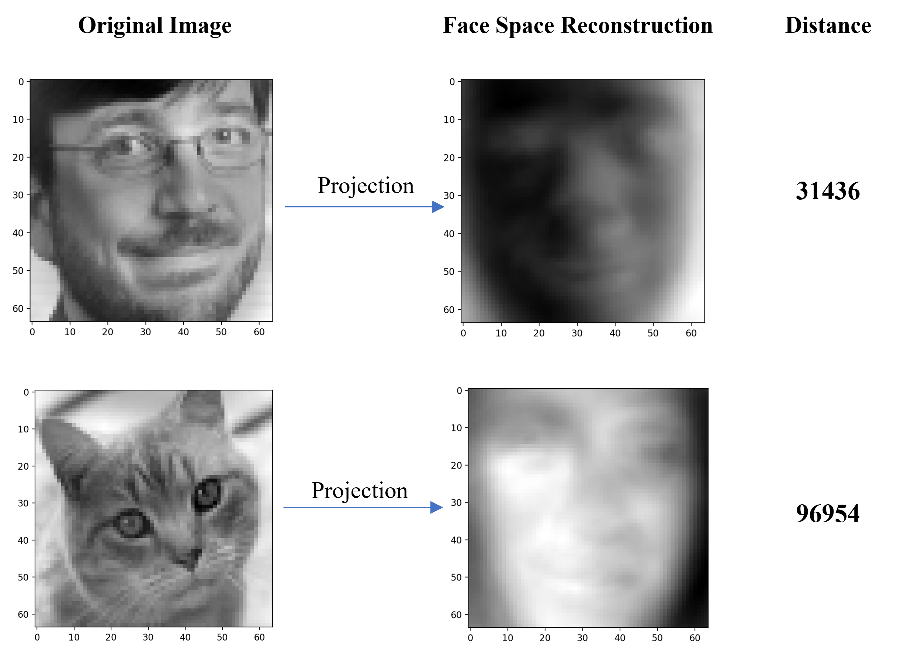

<!-- Check whether the assignment is ready to release -->
{{'now' | date: '%s'}}
{{page.release_date | date: '%s'}}
 
<div class="alert alert-danger">
Warning: this assignment is out of date.  It may still need to be updated for this year's class.  Check with your instructor before you start working on this assignment.
</div>

<!-- End of check whether the assignment is up to date -->


<!-- Check whether the assignment is up to date -->
{{'now' | date: '%Y'}}
{{page.due_date | date: '%Y'}}
 
<div class="alert alert-danger">
Warning: this assignment is out of date.  It may still need to be updated for this year's class.  Check with your instructor before you start working on this assignment.
</div>

<!-- End of check whether the assignment is up to date -->


<div class="alert alert-info">
This assignment is due on {{ page.due_date | date: "%A, %B %-d, %Y" }} before {{ page.due_date | date: "%I:%M%p" }}. 
</div>


<div class="alert alert-info">
You can download the materials for this assignment here:
<ul>

<li><a href="{{item.url}}">{{ item.name }}</a></li>

</ul>
</div>



# Robot Excercise 4: Deep Learning Application

## Preface
The COVID-19 spreads to the whole Galaxy, the planet where R2D2 lives included. To slow down the propagation speed of the virus, R2D2 has a new mission to recognize the faces and find people who don't wear masks. R2D2 will take advantage of its new deep learning module to learn from the dataset gathered from other planets.

## Instruction
This assignment consists of 2 parts. In part 1, you will learn how to use [PCA](https://en.wikipedia.org/wiki/Principal_component_analysis) to implement a face detector. 

While for part 2, you will utilize the Convolutional Neural Network (CNN) to conduct a mask classification.

A skeleton notebook [r2d2_hw4.ipynb](r2d2_hw4.ipynb) containing empty definitions for each question has been provided. Please do not change any of that. Since portions of this assignment will be graded automatically, none of the names or function signatures in this file should be modified. However, you are free to introduce additional variables or functions if needed. You could use the [Google Colab](https://colab.research.google.com/) to edit the notebook file and conduct the training using the free GPU from Google. 

You are strongly encouraged to follow the Python style guidelines set forth in PEP 8, which was written in part by the creator of Python. However, your code will not be graded for style.

Once you have completed the assignment, you should submit your file on [Gradescope]({{page.submission_link}}).

## Part 1: PCA Face Recognition

Principle Component Analysis (PCA) is a widely used approach for dimension reduction and making prediction models. For example, for a person with many personalities, you could always find several main personalities to describe him. And PCA does the similar job, which could pick several features to describe a large data. 

PCA consists of two main steps:

1. Compute the [covariance matrix](https://en.wikipedia.org/wiki/Covariance_matrix) of the dataset.
2. Compute the [eigenvalue](https://en.wikipedia.org/wiki/Eigenvalues_and_eigenvectors) and [eigenvector](https://en.wikipedia.org/wiki/Eigenvalues_and_eigenvectors) of the covariance matrix.

These are basic linear algebra concepts and if you are unfamiliar with these terms, please click the Wiki link for reference.

Now swith to our face detection task, just like the eigenvector, we could also use PCA to find some [eigenfaces](https://en.wikipedia.org/wiki/Eigenface), aka principle faces, to represent human faces. 

<p align="center">
  
</p>

### 1. Data Preprocess [5 points]

To find the effective eigenfaces, we need a large amount of real human faces as our dataset. The [Labeled Faces in the Wild Home (LFW)](https://devconnected.com/how-to-count-files-in-directory-on-linux/) provides over 13,000 faces and we selected the first 2,000 faces which are large enought for our task. You could download the dataset [here](faces.p) or just run the cell in the notebook to fetch the data.

To use the dataset, run the following code to convert it to a numpy array

```python
>>> import pickle
>>> faces = pickle.load(open("faces.p", "rb"))
>>> print(faces.shape)
(2000, 64, 64)
```
This array contains 2000 rows, each row represents a face with the size of 64 by 64 pixels.

**TODO**

* Implement the `flatten_faces(faces)` which flatten the 2D face to a 1D vector.

	```python
	>>> face_vectors = flatten_faces(faces)
	>>> print(face_vectors.shape)
	(2000, 4096)
	```
* Implement the `cal_avgface(face_vectors)` which takes the mean of all face vectors to get the average face of the dataset.

	```python
	>>> average_face = cal_avgface(face_vectors)
	>>> print(average_face.shape)
	(4096,)
	```

	You could also take a look at how it looks like by running:

	```python3
	>>> import matplotlib.pyplot as plt
	>>> plt.imshow(average_face.reshape(64, 64), cmap='gray')
	>>> plt.show()
	```
	<p align="center">
	  
	</p>

	<p align="center">
	    <em>Average Face</em>
	</p>

	If your result looks like above, you are on the right track and you could save the average face by:

	```python
	>>> pickle.dump(average_face, open('average_face.p', 'wb'))
	```

### 2. Compute the Eigenface [10 points]
Now we could start to compute the eigenfaces, as mentioned before, we need two steps to get the eigenfaces - compute the covariance matrix and take the eigenvector of this matrix. The math theory part is shown below, you could also read this [instruction](http://www.vision.jhu.edu/teaching/vision08/Handouts/case_study_pca1.pdf) from JHU for details.

**TODO**

* Implement the `cal_covariance(A)` which takes in the face vector minus by the average face and return the covariance matrix given the equation $$C = AA^T$$

	```python
	>>> A = face_vectors - average_face
	>>> C = cal_covariance(A)
	>>> print(C.shape)
	(2000, 200)
	```

* Implement the `cal_eigenvectors(C)` which takes in the covariance matrix and return the eigenvectors **sorted** by the **descending** order of the eigenvalue. It may take around 30 seconds for compution.

	```python
	>>> eigenvectors = cal_eigenvectors(C)
	>>> print(eigenvectors.shape)
	(2000, 2000)
	```

* Implement the `cal_eigenfaces(eigenvectors)` which transform the eigenvectors to eigenfaces using the formula $$eigenfaces = (A^T \cdot eigenvectors)^T$$

	```python
	>>> eigenfaces = cal_eigenfaces(eigenvectors)
	>>> print(eigenfaces.shape)
	(2000, 4096)
	```
	You could take a look at what the first several eigenfaces look like by:
	
	```python
	>>> plt.imshow(eigenfaces[0].reshape(64, 64), cmap='gray')
	>>> plt.show()
	```
	
	<p align="center">
	  
	</p>

	If your result looks similar as above, you could save the eigenfaces using:

	```python
	pickle.dump(eigenfaces, open('eigenfaces.p', 'wb'))
	```

### 3. Projection on Face Space [10 points]
After we get the eigenfaces, we could project any image to the face space. We could calculate the distance between original image and the projected image to indentify whether it is a human face and thus the face detector is bulit. The figure shown below demonstrates how we could use the approach to detect human face. The distance of CCB's is mush smaller than the kitten's which means it is more likely to be a human face.

<p align="center">
  
</p>

**TODO**

* Implement the `proj2face_space(target_vector, eigenfaces)` which takes in the target vector whe want to analyze and the eigenfaces and return its projection vector on the face space. It includes two steps:
	* Compute the weights of each eigenfaces, $$weight = eigenfaces \cdot targetvector^T$$, and **normalize** it using L1 Norm.
	* Mutiple the weight with the eigenfaces using $$weight^T \cdot eigenfaces$$

	```python
	>>> face_space_vector = proj2face_space(target_vector, eigenfaces)
	>>> print(face_space_vector.shape)
	(4096,)
	```

* Implement the `dist2face_space(target_vector, face_space_vector)` which returns the euclidean distance between the two vectors. You may use the [np.linalg](https://numpy.org/doc/stable/reference/routines.linalg.html) API.

#### 4. Real-Time Face Detector [5 points]

If everything goes well so far, you could now use the Raspberry pi camera system to bulid a face detector. We provide a function in the [detector.py](detector.py) called `pca_face_detection(camera, k, THRESHOLD)` in the skeleton code, and please make sure you put the **eigenfaces.p** and **averageface.p** in the same directory of the skeleton file. The argument `k` represents the number of eigenfaces you want to use and the `threshold` stands for the boundary of distinguish human face. The TA used k=20 and threshold=50000 which works well. You may need to fine tune these parameters to get better performance.

```
with RPiCamera('tcp://IP_ADDRESS:65433') as camera:
	pca_face_detection(camera, 20, 50000)
``` 

<p align="center">
  
</p>

Record a **short video** to show the performance of your face detector and submit the link of your video through this [form](https://forms.gle/DNiHhYS4BLH6JCuL7).

## Part 2. Mask Detection
> “We need, as a nation, to show a degree of consistency of everybody following public-health recommendations on wearing masks or other face coverings”, said Dr. Fauci.

Now it's time to apply the machine learning skills to deal with the big challeng we are facing now! In this part, we will implement a real time mask detector using the camera system. This homework is mainly described in this [notebook](r2d2_hw4.ipynb), you could directly edit it in Google Colab.

### 1. Data Preprocessing
We use the dataset from kaggle, [here](https://www.kaggle.com/andrewmvd/face-mask-detection) is the original dataset in xml type. We have preprocessed the original dataset into a dictionary with the format {'image': np.array, 'label': 'good'/'bad'}.

**TODO**

* Implement the `preprocess(image)` which transforms the image data according to the following steps:
	* Convert gray image to RGB
	* Resize the image to 128 * 128
	* Scale the value of each pixel from [0, 255] to [-1, 1]

### 2. Baseline - Perceptron [10 points]
For the baseline model, we simply flatten the image data and utlize Perceptron as our classifier.

**TODO**

* Implement the `flatten(images)` which convert the 2D images to 1D vector.
* Conduct a perceptron classification on the dataset using `sklearn` API.

### 3. Build Your Own CNN Model [10 points]

In this section, you are required to construct a nerual network using the [keras](https://keras.io) platform.

**TODO**

Build a neural network (show below) according to the following descriptions:

* Convolution with 32 filters with kernel size 7x7 followed by ReLU activation function;
* Max Pool with filter size/pool size = 7 and stride = 4;
* Convolution with 16 filters with kernel size 5x5 followed by ReLU activation function;
* Max Pool with filter size/pool size = 7 and stride = 4;
* Flatten layer to transform 3D layers to a single tensor/vector;
* Fully Connected with 64 neurons and ReLU activation function
* Fully Connected with 2 neurons and softmax activation function

<p align="center">
  
</p>

### 4. Advanced CNN Model using ImageNet [10 points]

To get better performance, we could use more complicated networks. There are various of architectures available in [keras](https://keras.io/api/applications/) like [VGG](https://keras.io/api/applications/vgg/), [InceptionV3](https://keras.io/api/applications/vgg/), etc.

Feel free to experiment on different model architecture and find your best model. Evaluate your model on the test images and upload to the leaderboard to compete with your classmates.

### 5. Real-Time Mask Detector [5 points]

After finding the most appropriate face detector and you fine tuned mask classifier. It's the time to apply these on the R2D2. First, save your model with the weights. Then use the `mask_detection(camera)` in the [detector.py](detector.py) and you will be able to implement a real time mask detector.

<p align="center">
  
</p>

Record a **short video** to show the performance of your mask detector and submit the link of your video through this [form](https://forms.gle/DNiHhYS4BLH6JCuL7).

### Submission

Here are what you need to submit for this homework:

* r2d2_hw4.ipynb
* detector.py (comment keras import and all functions except for `preprocess`, `proj2face_space` and `dist2face_space`)
* average_face.p
* eigenfaces.p
* perceptron.p
* cnn.p
* best.p (It will be uploaded to the leaderboard)

For the leaderboad, we will give top 1 extra 5 points for this assigenment, top 2-3: 3 points, top 5 - 10: 1 point.
