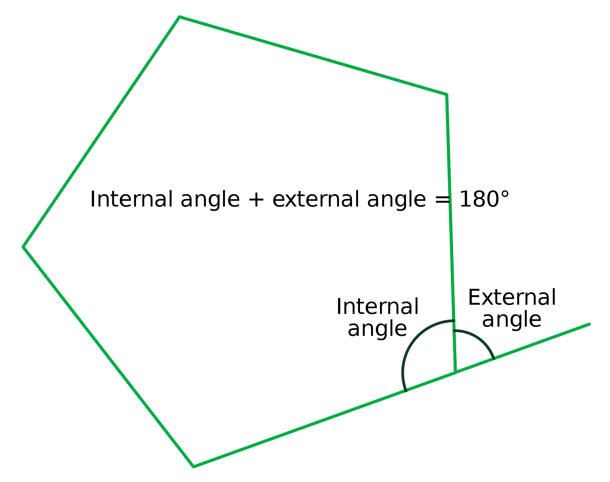

<!-- Check whether the assignment is ready to release -->
{{'now' | date: '%s'}}
{{page.release_date | date: '%s'}}
 
<div class="alert alert-danger">
Warning: this assignment is out of date.  It may still need to be updated for this year's class.  Check with your instructor before you start working on this assignment.
</div>

<!-- End of check whether the assignment is up to date -->


<!-- Check whether the assignment is up to date -->
{{'now' | date: '%Y'}}
{{page.due_date | date: '%Y'}}
 
<div class="alert alert-danger">
Warning: this assignment is out of date.  It may still need to be updated for this year's class.  Check with your instructor before you start working on this assignment.
</div>

<!-- End of check whether the assignment is up to date -->

<div class="alert alert-info">
This assignment is due on {{ page.due_date | date: "%A, %B %-d, %Y" }} before {{ page.due_date | date: "%I:%M%p" }}. 
</div>


<div class="alert alert-info">
You can download the materials for this assignment here:
<ul>

<li><a href="{{item.url}}">{{ item.name }}</a></li>

</ul>
</div>


Robot Excercise 1: Using Python to Control R2D2
=============================================================

## Instructions

In this assignment, you'll learn how to write Python code to control your robot.  A skeleton file [r2d2_hw1.py](r2d2_hw1.py) containing empty definitions for each question has been provided. Since portions of this assignment will be graded automatically, none of the names or function signatures in this file should be modified. However, you are free to introduce additional variables or functions if needed.

Unless explicitly stated otherwise, you may not import any of the standard Python modules, meaning your solutions should not include any lines of the form `import x` or `from x import y`. Accordingly, you may find it helpful to refresh yourself on Python's built-in functions and data types.

You will find that in addition to a problem specification, each programming question also includes a pair of examples from the Python interpreter. These are meant to illustrate typical use cases, and should not be taken as comprehensive test suites.

You may submit as many times as you would like before the deadline, but only the last submission will be saved. 

You are strongly encouraged to follow the Python style guidelines set forth in [PEP 8](http://www.python.org/dev/peps/pep-0008/), which was written in part by the creator of Python. However, your code will not be graded for style.

Once you have completed the assignment, you should submit your file on [Gradescope]({{page.submission_link}}).

Because this is an extra credit assignment, late submissions will not be accepted (you cannot use late days on this assignment). 

## Set Up 

You only need to run this set up once.  After you've successfully set up your server, you can skip ahead to the "Lets get rolling" section below.

For now, we have setup instructions for Mac.  We are working on creating instructions for Windows and Linux.

To get started, we are going to download a set of APIs for controling the robots via Bluetooth.  This step is a little bit complicated, so we recommend that you start early, so that you can ask for help if you get stuck.

1. Download and install the current version of Python from [https://www.python.org/downloads/](https://www.python.org/downloads/).  
2. After you have installed it, you will need to double click on the **"Install Certificates.command"** file in your `/Applications/Python 3.7` folder.
3.  The Mac installer will put it at /usr/local/bin/python3 which you can verify by checking the date after typing
```bash
ls -la /usr/local/bin/py*
```
You should see today’s date.
4. Download the repo
```bash
git clone https://github.com/josephcappadona/sphero-project.git
cd sphero-project
```
5. Create a virtual environment 
```bash
/usr/local/bin/python3 -m venv r2d2
source r2d2/bin/activate
python -m pip install --upgrade pip
```
6. Install yarn by typing these commands into the terminal.
```bash
curl -L -o latest.tar.gz https://yarnpkg.com/latest.tar.gz
tar xfz latest.tar.gz
mv yarn-*/lib/* r2d2/lib/
mv yarn-*/bin/* r2d2/bin/
rm -r latest.tar.gz yarn-*
```

7. Set up Node in your virtual environment
```bash
python -m pip install nodeenv
nodeenv -p --node=10.15.3
```

8. Install python dependencies
```bash
python -m pip install numpy pygame
```


9. Set your Path
```bash
export PATH=/usr/bin:/bin:/usr/sbin:/sbin:/usr/local/bin:/opt/X11/bin:$PATH
```


10. Compile the server library and dependencies
```bash
cd spherov2.js
sudo yarn install
cd lib/
yarn rebuild
```

11. Make sure that Bluetooth is turned on.  Go to the Apple menu and open System Preferences.  Click on the Bluetooth preferences icon.  If you see "Bluetooth: On" you're all set.  If not, click on the "Turn Bluetooth On" button.

<!--
11. Start the server, and leave it running in its own Terminal window.
```bash
cd ../examples/
sudo yarn server
```

12. Open a new Terminal window, and change into your  sphero-project director.  Then activate your virual environment.
```bash
cd sphero-project/
source r2d2/bin/activate
```

13. Change into the src directory and run python:
```bash
cd src/
python 
```

14.  Try copying and pasting these commands into the Python environment:
```python
from client import DroidClient
droid = DroidClient() 
droid.scan() # Scan the area for droids.
# Connect to your robot.
droid.connect_to_droid('D2-55A2') # Replace D2-55A2 with your ID
droid.animate(5)
```
If you hear a happy chirp, you're ready to go!
-->


## 1. Let's get rolling

Let's use Python to send commands to the robots! We'll need two terminal windows to do this.  One to run the the R2D2 server, and one to run Python "REPL" environment.  REPL stands for read, eval, print, loop.  That means we can interactively write and test code in the terminal.  

First, launch the R2D2 server in its own terminal window.  This will manage the bluetooth connection between your computer and the robot, and will relay commands from your python code to the robot.  You should launch the server in its own terminal window by running the commands:
```bash
cd sphero-project/
source r2d2/bin/activate
cd spherov2.js/examples
sudo yarn server
```
It will ask for your password, and then if everything is working properly, you'll see this:
```bash
yarn run v1.16.0
$ ts-node src/server
Listening...
```

Next, open a second terminal window and type the following commands:
```bash
cd sphero-project
source r2d2/bin/activate
cd src/
python
```
You'll now see the REPL environment's  `>>>`  prompt where you can interactively enter python commands.  Try copying and pasting these commands:

```python
from client import DroidClient
droid = DroidClient() 
droid.scan() # Scan for droids.
# Connect to your robot.
droid.connect_to_droid('D2-55A2') # Replace D2-55A2 with your droid's ID
droid.animate(5)
```
This should cause your robot to make a friendly chirping sound.  Next you can have it roll by passing it 3 arguments, the speed (ranging from 0.0 to 1.0), the heading (0 to 360) and the amount of time to roll (in seconds).
```python
droid.roll(0.3, 90, 3)
```
The heading variable is relative to the robot's orientation when you first connect to it.  0&deg; is straight ahead, 90&deg; is to its right, 180&deg; is behind it, and 270&deg; is to its left.

```python 
droid.roll(0, 90, 0) # turn right 
droid.roll(0, 180, 0)  # turn to face backwards from the initial orientation
droid.roll(0, 279, 0)  # turn to face left from the initial orientation
droid.roll(0, 0, 0)  # return to the initial orientation
```
The robot has a gyroscope, which allows it to remember its original orientation, even if you pick it up and manually reposition it.  Turning back to 0&deg will cause it to face the same direction as when it woke up.

If you'd like to explore what commands a Python class supports, you can use the ``dir(ClassName)`` or ``help(ClassName)`` functions.  Type
```python
help(DroidClient)
```
in the Python REPL environment to see what methods your robots supports.

## 2. For Loops in Python

For loops in Python are done differently than for loops in Java or C++.  In a for loop in Java, we initialize a variable, test a truth condition, and then increment (or decrement a variable) like so: 
```java
for(int i=1; i<=10; i++){  
    System.out.println(i);  
}  
```
Whereas in Python, we actually have a variable that gets assigned a value based on each element in a list.  In our Python for statement that caused the robot to drive in a square, we used the `range()` function, which generates a list of numbers.  

The python expression
```python
for i in range(num):
```
is very common.


<!-- <div class="alert alert-info" markdown="1"> -->
+ Write a function ```drive_square()``` that uses a for loop to drive in a square by rolling forward, turning 90 degrees and then rolling forward again.  Change the heading 4 times to complete the square. Set speed to 1 and duration to 1. 

+ Write a function ```drive_rectangle()``` that works similarly to ```drive_square()```, but the first and third sides of the rectangle should be twice as long as the second and fourth sides. Set speed to 1. 
<!-- </div> -->

## 3. Lists 

Python's for loop also allows us to execute a series of roll commands based on a list of headings.  Creating a list in python is easy.  We can initalize a list with a bunch of vables like like this:

```python
headings = [0, 90, 180, 270] 
```

Or we can start with an empty list, and then add values to it using the `append()` method.

```python
headings = [] # initalize an empty list
headings.append(0) # add an item to the end of the list
headings.append(90)
headings.append(180)
headings.append(270)
```

Once we've got that list, we could use a for loop to drive the robot in a square. We can do this in a few ways.  We could use a for loop with `range()` again and giving it the length of the list as its argument, which we can get via `len(headings)`.  
```python
for i in range(len(headings)):
    heading = headings[i] 
    droid.roll(0.3, heading, 2)
```
But there is a cooler way to do it in Python without a variable `i`:

```python
for heading in headings:
    droid.roll(0.3, heading, 2)
```

+ Write ```drive_robot(headings)```, which will use a for loop to roll the droid in each direction it is given, in order. Set the speed to 1, and duration to 1. Notice that passing in```python headings=[0,90,180,279] ``` drives the robot in a square. 

+ Give an example of a list of headings that would result in the robot driving in a pentagon. 

## 4. Tuples and multiple return variables

Our roll command takes three arguments `speed`, `heading`, and `duration`.  We can encode all three of those into a Python type called a tuple.  A tuple is an ordered list of values. In Python a tuple is immutable, meaning the its elements cannot be changed (unlike a list). In Python tuples are written with round brackets, and their elements can be accessed with an index in square brackets (just like accessing an element of a list).

```python
roll_command = (0.3, 0, 2) 
speed = roll_command[0]
heading = roll_command[1]
duration = roll_command[2]
```

Let's create a list of (speed, heading, duration) tuples.  

```python
roll_commands = [] # create an empty list
roll_commands.append((0.5, 0, 1)) # add an item to the end of the list
roll_commands.append((0.5, 72, 1))
roll_commands.append((0.5, 144, 1))
roll_commands.append((0.5, 216, 1))
roll_commands.append((0.5, 288, 1))
roll_commands.append((0, 0, 0))

```
Or equivalently:
```python
roll_commands = [ (0.5, 0, 1),
                  (0.5, 72, 1),
                  (0.5, 144, 1),
                  (0.5, 216, 1),
                  (0.5, 288, 1),
                  (0, 0, 0), ]
```

You could use a for loop to execute each of the roll commands in turn like this:
```python
for i in range(len(roll_commands)):
    command = roll_commands[i]
    speed = command[0]
    heading = command[1]
    duration = command[2]
    droid.roll(speed, heading, duration)
```

Python also allows multiple return types, which means that we can assign several variables simulatenously. So we can say:

```python
speed, heading, duration = roll_commands[0]
```
This allows us to write very concise for loops:

```python
for speed, heading, duration in roll_commands:
    droid.roll(speed, heading, duration)
```

+ Write a function ```drive_speedy(roll_commands)``` that takes in a list of roll_command tuples, and if the speed is faster than 0.5, doubles the duration.
 

## 5. Python functions

Instead of manually specifying the commands to have the robot drive in a square or a pentgon, let's write a function that will let it drive in the shape of any polygon. 

Let's generalize our ```drive_square()```function to be for any regular polygon.  For a polygon with $n$ sides, we'll need to compute what angle to turn to turn instead of 90&deg; in a square.  

<center>

</center>

Here's how to compute the *interior* angle of a polygon: 
    $$ \frac{(n-2) \cdot 180}{n} $$.
The angle that you want to turn the droid is the *exterior* angle.  The exterior angle is 180&deg; minus the interior angle. Use this angle to implement ```drive_polygon(n, speed=0.5, duration=2)```:

In Python, you can set default values to arguments that you pass into a function.  In this case, we have set default values for speed and duration.  This means that you can call the function just by specifying the number of sides in the polygon. 

```python
drive_polygon(3) # triangle
drive_polygon(3, speed=1) # faster, and therefore larger triangle
drive_polygon(3, speed=1, duration=1) #making it smaller by setting the duration value to be lower
drive_polygon(4) # square
drive_polygon(5) # pentagon
drive_polygon(8, duration=1) # octogon
```

## 6. Python Dictionaries 

Python dictionaries are hash tables that let us store key-value pairs. Let's use a dictionary to map from color names (Strings) onto their corresponding RGB values.  We'll store the RGB values as (red, green, blue) triples that indiciate the intesity of each of those colors (ranging from 0 to 255).  

Here's how we create an empty dictionary in Python:
```python
color_names_to_rgb = {} 
```
We can add elements like this:
```python
color_names_to_rgb['black'] = (0,0,0)
color_names_to_rgb['white'] = (255,255,255)
color_names_to_rgb['red'] = (255,0,0)
color_names_to_rgb['blue'] = (0,0,255)
color_names_to_rgb['yellow'] = (255,255,0)
color_names_to_rgb['cyan'] = (0,255,255)
color_names_to_rgb['aqua'] = (0,255,255) # There can be two keys with the same value, but not one key with multiple values.
color_names_to_rgb['magenta'] = (255,0,255)
color_names_to_rgb['gray'] = (192,192,192)
```

We can look up values like this:
```python
color_name = "blue"
color_code = color_names_to_rgb[color_name]
```
We can iterate through keys like this:
```python
for color_name in color_names_to_rgb.keys():
    r,g,b = color_names_to_rgb[color_name]
    print("The color %s has %i parts red, %i parts green, and %i parts blue." % (color_name,r,g,b)) # This is. a fancy print statement. 
```

We can set the color on our droid's front and back lights with the `set_front_LED_color` and `set_back_LED_color` functions, which take RGB values as input.

```python
droid.set_front_LED_color(255,0,255)
droid.set_back_LED_color(255,0,255)
```

Use this color dictionary to get started: 

```python
def init_color_names_to_rgb():
  color_names_to_rgb = {} 
  color_names_to_rgb['red'] = (255,0,0)
  color_names_to_rgb['orange'] = (255,165,0)
  color_names_to_rgb['yellow'] = (255,255,0)
  color_names_to_rgb['green'] = (0,128,0)
  color_names_to_rgb['blue'] = (0,0,255)
  color_names_to_rgb['indigo'] = (75,0,130)
  color_names_to_rgb['violet'] = (238,130,238)
  color_names_to_rgb['purple'] = (128,0,128)
```

+ Why don't you try to write a function ```set_lights(color_name, which_light='both')``` that will set the color of either the front, back, or both of the droid's lights to the same value using the color name?

+ Now, let's write a function ```flash_colors(colors, seconds=1)``` to walk through a list of colors, and set the front light to each color in turn for a certain number of seconds.  We'll use Python's time library to sleep between color changes.

```python
import time

time.sleep(2) # Example of how to wait for 2 seconds

rainbow = ['red', 'orange', 'yellow', 'green', 'blue', 'indigo', 'violet']


def flash_colors(colors, seconds=1):
    # TODO call the set_ligts method on each color in the colors list
    # wait for the specified number of seconds in between

color_names_to_rgb = init_color_names_to_rgb()

```

## 7. Sorting and Lambda Functions


Let's create a list of roll commands: 
```python
roll_commands = [ (.1, 0, 1),
                  (.1, 72, 1),
                  (.2, 144, 1),
                  (.2, 216, 1),
                  (.3, 288, 1),
                  (.4, 0, 1),
                  (.4, 72, 1),
                  (.4, 144, 1),
                  (.5, 216, 1),
                  (.6, 288, 1),
                  (.7, 0, 1),
                  (.8, 72, 1),
                  (.9, 144, 1),
                  (1, 216, 1),
                  (1, 288, 1),
                  (0, 0, 0), ]
```
Here's a quick function to exectute them in order:
```python
def roll_list(roll_commands):
    for speed, heading, duration in roll_commands:
        droid.roll(speed, heading, duration)
```

OK, so we have a list of a bunch of headings.  You can think of these as vectors.  We should be able add these in any order, and the resulting end point will be the same.  Is that right?  I can't remember. Let's just try it out and see.


Let's try sorting the roll_commands in different orders, and see whether the droid ends up at the same location, as when the commands are executed in the initial order.

You can use the `shuffle` command to put the items in a list in random order.

```python
from random import shuffle
shuffle(roll_commands)
print(roll_commands)
```

You can sort them with the sort method on lists:

```python
roll_commands.sort()
print(roll_commands)
```

You can also sort them in reverse order with the `reverse` keyword argument:

```python
roll_commands.sort(reverse=True)
print(roll_commands)
```

You can also sort a list by specifying a custom function to call on the objects within the list:

```python
def sortSecond(val):
    return val[1]

roll_commands.sort(key=sortSecond, reverse=False)
print(roll_commands)
```

Python supports `lambda` functions, which allows us to rewrite the previous snippet without the need to explicitly define a `sortSecond` function:

```python
roll_commands.sort(key=lambda e: e[1], reverse=False)
print(roll_commands)
```

+ Write a one-line function ```sort_lambda(roll_commands)```that uses a lamba function to first sort the roll_commands by duration, and then by speed.


## 8. Driving with the keyboard arrow keys

Let's design a video game style controler for the robot, where we can use the arrow keys to change its speed (by pressing *up* or *down*) and its orientation (by pressing *left* or *right*)

First, we'll give you a function for reading in a keystroke from the keyboard.  Here it is:

```python
import sys,tty,os,termios
def getkey():
     old_settings = termios.tcgetattr(sys.stdin)
     tty.setcbreak(sys.stdin.fileno())
     try:
         while True:
             b = os.read(sys.stdin.fileno(), 3).decode()
             if len(b) == 3:
                 k = ord(b[2])
             else:
                 k = ord(b)
             key_mapping = {
                 127: 'backspace',
                 10: 'return',
                 32: 'space',
                 9: 'tab',
                 27: 'esc',
                 65: 'up',
                 66: 'down',
                 67: 'right',
                 68: 'left'
             }
             return key_mapping.get(k, chr(k))
     finally:
         termios.tcsetattr(sys.stdin, termios.TCSADRAIN, old_settings)
```

Next, you can write a function to continuously read in the keyboard input and use it to drive the robot.

```python
def drive_with_keyboard(speed_increment=.1, heading_increment=45, duration=0.1):
    speed = 0
    heading = 0
    max_speed = 255
    while True:
        key = getkey()
        if key == 'esc':
            break
        elif key == 'up':
            # TODO - finish this function
```


## 9. Sending a message

In Star Wars, R2-D2 delivers a message from Princess Leia to Obi-Wan Kenobi.  Our robots can only play pre-programmed sounds, so we will use the robot's lights to blink out the message "Help me, Obi-Wan Kenobi. You're my only hope." in [Morse Code](https://en.wikipedia.org/wiki/Morse_code).

Here we will use the Python concept of a [generator](https://wiki.python.org/moin/Generators). Generators behave similar to iterators like lists, so they can be used in Python's for loops.  They have the added nice property of creating the next item on-demand, which means that they can often be more efficient than the equivalent operation of generating a list and returning its iterator.   That property is nice in this example, since the message that Leia sent to Obi-Wan is actually quite a bit longer than everyone remembers:

<blockquote style="font-size:15px">
General Kenobi. Years ago, you served my father in the Clone Wars. Now he begs you to help him in his struggle against the Empire. I regret that I am unable to present my father's request to you in person, but my ship has fallen under attack and I'm afraid my mission to bring you to Alderaan has failed. I have placed information vital to the survival of the Rebellion into the memory systems of this R2 unit. My father will know how to retrieve it. You must see this droid safely delivered to him on Alderaan. This is our most desperate hour. Help me, Obi-Wan Kenobi. You're my only hope.
</blockquote>

Try to write the following methods:

```python
def encode_in_morse_code(message): 
    # TODO - Create a generator that walks through each 
    # character in a message string.
    # Skip over any non-alphanumeric characters.
    # Encode numbers and letters as morse code strings like
    # A = '.-'
    # B = '-...'
    # ...
    # Return a string for the next character.

def blink(lenth):
  # TODO - make the holo projector blink

def play_message(message, short_length=0.1, long_length=0.3, length_between_blips=0.1, length_between_letters=0.5):
    # TODO - blink out the message on the holo projector.

```
Hint: To set holo projector on/off, do ```droid.set_holo_projector_intensity(1)```, and ```droid.set_holo_projector_intensity(0)```.
