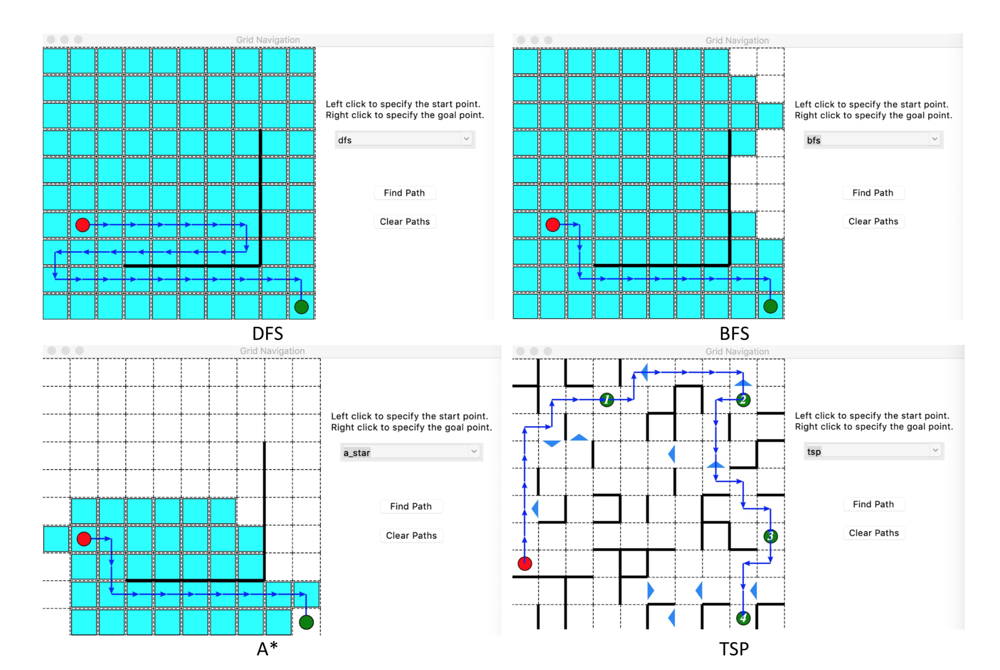

<!-- Check whether the assignment is ready to release -->
{{'now' | date: '%s'}}
{{page.release_date | date: '%s'}}
 
<div class="alert alert-danger">
Warning: this assignment is out of date.  It may still need to be updated for this year's class.  Check with your instructor before you start working on this assignment.
</div>

<!-- End of check whether the assignment is up to date -->


<!-- Check whether the assignment is up to date -->
{{'now' | date: '%Y'}}
{{page.due_date | date: '%Y'}}
 
<div class="alert alert-danger">
Warning: this assignment is out of date.  It may still need to be updated for this year's class.  Check with your instructor before you start working on this assignment.
</div>

<!-- End of check whether the assignment is up to date -->


<div class="alert alert-info">
This assignment is due on {{ page.due_date | date: "%A, %B %-d, %Y" }} before {{ page.due_date | date: "%I:%M%p" }}. 
</div>


<div class="alert alert-info">
You can download the materials for this assignment here:
<ul>

<li><a href="{{item.url}}">{{ item.name }}</a></li>

</ul>
</div>



Robot Excercise 2: Robot Navigation [100 points]
=============================================================
## Preface
During a reconnaissance mission gone wrong, R2D2 was attacked by Stormtroopers, leaving his executive control unit disconnected from his motor control unit. Luckily, R2D2’s motor control unit can still access his 9G-capable network card. He just needs you to SSH into his motor control unit and guide him to the rendezvous with C3PO and Luke, but time is of the essence, so you must use A\* search to get him there as fast as possible. He just needs you to program and run the A\* search algorithm and integrate motor controls via his motor control unit API.

## Instructions
In this assignment, you’ll learn the differences between “uninformed” search algorithms like BFS and DFS, and “informed” search algorithms like A\*. You will use both types of algorithms to solve multi-dimensional mazes and see how their performance compares (and save R2D2!). 

A skeleton file [r2d2_hw2.py](r2d2_hw2.py) containing empty definitions for each question has been provided. Some helper functions and functions required for GUI are also provided. Please do not change any of that. Since portions of this assignment will be graded automatically, none of the names or function signatures in this file should be modified. However, you are free to introduce additional variables or functions if needed.

You are strongly encouraged to follow the Python style guidelines set forth in PEP 8, which was written in part by the creator of Python. However, your code will not be graded for style.

Once you have completed the assignment, you should submit your file on [Gradescope]({{page.submission_link}}).

Since this is an extra credit assignment, late submissions will not be accepted (you cannot use late days on this assignment).

## 1. Implement a Graph [15 points]
In order to solve a maze, we first need to create a representation of a maze to run our algorithms on. We will implement our maze as a graph, where each vertex represents a grid cell, and an edge between vertices represents the ability to traverse between those grid cells.

There are many different ways we can implement a graph, and these design decisions will impact the running time of our algorithms. For this assignment, we will implement an undirected, unweighted graph with its edges stored as an adjacency list.

Implement a graph with the following interface: 

```python
class Graph:

    def __init__(self, V, E):
        # TODO: implement

    def neighbors(self, u):
        # TODO: implement

    def dist_between(self, u, v):
        # TODO: implement
```
1. **[5 points]** ```Graph(V, E)``` should take in a list of vertices ```V = [v_1, v_2, ...]``` and a list of edges ```E = [(v_1, v_2), (v_3, v_4), ...]```. You should convert the list of edges into an adjacency list representation.

2. **[8 points]**```neighbors(u)``` should take in a vertex ```u``` and return the list of vertices reachable from u (you don’t need to include ```u``` in that list). Try to avoid recomputing neighborhoods every time the function is called since for large graphs this can waste a lot of time.

3. **[2 points]**```dist_between(u, v)``` should take in two vertices ```u``` and ```v``` and return 1 if there is an edge between ```u``` and ```v```, otherwise it should return None.

For example, for this 2x2 graph,

```python
>>> V = [(0, 0), (0, 1), (1, 0), (1, 1)]
>>> E = [((0,0), (0,1)), ((0,1), (1,1)), ((1,1), (1,0))]
>>> G = Graph(V, E)
>>> G.neighbors((0,0))
[(0, 1)]
>>> G.dist_between((0,0), (0,1))
1.0
>>> G.dist_between((0,0), (1,0))
None
```
You could use the provided ```generate_map``` and ```printmap``` functions to test your graphs. The ```generate_map(row, cols, barriers)``` takes in the number of the rows and columns of your desired map and ```barriers``` is a list of edges you want to remove from the fully connected map (with no barrier). Note that in this function, each edge in the barriers, along with its interpositional edge will all be removed. ```printmap(G)``` is a visualization function that display the grid world. An example is shown below:

```python
>>> vertics, edges = generate_map(3, 3, [])
>>> G = Graph(vertics, edges)
>>> printmap(G)
☐   ☐   ☐   
            
☐   ☐   ☐   
            
☐   ☐   ☐  

>>> vertics, edges = generate_map(3, 3, [((0, 0), (0, 1)), ((1, 1), (1, 2)), ((1, 1), (0, 1))])
>>> G = Graph(vertics, edges)
>>> printmap(G)
☐ | ☐   ☐   
   ===     
☐   ☐ | ☐   
           
☐   ☐   ☐  
```
## 2. Implement BFS and DFS [40 points]
BFS and DFS, two algorithms that you will revisit again and again in this course, are two of the most primitive graph algorithms. 
Using pseudocode from [here](https://en.wikipedia.org/wiki/Breadth-first_search#Pseudocode) and [here](https://en.wikipedia.org/wiki/Depth-first_search#Pseudocode) and the lecture slides, implement both of them from the skeleton code below:

```python
def BFS(G, start, goal):
    '''
        path -- a list of tuples
        node-visited -- a list of tuples
    '''
    return path, node_visited

def DFS(G, start, goal):
    '''
        path -- a list of tuples
        node-visited -- a list of tuples
    '''
    return path, node_visited
```

Here are outputs of the test cases:

```python
>>> vertics, edges = generate_map(3, 3, [])
>>> G = Graph(vertics, edges)
>>> solution_BFS = BFS(G, (0, 0), (2, 2))[0]
[(0, 0), (1, 0), (2, 0), (2, 1), (2, 2)]

>>> solution_DFS = DFS(G, (0, 0), (2, 2))[0]
[(0, 0), (1, 0), (2, 0), (2, 1), (1, 1), (0, 1), (0, 2), (1, 2), (2, 2)]
``` 

You could use the provided ```printpath(G, start, goal, path)``` function to visualize your solution. The ``` ☑``` represents the start node and path nodes and ``` ☒``` represents the goal node.

```python
>>> printpath(G, (0,0), (2,2), solution_BFS)
☑   ☐   ☐   
           
☑   ☐   ☐   
           
☑   ☑   ☒ 

>>>  printpath(G, (0,0), (2,2), solution_DFS)
☑   ☑   ☑   
           
☑   ☑   ☑   
           
☑   ☑   ☒  

```

## 3. Implement A\* Search [35 points]
1. **[25 points]** Using the pseudocode [here](https://en.wikipedia.org/wiki/A*_search_algorithm#Pseudocode) and the lecture slides, implement A\* search by finish the following function:

    ```python
    def A_star(G, start, goal):
        '''
            find solution using A* search
        '''
        return path, node_visited
    ```

    Several example test cases:

    ```python
    >>> vertics, edges = generate_map(3, 3, [])
    >>> G = Graph(vertics, edges)
    >>> solution_A_star = A_star(G, (0, 0), (2, 2))[0]
    [(0, 0), (0, 1), (0, 2), (1, 2), (2, 2)]
    >>> printpath(G, (0,0), (2,2), solution_A_star)
    ☑   ☑   ☑   
               
    ☐   ☐   ☑   
               
    ☐   ☐   ☒  

    >>> vertics, edges = generate_map(4, 4, [((1, 2), (1, 3)), ((2, 2), (2, 3)), ((2, 2), (3, 2)), ((2, 1), (3, 1))])
    >>> G = Graph(vertics, edges)
    >>> printmap(G)
    ☐   ☐   ☐   ☐   
                   
    ☐   ☐   ☐ | ☐   
                   
    ☐   ☐   ☐ | ☐   
       === ===     
    ☐   ☐   ☐   ☐   

    >>> solution_A_star = A_star(G, (1, 1), (3, 3))
    [(1, 1), (0, 1), (0, 2), (0, 3), (1, 3), (2, 3), (3, 3)][0]

    >>> printpath(G, (1, 1), (3, 3), solution_A_star)
    ☐   ☑   ☑   ☑   
                   
    ☐   ☑   ☐ | ☑   
                   
    ☐   ☐   ☐ | ☑   
       === ===     
    ☐   ☐   ☐   ☒  
    ```

2. **[10 points]** Try to apply [Traveling Sales Person (TSP)] (https://en.wikipedia.org/wiki/Travelling_salesman_problem) algorithm to solve a search problem with multiple goals. ```tsp(G, start, goals) ``` function shown below calls the A star you implemented above and return the shortest path which visites all the goal nodes. You could use ```itertools``` to generate all the combinations of two target nodes and use A star to calculate the cost of each combination, then find the optimal order that has the shortest total cost.

    ```python
    def tsp(G, start, goals):
        '''
            return the optimal order of nodes and shortest path that passes all the goals
            output format: (order, path)
        '''
        return optimal_order, path
    ```
    An example is shown as follows:

    ```python
    >>> vertics, edges = generate_map(4, 4, [((1, 2), (1, 3)), ((2, 2), (2, 3)), ((2, 2), (3, 2)), ((2, 1), (3, 1))])
    >>> G = Graph(vertics, edges)
    >>> printmap(G)
    ☐   ☐   ☐   ☐   
                   
    ☐   ☐   ☐ | ☐   
                   
    ☐   ☐   ☐ | ☐   
       === ===     
    ☐   ☐   ☐   ☐  

    >>> optimal_order, shortest_path = tsp(G, (0, 0), [(2, 2), (3, 3), (3, 0)])
    >>> optimal_order
    ((0, 0), (2, 2), (3, 0), (3, 3))
    >>> shortest_path
    [(0, 0), (0, 1), (0, 2), (1, 2), (2, 2), (2, 2), (2, 1), (2, 0), (3, 0), (3, 0), (3, 1), (3, 2), (3, 3)]

    >>> printtsp(G, (0, 0), [(2, 2), (3, 3), (3, 0)], shortest_path)

    ☑   ☑   ☑   ☐   
                   
    ☐   ☐   ☑ | ☐   
                   
    ☑   ☑   ☒ | ☐   
       === ===     
    ☒   ☑   ☑   ☒ 
    ```

If you finish all the steps above, you are able to use the provided GUI to display your solutions. You could choose different methods(dfs, bfs, A\*) in the GUI and compare the results of them. The nodes that visited in your algorithm will be colored and you could find the difference between these method through it.

    python3 r2d2_navigation_gui.py rows cols

Type in the above command in terminal and it will generate a random graph which has the size of rows $$\times$$ cols that you just insert. Left click to set the start position and right click to set the goal position, choose your method in the pull-down menu on the right side and click find path to display your solution. If you choose 'tsp' as your method, you coule do multiple right clicks to set more than one goals and then click find path, it will show the number of order on each goal. Some examples of GUI is shown below.
<!--  -->
<center>

</center>

## 4. Let your Robots rolling in a real game [10 points]

In this step, you will convert your navigation solution to the commands for your R2D2 to play in a game.

1. **[5 points]** ```path2move(path)``` take in your finded path and return a dictionary which uses directions('north', 'west', 'south', 'east') as keys and move distance as values. The output shoule look like this:

    ```python
    >>> vertics, edges = generate_map(3, 3, [])
    >>> G = Graph(vertics, edges)
    >>> solution_A_star = A_star(G, (0, 0), (2, 2))[0]
    [(0, 0), (0, 1), (0, 2), (1, 2), (2, 2)]
    >>> path2move(solution_A_star)
    [('east', 2), ('south', 2)]

    >>> vertics, edges = generate_map(4, 4, [((1, 2), (1, 3)), ((2, 2), (2, 3)), ((2, 2), (3, 2)), ((2, 1), (3, 1))])
    >>> G = Graph(vertics, edges)
    >>> solution_A_star = A_star(G, (1, 1), (3, 3))[0]
    >>> path2move(solution_A_star)
    >>> [('north', 1), ('east', 2), ('south', 3)]

    ```

2. **[5 points]**```r2d2_action(movement, droid, speed, time_for_moving_one_step)``` transfers the movement generated above to the commands for robot. This fuction also takes in the droid object as input, the speed and time will be used in ```droid.roll(speed, direction, time)``` function. The speed and time may varies according to the size of real world map. The direction range from 0 - 360 and it is decided by the key in the ```movement``` and the initial direction of the robot.

    ```python
    def r2d2_action(movement, droid, speed, time)
        '''
            convert movemnts to the commands for R2D2
        '''
        pass
    ```